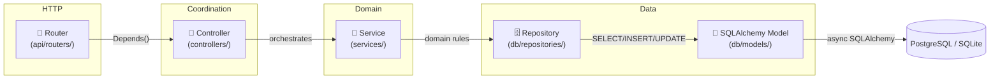
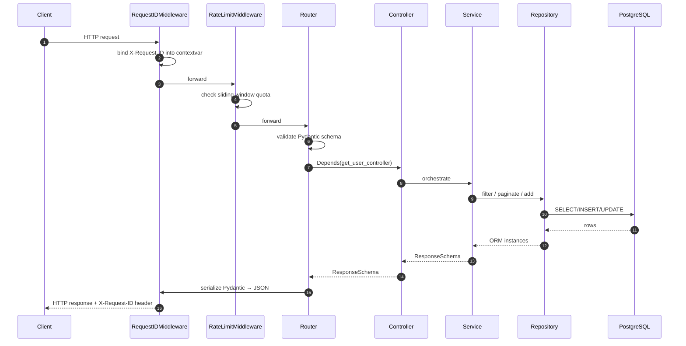

# Architecture

The SDK enforces a strict **router → controller → service → repository** layering. Every Tempest project follows the same shape, so a developer dropped into a new repo finds the file they need on the first try.

## The four layers



## What lives where

!!! abstract "Layer responsibilities"

    | Layer | Owns | NEVER touches |
    | --- | --- | --- |
    | **Router** | HTTP verbs, status codes, request/response schemas, `Depends()` | DB, business logic |
    | **Controller** | Coordination across multiple services, cross-cutting policy (audit log, outbox emit, downstream notify) | DB, request/response shape |
    | **Service** | Domain rules (uniqueness, derived state, transactional flow) | HTTP, SQLAlchemy types |
    | **Repository** | Raw async SQLAlchemy queries, CRUD + filter + pagination | Domain rules, HTTP |

The repository **MUST** be a [`BaseRepository[ModelType]`][tempest_fastapi_sdk.BaseRepository] subclass (or instance). The service **MUST** be a [`BaseService[RepositoryT, ResponseT]`][tempest_fastapi_sdk.BaseService] subclass. The controller **MUST** be a [`BaseController[ServiceT, ResponseT]`][tempest_fastapi_sdk.BaseController] subclass — even when every method is a pass-through, because the controller is the seam to add cross-service coordination later.

## Mandatory project layout

```text
<service>/
├── main.py                          # ONE-LINER: from src.server import run; run()
└── src/ (or app/)
    ├── __init__.py                  # re-exports run from src.server
    ├── server.py                    # programmatic uvicorn.run() + module-level FastAPI app
    ├── api/
    │   ├── app.py                   # create_app() factory + middleware + exception handlers
    │   ├── routers/                 # HTTP endpoints, no business logic
    │   ├── dependencies/            # PACKAGE (auth.py + controllers.py / services.py)
    │   └── docs/                    # OpenAPI customization
    ├── controllers/                 # Orchestrate between services
    ├── services/                    # Business logic layer
    ├── schemas/                     # Pydantic v2 request/response DTOs
    ├── core/                        # settings.py + constants + exceptions + logging
    ├── db/ (optional)
    │   ├── models/                  # SQLAlchemy ORM models
    │   └── repositories/            # Data access layer
    ├── utils/ (optional)            # Shared stateless helpers
    ├── queue/ (optional)            # FastStream consumers/publishers
    └── tasks/ (optional)            # TaskIQ background tasks
```

!!! warning "Rules that are not negotiable"

    - `main.py` at the service root is a **one-liner** that imports `run` from `src.server`. Never `subprocess.run(["uvicorn", ...])`.
    - `src/server.py` exposes both a `run()` function and the importable `app` instance.
    - `api/dependencies/` is **always a package**, never a flat file. Auth lives in `auth.py`; factory providers live in `controllers.py` (or `services.py` when there is no controller layer yet).
    - Routers receive controllers via `Depends`, never constructed inline.
    - Meta endpoints (`/health`, `/tool-spec`) live at the **root prefix**; business endpoints live under `/api/<domain>`.

## Request lifecycle



Every step has a clear owner — the **router never talks to SQLAlchemy**, the **repository never raises HTTP exceptions** (it raises the `not_found_exception` configured on `__init__`, and the exception handler turns it into the JSON envelope).

## Exception envelope

The SDK ships [`AppException`][tempest_fastapi_sdk.AppException] + [`register_exception_handlers`][tempest_fastapi_sdk.register_exception_handlers] so every error in your service serializes to the same JSON shape:

```json
{
    "detail": "Usuário não encontrado",
    "code": "USER_NOT_FOUND",
    "details": {"user_id": "01923..."}
}
```

The frontend branches on `code` (stable, machine-readable), never on the (potentially translated) `detail`.

## Where to go next

| You want to… | Read |
| --- | --- |
| Build a feature step by step | **[Tutorial »](tutorial.md)** |
| Wire a specific helper | **[Recipes »](recipes/index.md)** |
| Look up a class signature | **[Reference »](reference.md)** |
| Upgrade from an older version | **[Migration guide »](migration.md)** |

## Controllers & services layering


`BaseService[RepositoryT, ResponseT]` and `BaseController[ServiceT, ResponseT]` are generic skeletons matching the SDK layering (router → controller → service → repository). They expose pass-through CRUD methods so simple endpoints can subclass them without overriding anything; you override only methods that need orchestration.

What you inherit by subclassing `BaseService[RepositoryT, ResponseT]`:

| Method | Returns | Notes |
| --- | --- | --- |
| `get_by_id(id)` | `ResponseT` | Awaits `repository.get_by_id` + `repository.map_to_response`. Raises `repository.not_found_exception` on miss. |
| `get_or_none(filters)` | `ResponseT \| None` | Same shape, returns `None` instead of raising. |
| `list(filters=None, order_by=None, ascending=True)` | `list[ResponseT]` | Returns `[]` on empty match (never raises). |
| `paginate(filters=None, order_by=None, page=1, page_size=20, ascending=True)` | `dict` with mapped `items` + `total`/`page`/`page_size`/`pages`. | Offset pagination via `repository.paginate`. |
| `count(filters=None)` | `int` | Pass-through to `repository.count`. |
| `exists(filters)` | `bool` | Pass-through to `repository.exists`. |
| `delete(id)` | `None` | Hard delete via `repository.delete`. |

`map_to_response` is `await`-ed when it returns a coroutine, so async mappers work transparently — no method override needed.

What you inherit by subclassing `BaseController[ServiceT, ResponseT]`:

| Method | Forwards to | Notes |
| --- | --- | --- |
| `get_by_id(id)` | `service.get_by_id` | Same return type as the service. |
| `list(filters, order_by, ascending)` | `service.list` | Same. |
| `paginate(filters, order_by, page, page_size, ascending)` | `service.paginate` | Same. |
| `count(filters)` | `service.count` | Same. |
| `delete(id)` | `service.delete` | Same. |

When a use case needs domain rules, override the inherited method in the service. When a use case needs to coordinate more than one service, override the inherited method (or add a new one) in the controller. The router never grows — it only depends on the controller.

```python
# src/services/user_service.py
from uuid import UUID

from tempest_fastapi_sdk import BaseService

from src.db.repositories import UserRepository
from src.schemas.user import UserCreate, UserResponse, UserUpdate
from src.utils.security import password_utils


class UserService(BaseService[UserRepository, UserResponse]):
    """Business logic for the user feature."""

    async def signup(self, data: UserCreate) -> UserResponse:
        # Business logic — hash the password, then delegate to the repo.
        instance = self.repository.map_to_model(
            {
                "name": data.name,
                "email": data.email,
                "password_hash": password_utils.hash(data.password),
            },
        )
        created = await self.repository.add(instance)
        return self.repository.map_to_response(created)


# src/controllers/user_controller.py
from tempest_fastapi_sdk import BaseController

from src.schemas.user import UserCreate, UserResponse
from src.services.user_service import UserService


class UserController(BaseController[UserService, UserResponse]):
    """Thin orchestration over UserService."""

    async def signup(self, data: UserCreate) -> UserResponse:
        # Pass-through today; the controller is the seam to add
        # cross-service coordination later (audit log, outbox event,
        # downstream notification, etc.) without touching the router.
        return await self.service.signup(data)


# src/api/dependencies/controllers.py
from fastapi import Depends
from sqlalchemy.ext.asyncio import AsyncSession

from src.api.app import db
from src.controllers.user_controller import UserController
from src.db.repositories import UserRepository
from src.services.user_service import UserService


def get_user_controller(
    session: AsyncSession = Depends(db.session_dependency),
) -> UserController:
    # UserRepository is a subclass of BaseRepository[UserModel] whose
    # __init__ injects `model=UserModel` via super().__init__(session, model=UserModel).
    # See the tutorial for the full skeleton:
    # https://mauriciobenjamin700.github.io/tempest-fastapi-sdk/en/tutorial/#6-repository
    return UserController(UserService(UserRepository(session)))


# src/api/routers/users.py
from fastapi import APIRouter, Depends, status

from src.api.dependencies.controllers import get_user_controller
from src.controllers.user_controller import UserController
from src.schemas.user import UserCreate, UserResponse

router = APIRouter(prefix="/users", tags=["users"])


@router.post(
    "/",
    response_model=UserResponse,
    status_code=status.HTTP_201_CREATED,
)
async def create_user(
    data: UserCreate,
    controller: UserController = Depends(get_user_controller),
) -> UserResponse:
    return await controller.signup(data)
```

Keep controllers present even when they only pass through — the import graph stays uniform across services, so adding cross-cutting policy later doesn't change the router signature.

