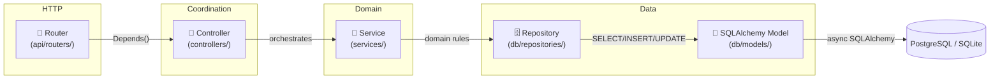
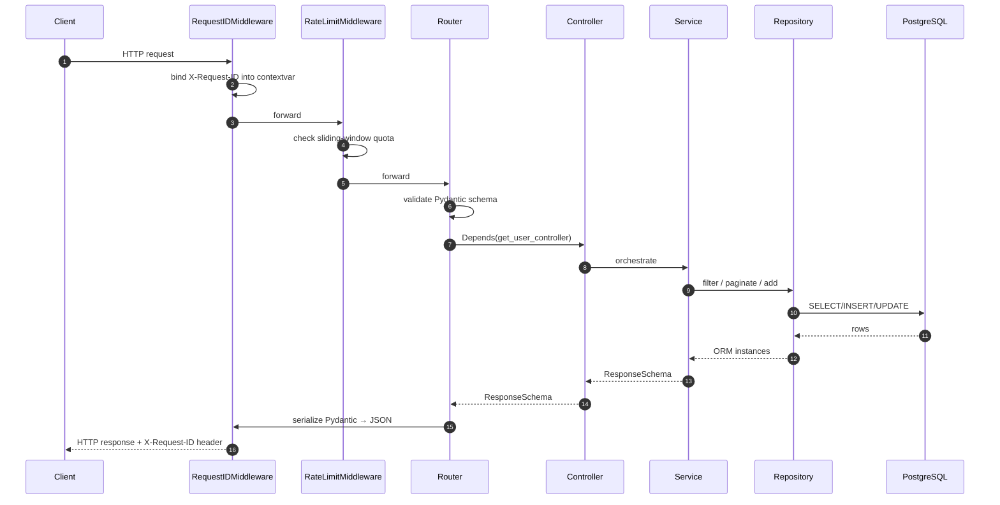

# Architecture

The SDK enforces a strict **router → controller → service → repository** layering. Every Tempest project follows the same shape, so a developer dropped into a new repo finds the file they need on the first try.

## The four layers



## What lives where

!!! abstract "Layer responsibilities"

    | Layer | Owns | NEVER touches |
    | --- | --- | --- |
    | **Router** | HTTP verbs, status codes, request/response schemas, `Depends()` | DB, business logic |
    | **Controller** | Coordination across multiple services, cross-cutting policy (audit log, outbox emit, downstream notify) | DB, request/response shape |
    | **Service** | Domain rules (uniqueness, derived state, transactional flow) | HTTP, SQLAlchemy types |
    | **Repository** | Raw async SQLAlchemy queries, CRUD + filter + pagination | Domain rules, HTTP |

The repository **MUST** be a [`BaseRepository[ModelType]`][tempest_fastapi_sdk.BaseRepository] subclass (or instance). The service **MUST** be a [`BaseService[RepositoryT, ResponseT]`][tempest_fastapi_sdk.BaseService] subclass. The controller **MUST** be a [`BaseController[ServiceT, ResponseT]`][tempest_fastapi_sdk.BaseController] subclass — even when every method is a pass-through, because the controller is the seam to add cross-service coordination later.

## Mandatory project layout

```text
<service>/
├── main.py                          # ONE-LINER: from src.server import run; run()
└── src/ (or app/)
    ├── __init__.py                  # re-exports run from src.server
    ├── server.py                    # programmatic uvicorn.run() + module-level FastAPI app
    ├── api/
    │   ├── app.py                   # create_app() factory + middleware + exception handlers
    │   ├── routers/                 # HTTP endpoints, no business logic
    │   ├── dependencies/            # PACKAGE (auth.py + controllers.py / services.py)
    │   └── docs/                    # OpenAPI customization
    ├── controllers/                 # Orchestrate between services
    ├── services/                    # Business logic layer
    ├── schemas/                     # Pydantic v2 request/response DTOs
    ├── core/                        # settings.py + constants + exceptions + logging
    ├── db/ (optional)
    │   ├── models/                  # SQLAlchemy ORM models
    │   └── repositories/            # Data access layer
    ├── utils/ (optional)            # Shared stateless helpers
    ├── queue/ (optional)            # FastStream consumers/publishers
    └── tasks/ (optional)            # TaskIQ background tasks
```

!!! warning "Rules that are not negotiable"

    - `main.py` at the service root is a **one-liner** that imports `run` from `src.server`. Never `subprocess.run(["uvicorn", ...])`.
    - `src/server.py` exposes both a `run()` function and the importable `app` instance.
    - `api/dependencies/` is **always a package**, never a flat file. Auth lives in `auth.py`; factory providers live in `controllers.py` (or `services.py` when there is no controller layer yet).
    - Routers receive controllers via `Depends`, never constructed inline.
    - Meta endpoints (`/health`, `/tool-spec`) live at the **root prefix**; business endpoints live under `/api/<domain>`.

## Request lifecycle



Every step has a clear owner — the **router never talks to SQLAlchemy**, the **repository never raises HTTP exceptions** (it raises the `not_found_exception` configured on `__init__`, and the exception handler turns it into the JSON envelope).

## Exception envelope

The SDK ships [`AppException`][tempest_fastapi_sdk.AppException] + [`register_exception_handlers`][tempest_fastapi_sdk.register_exception_handlers] so every error in your service serializes to the same JSON shape:

```json
{
    "detail": "Usuário não encontrado",
    "code": "USER_NOT_FOUND",
    "details": {"user_id": "01923..."}
}
```

The frontend branches on `code` (stable, machine-readable), never on the (potentially translated) `detail`.

## Where to go next

| You want to… | Read |
| --- | --- |
| Build a feature step by step | **[Tutorial »](tutorial.md)** |
| Wire a specific helper | **[Recipes »](recipes/index.md)** |
| Look up a class signature | **[Reference »](reference.md)** |
| Upgrade from an older version | **[Migration guide »](migration.md)** |
