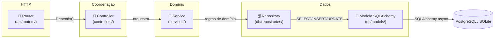
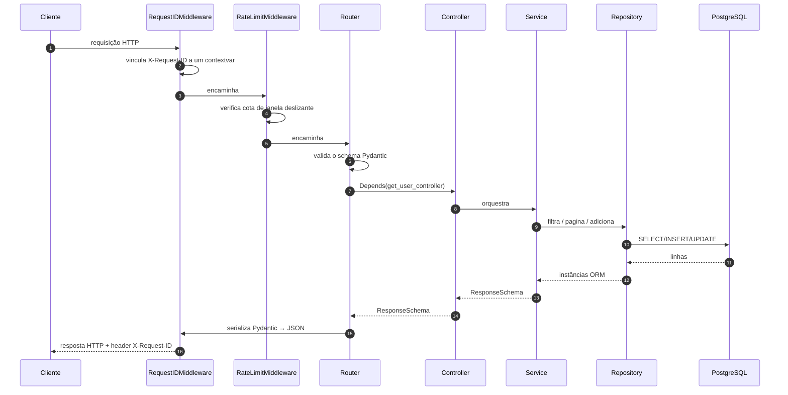

# Arquitetura

O SDK impõe um fatiamento estrito **router → controller → service → repository**. Todo projeto Tempest segue o mesmo formato, então um desenvolvedor jogado em um repositório novo encontra o arquivo que precisa logo de primeira.

## As quatro camadas



## O que vive onde

!!! abstract "Responsabilidades de cada camada"

    | Camada | Responsável por | NUNCA toca |
    | --- | --- | --- |
    | **Router** | Verbos HTTP, status codes, schemas de request/response, `Depends()` | DB, lógica de negócio |
    | **Controller** | Coordenação entre múltiplos services, política transversal (log de auditoria, emissão de outbox, notificação downstream) | DB, formato de request/response |
    | **Service** | Regras de domínio (unicidade, estado derivado, fluxo transacional) | HTTP, tipos do SQLAlchemy |
    | **Repository** | Queries SQLAlchemy async cruas, CRUD + filtro + paginação | Regras de domínio, HTTP |

O repository **DEVE** ser uma subclasse (ou instância) de [`BaseRepository[ModelType]`][tempest_fastapi_sdk.BaseRepository]. O service **DEVE** ser uma subclasse de [`BaseService[RepositoryT, ResponseT]`][tempest_fastapi_sdk.BaseService]. O controller **DEVE** ser uma subclasse de [`BaseController[ServiceT, ResponseT]`][tempest_fastapi_sdk.BaseController] — mesmo quando todo método é um pass-through, porque o controller é a costura para adicionar coordenação entre services mais tarde.

## Layout obrigatório do projeto

```text
<service>/
├── main.py                          # ONE-LINER: from src.server import run; run()
└── src/ (ou app/)
    ├── __init__.py                  # re-exporta run de src.server
    ├── server.py                    # uvicorn.run() programático + app FastAPI no nível do módulo
    ├── api/
    │   ├── app.py                   # factory create_app() — middleware + handlers + wiring (magro)
    │   ├── routers/                 # endpoints HTTP, sem lógica de negócio
    │   ├── dependencies/            # PACOTE (auth.py + resources.py + controllers.py / services.py)
    │   └── docs/                    # customização do OpenAPI
    ├── controllers/                 # orquestra entre services
    ├── services/                    # camada de lógica de negócio
    ├── schemas/                     # DTOs de request/response Pydantic v2
    ├── core/                        # settings.py + constants + exceptions + logging
    ├── db/ (opcional)
    │   ├── models/                  # modelos ORM SQLAlchemy
    │   └── repositories/            # camada de acesso a dados
    ├── utils/ (opcional)            # helpers stateless compartilhados
    ├── queue/ (opcional)            # consumers/publishers FastStream
    └── tasks/ (opcional)            # tarefas em background TaskIQ
```

!!! warning "Regras inegociáveis"

    - `main.py` na raiz do serviço é um **one-liner** que importa `run` de `src.server`. Nunca `subprocess.run(["uvicorn", ...])`.
    - `src/server.py` expõe tanto uma função `run()` quanto a instância `app` importável.
    - `api/dependencies/` é **sempre um pacote**, nunca um arquivo plano. A auth vive em `auth.py`; os provedores factory vivem em `controllers.py` (ou `services.py` quando ainda não há camada de controller).
    - **Singletons de infra (db / storage / mail) vivem em `dependencies/resources.py`**, construídos uma vez (`db = AsyncDatabaseManager(**settings.database_kwargs())`) e acessados via provedores `get_db` / `get_session` / `get_storage` / `get_mailer`. O `app.py` **importa** esses recursos para o lifespan e o wiring dos routers — não os constrói inline. Isso mantém o `app.py` magro e dá um único dono do ciclo de vida dos recursos.
    - Routers recebem controllers (e sessões/recursos) via `Depends`, nunca construídos inline.
    - Endpoints meta (`/health`, `/tool-spec`) ficam no **prefixo raiz**; endpoints de negócio ficam sob `/api/<domínio>`.

## Ciclo de vida da requisição



Cada passo tem um dono claro — o **router nunca conversa com o SQLAlchemy**, o **repository nunca levanta exceções HTTP** (ele levanta a `not_found_exception` configurada no `__init__`, e o exception handler a transforma no envelope JSON).

## Envelope de exceções

O SDK traz [`AppException`][tempest_fastapi_sdk.AppException] + [`register_exception_handlers`][tempest_fastapi_sdk.register_exception_handlers] para que todo erro no seu serviço serialize no mesmo formato JSON:

```json
{
    "detail": "Usuário não encontrado",
    "code": "USER_NOT_FOUND",
    "details": {"user_id": "01923..."}
}
```

O frontend ramifica no `code` (estável, legível por máquina), nunca no `detail` (que pode estar traduzido).

## Para onde ir agora

| Você quer… | Leia |
| --- | --- |
| Construir uma feature passo a passo | **[Tutorial »](tutorial.md)** |
| Conectar um helper específico | **[Receitas »](recipes/index.md)** |
| Consultar a assinatura de uma classe | **[Referência »](reference.md)** |
| Atualizar de uma versão antiga | **[Guia de migração »](migration.md)** |

## Camadas de controllers & services


`BaseService[RepositoryT, ResponseT]` e `BaseController[ServiceT, ResponseT]` são esqueletos genéricos que casam com o fatiamento do SDK (router → controller → service → repository). Eles expõem métodos CRUD pass-through para que endpoints simples possam herdar deles sem sobrescrever nada; você sobrescreve apenas os métodos que precisam de orquestração.

O que você herda ao subclassear `BaseService[RepositoryT, ResponseT]`:

| Método | Retorna | Notas |
| --- | --- | --- |
| `get_by_id(id)` | `ResponseT` | Aguarda `repository.get_by_id` + `repository.map_to_response`. Levanta `repository.not_found_exception` quando não encontra. |
| `get_or_none(filters)` | `ResponseT \| None` | Mesmo formato, retorna `None` em vez de levantar. |
| `list(filters=None, order_by=None, ascending=True)` | `list[ResponseT]` | Retorna `[]` quando não há correspondência (nunca levanta). |
| `paginate(filters=None, order_by=None, page=1, page_size=20, ascending=True)` | `dict` com `items` mapeados + `total`/`page`/`page_size`/`pages`. | Paginação por offset via `repository.paginate`. |
| `count(filters=None)` | `int` | Pass-through para `repository.count`. |
| `exists(filters)` | `bool` | Pass-through para `repository.exists`. |
| `update(id, data)` | `ResponseT` | Busca por id, copia os campos presentes em `data` (um `BaseSchema`) na instância, persiste e mapeia. `to_dict()` descarta unset/`None`, então serve PUT e PATCH. |
| `delete(id)` | `None` | Hard delete via `repository.delete`. |

`map_to_response` é aguardado com `await` quando retorna uma coroutine, então mappers async funcionam de forma transparente — sem precisar sobrescrever o método.

O que você herda ao subclassear `BaseController[ServiceT, ResponseT]`:

| Método | Encaminha para | Notas |
| --- | --- | --- |
| `get_by_id(id)` | `service.get_by_id` | Mesmo tipo de retorno do service. |
| `list(filters, order_by, ascending)` | `service.list` | Igual. |
| `paginate(filters, order_by, page, page_size, ascending)` | `service.paginate` | Igual. |
| `count(filters)` | `service.count` | Igual. |
| `update(id, data)` | `service.update` | Igual. |
| `delete(id)` | `service.delete` | Igual. |

Quando um caso de uso precisa de regras de domínio, sobrescreva o método herdado no service. Quando um caso de uso precisa coordenar mais de um service, sobrescreva o método herdado (ou adicione um novo) no controller. O router nunca cresce — ele só depende do controller.

```python
# src/services/user_service.py
from uuid import UUID

from tempest_fastapi_sdk import BaseService

from src.db.repositories import UserRepository
from src.schemas.user import UserCreate, UserResponse, UserUpdate
from src.utils.security import password_utils


class UserService(BaseService[UserRepository, UserResponse]):
    """Business logic for the user feature."""

    async def signup(self, data: UserCreate) -> UserResponse:
        # Business logic — hash the password, then delegate to the repo.
        instance = self.repository.map_to_model(
            {
                "name": data.name,
                "email": data.email,
                "password_hash": password_utils.hash(data.password),
            },
        )
        created = await self.repository.add(instance)
        return self.repository.map_to_response(created)


# src/controllers/user_controller.py
from tempest_fastapi_sdk import BaseController

from src.schemas.user import UserCreate, UserResponse
from src.services.user_service import UserService


class UserController(BaseController[UserService, UserResponse]):
    """Thin orchestration over UserService."""

    async def signup(self, data: UserCreate) -> UserResponse:
        # Pass-through today; the controller is the seam to add
        # cross-service coordination later (audit log, outbox event,
        # downstream notification, etc.) without touching the router.
        return await self.service.signup(data)


# src/api/dependencies/controllers.py
from fastapi import Depends
from sqlalchemy.ext.asyncio import AsyncSession

from src.api.app import db
from src.controllers.user_controller import UserController
from src.db.repositories import UserRepository
from src.services.user_service import UserService


def get_user_controller(
    session: AsyncSession = Depends(db.session_dependency),
) -> UserController:
    # UserRepository é uma subclasse de BaseRepository[UserModel] cujo
    # __init__ injeta `model=UserModel` via super().__init__(session, model=UserModel).
    # Veja o tutorial para o esqueleto completo:
    # https://mauriciobenjamin700.github.io/tempest-fastapi-sdk/tutorial/#6-repository
    return UserController(UserService(UserRepository(session)))


# src/api/routers/users.py
from fastapi import APIRouter, Depends, status

from src.api.dependencies.controllers import get_user_controller
from src.controllers.user_controller import UserController
from src.schemas.user import UserCreate, UserResponse

router = APIRouter(prefix="/users", tags=["users"])


@router.post(
    "/",
    response_model=UserResponse,
    status_code=status.HTTP_201_CREATED,
)
async def create_user(
    data: UserCreate,
    controller: UserController = Depends(get_user_controller),
) -> UserResponse:
    return await controller.signup(data)
```

Mantenha os controllers presentes mesmo quando só fazem pass-through — o grafo de imports fica uniforme entre os serviços, então adicionar política transversal mais tarde não muda a assinatura do router.
