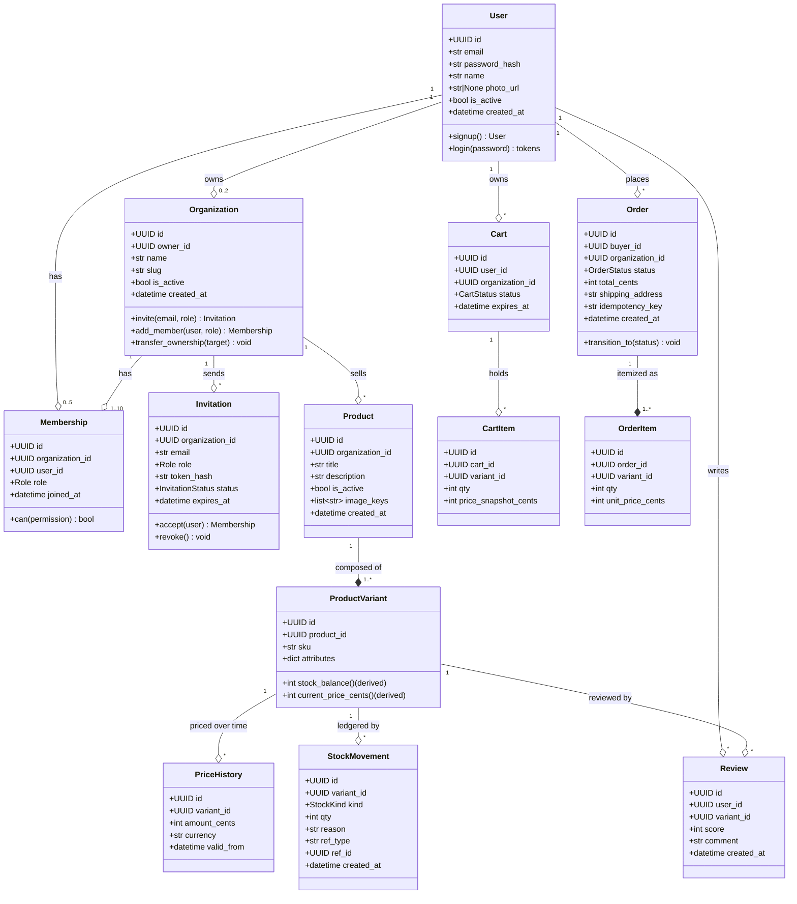
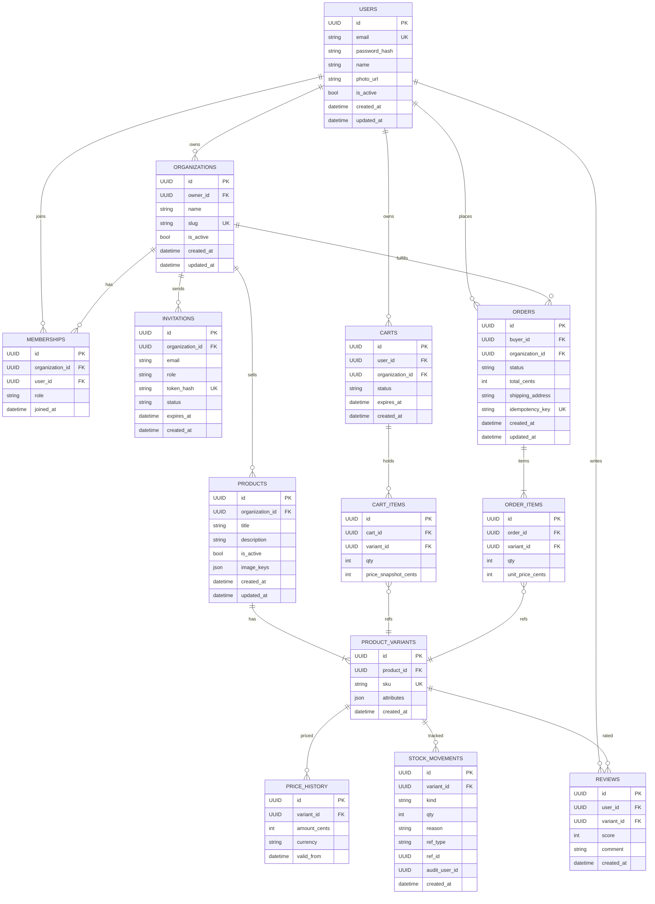
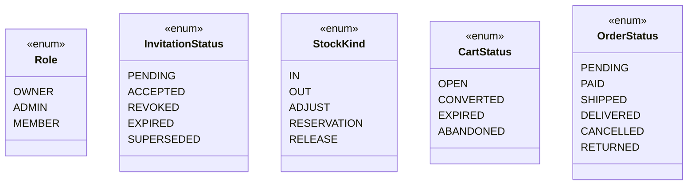

# Domain model

This page ships the **conceptual model** (UML class), the **physical model** (ER), and a glossary of each entity's attributes. Diagrams use Mermaid — rendered automatically by MkDocs Material.

## Class diagram (UML)

## ER diagram (physical model)

## Enums

## Invariants (executable summary)

| Entity | Invariant | Where it's enforced |
|--------|-----------|---------------------|
| `User` | unique email, active, bcrypt-hashed | DB constraint + signup service |
| `Organization` | owner is a member with role OWNER, unique slug, 1 OWNER per org | constraint + trigger or service |
| `Membership` | `(org_id, user_id)` unique, ≤10 per org, ≤5 per user, exactly 1 OWNER per org | unique constraint + service guard |
| `Invitation` | unique token_hash, expires in 7d, terminal status doesn't mutate | constraint + state machine in service |
| `Product` | ≥1 active variant to appear in the catalog | catalog query |
| `ProductVariant` | unique SKU within `organization_id` (via JOIN through product) | composite constraint + service |
| `PriceHistory` | append-only — no UPDATE/DELETE | revoke DB permissions + service |
| `StockMovement` | append-only, balance never negative | service guard + check constraint |
| `Order` | unique `idempotency_key`, transitions follow the state machine | constraint + state machine |

## Entity → SDK primitive mapping

| Entity | Inherits from | Repository | Service base |
|--------|---------------|-----------|--------------|
| `User` | `BaseUserModel` | `BaseRepository[UserModel]` | `BaseService` |
| `Organization` | `BaseModel + AuditMixin + SoftDeleteMixin` | `BaseRepository[OrganizationModel]` | `BaseService` |
| `Membership` | `BaseModel + AuditMixin` | `BaseRepository[MembershipModel]` | `BaseService` |
| `Invitation` | `BaseModel + AuditMixin` | `BaseRepository[InvitationModel]` | `BaseService` |
| `Product` | `BaseModel + AuditMixin + SoftDeleteMixin` | custom (JOINs variant+price) | `BaseService` |
| `ProductVariant` | `BaseModel + AuditMixin` | custom | `BaseService` |
| `PriceHistory` | `BaseModel` (no updated_at) | append-only | `BaseService` |
| `StockMovement` | `BaseModel` (no updated_at) | append-only via `bulk_create` when batching | `BaseService` |
| `Cart`/`CartItem` | `BaseModel + AuditMixin` | `BaseRepository[CartModel]` | `BaseService` |
| `Order`/`OrderItem` | `BaseModel + AuditMixin` | custom | `BaseService` |
| `Review` | `BaseModel + AuditMixin` | `BaseRepository[ReviewModel]` | `BaseService` |

`PriceHistory` and `StockMovement` are append-only, so their repository **doesn't expose `update` or `delete`** — only `create`/`list`/`get`. That prevents accidental ALTER on history.

## Next step

Jump to **[Critical flows](flows.en.md)** to see the sequence diagrams covering signup, invitation, product creation, checkout, and shipment.
