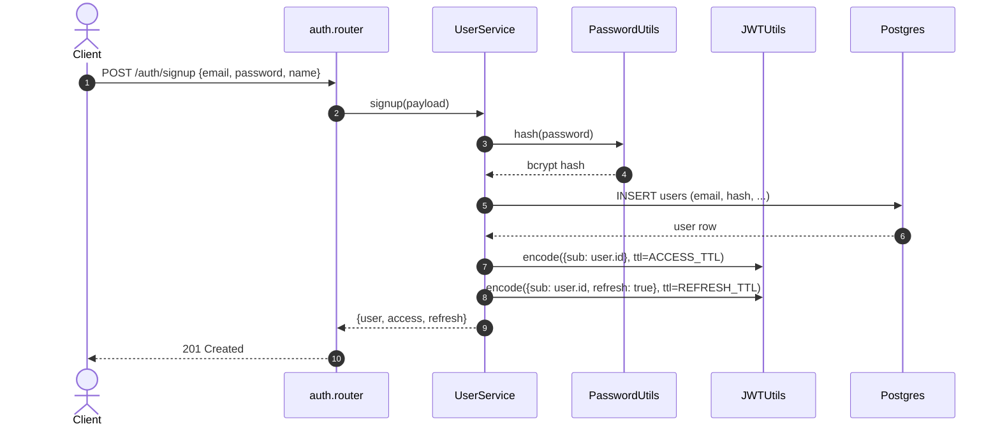
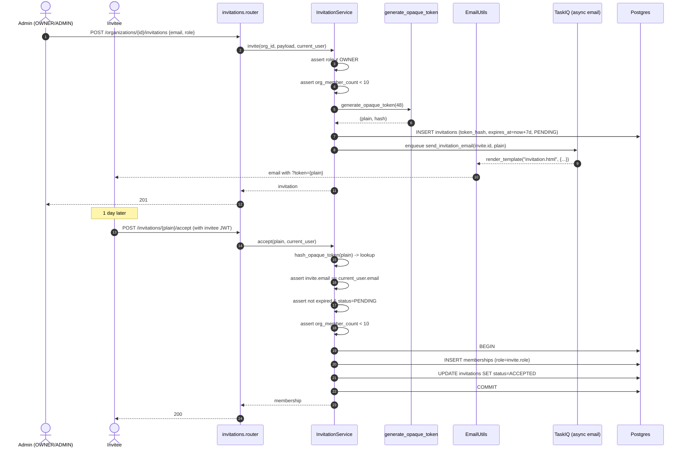
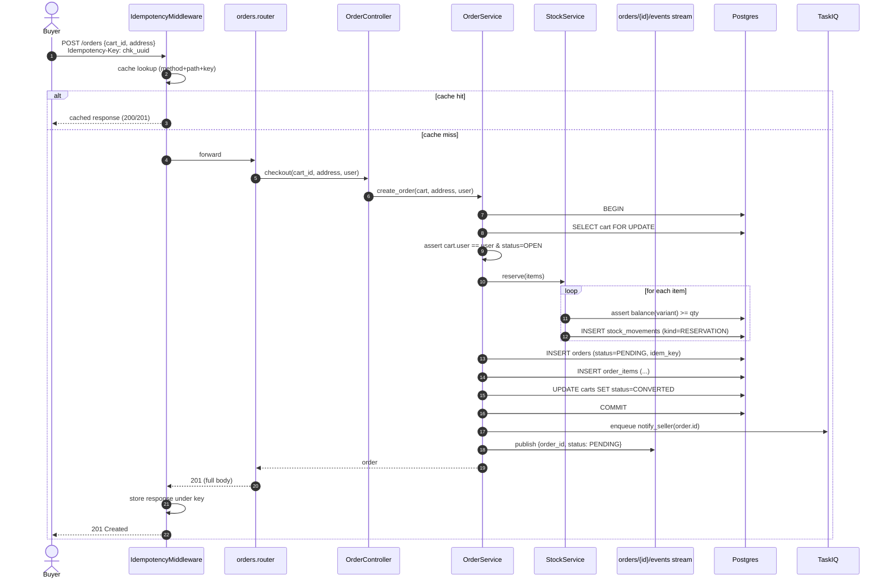
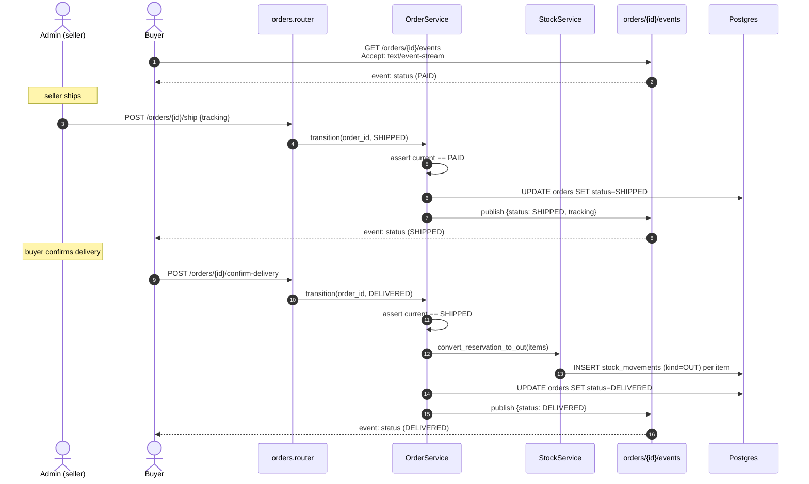
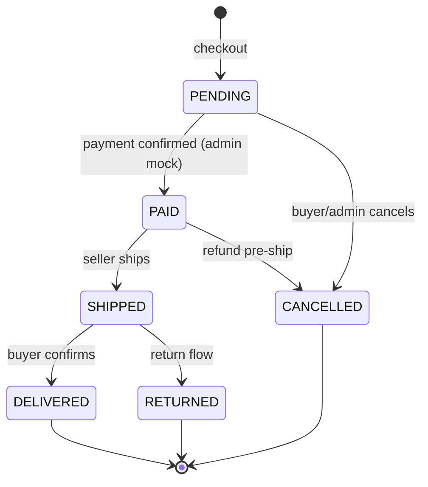
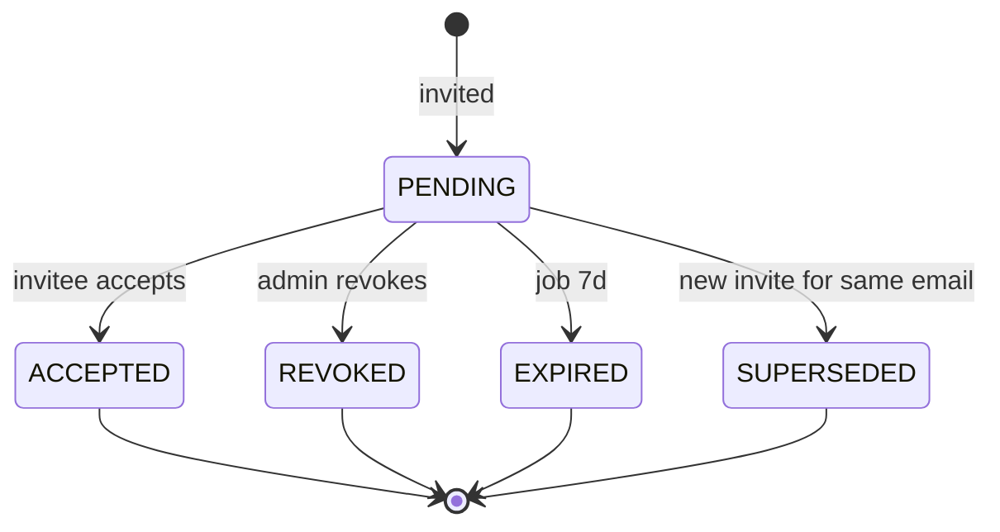

# Critical flows

Sequence diagrams for the 5 flows that **fail most often on first implementation**, plus the state machines for `Order` and `Invitation`. Each flow names the SDK primitives involved.

## 1. Public signup + login

**SDK touchpoints:**

- Public endpoint — `auth.router` doesn't use `Depends(get_current_user)`.
- `PasswordUtils.hash` (bcrypt) + `JWTUtils.encode` (HS256).
- Duplicate-email failure **MUST** become `ConflictException` → the SDK handler responds with `409` and the standard envelope.

## 2. Member invitation

**SDK touchpoints:**

- `generate_opaque_token(48)` returns `(plain, hash)`. Database stores only the hash.
- `EmailUtils.render_template("invitation.html", ctx)` (v0.24+).
- Send is async (TaskIQ) — endpoint returns `201` without waiting on SMTP.
- The acceptance is **one single transaction** — membership + invitation status are atomic.

## 3. Create product + variant + images

**SDK touchpoints:**

- Product creation is a single transaction — product + variants + first `PriceHistory` row.
- Images **never flow through the API** — the client `PUT`s directly to MinIO via a presigned URL (`MinIOUploadStorage.presigned_url` or `AsyncMinIOClient.presigned_put_url` directly).
- The public catalog reads `image_keys` and mints presigned read URLs (1h TTL).

## 4. Idempotent checkout

**SDK touchpoints:**

- `IdempotencyMiddleware` covers the endpoint without the handler having to care. If the buyer retries with the same `Idempotency-Key`, the middleware replays the original response — the handler does not run twice, stock is not decremented twice.
- Stock reservation lives **inside the same transaction** as the order `INSERT`. A failure on any item rolls everything back.
- The `SSE` notifies the stream (the buyer's client listening on `/orders/{id}/events`).
- `notify_seller` is queued — does not block the checkout response.

## 5. Shipping + real-time updates

**SDK touchpoints:**

- `EventStream` keeps a broadcaster per `order_id` — every connected buyer client receives the SSE.
- Transition **MUST** validate the source state (state machine inside the service).
- Stock becomes a definitive `OUT` only on delivery — cancelling earlier turns the `RESERVATION` into a `RELEASE`.

## State machine — Order

Forbidden transitions (any other arrow) **MUST** fail with `ConflictException("invalid state transition")`. Typical implementation is an enum + `dict[from, set[to]]` in the service.

## State machine — Invitation

`EXPIRED` is set by a TaskIQ task running hourly that sweeps invitations with `expires_at < now()`.

## Next step

Jump to the **[Endpoint map](api.en.md)** to see the full REST API ready to wire up the frontend contract.
