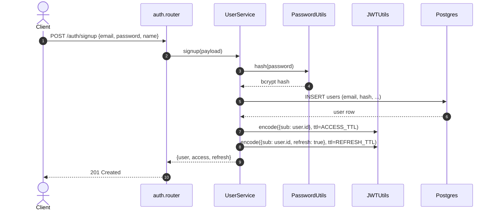
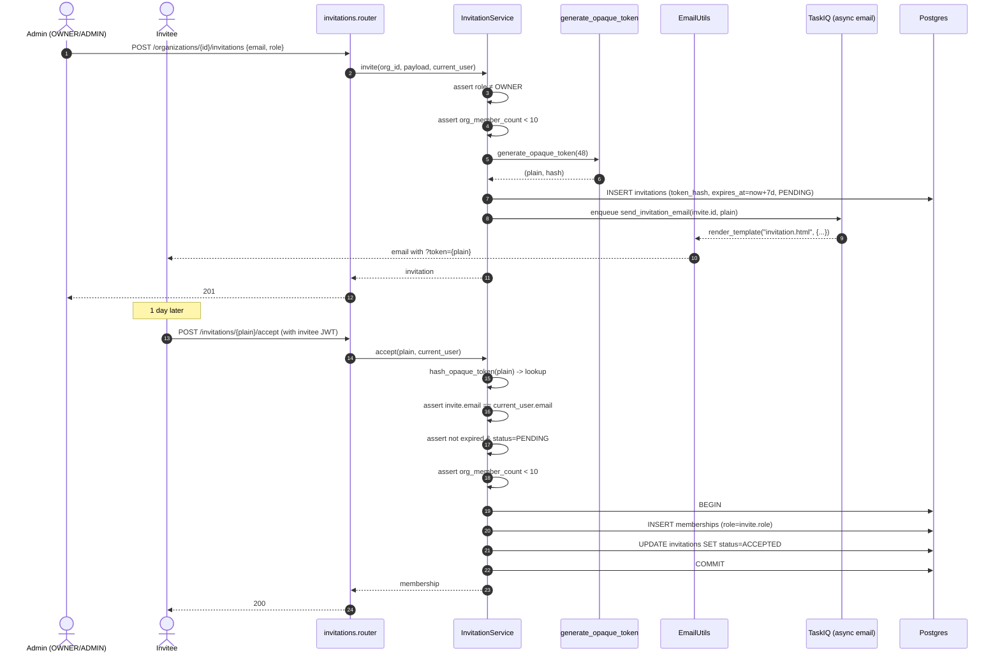
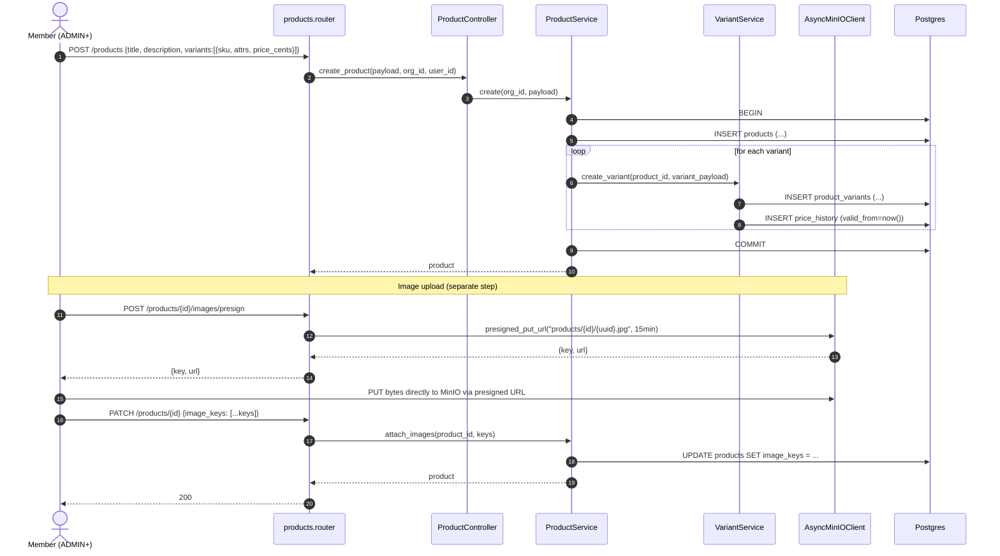
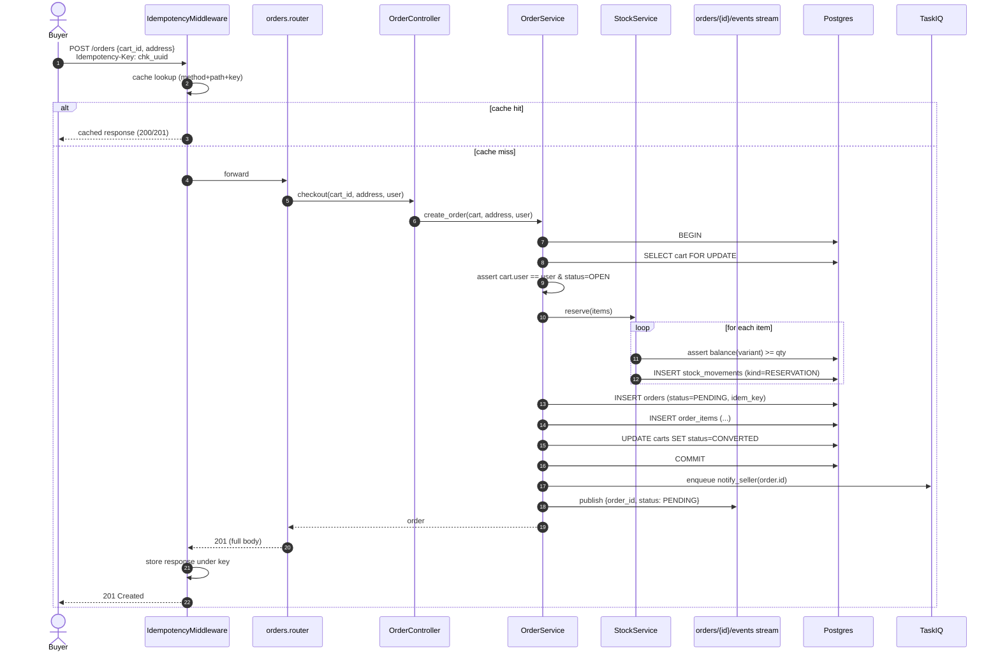
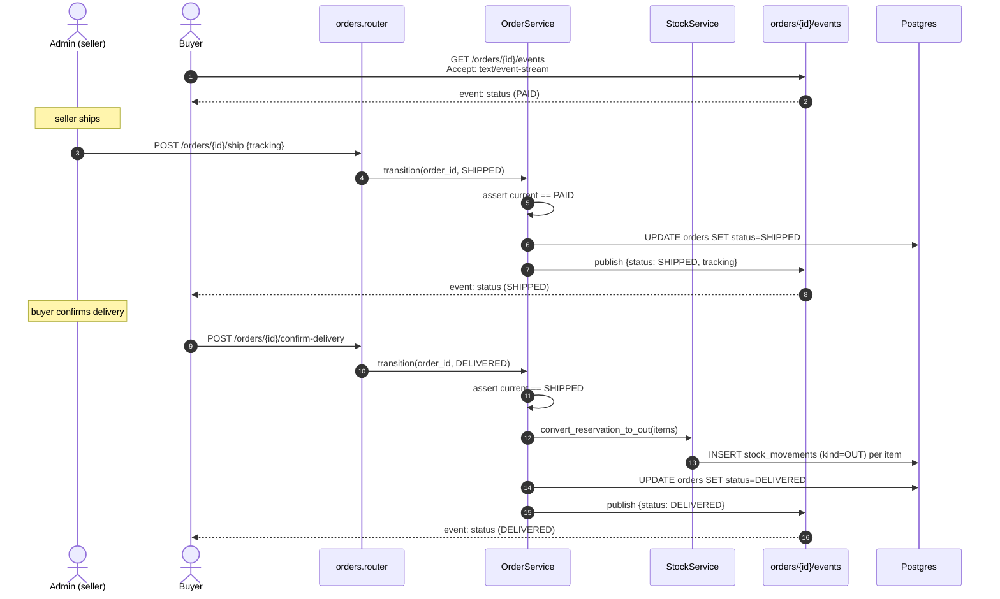
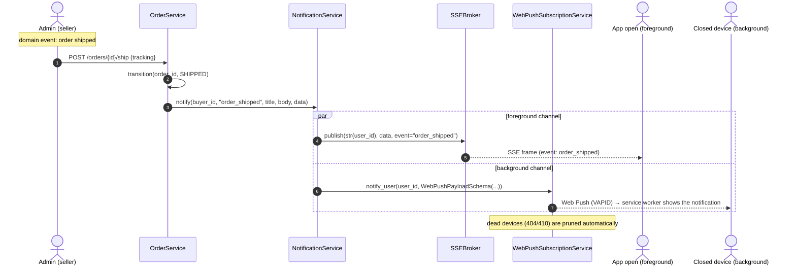
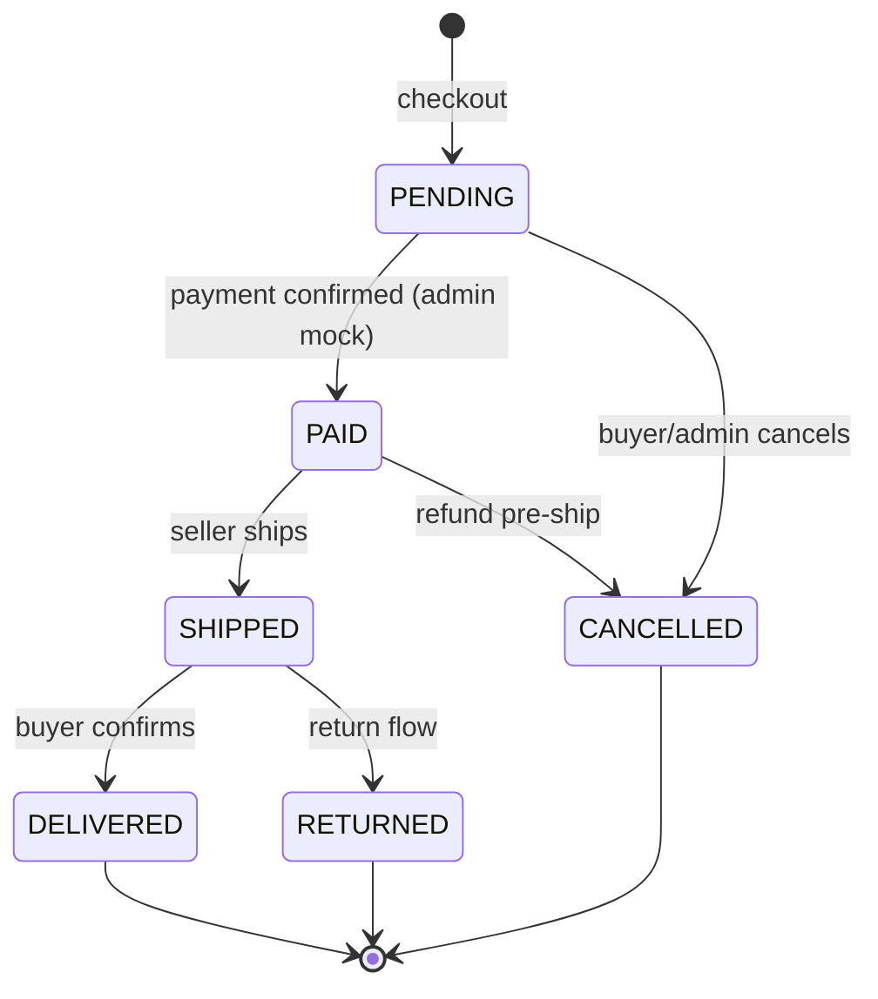
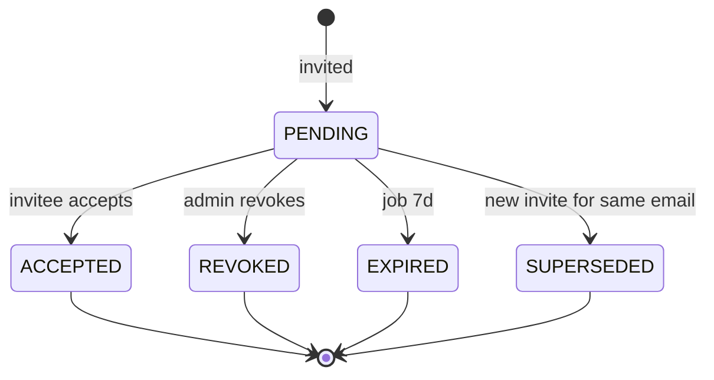

# Critical flows

Sequence diagrams for the flows that **fail most often on first implementation** — including real-time messaging (SSE + Web Push) — plus the state machines for `Order` and `Invitation`. Each flow names the SDK primitives involved.

## 1. Public signup + login



**SDK touchpoints:**

- Public endpoint — `auth.router` doesn't use `Depends(get_current_user)`.
- `PasswordUtils.hash` (bcrypt) + `JWTUtils.encode` (HS256).
- Duplicate-email failure **MUST** become `ConflictException` → the SDK handler responds with `409` and the standard envelope.

## 2. Member invitation



**SDK touchpoints:**

- `generate_opaque_token(48)` returns `(plain, hash)`.
- `EmailUtils.render_template("invitation.html", ctx)` (v0.24+).
- Send is async (TaskIQ) — endpoint returns `201` without waiting on SMTP.
- The acceptance is **one single transaction** — membership + invitation status are atomic.

!!! warning "The database stores only the hash"
    `generate_opaque_token(48)` returns `(plain, hash)`: the `plain` value only ever lives in the email sent to the invitee, and the database persists just `hash`. On acceptance the service calls `hash_opaque_token(plain)` and looks the row up by hash — a leak of the `invitations` table exposes no usable tokens.

## 3. Create product + variant + images



**SDK touchpoints:**

- Product creation is a single transaction — product + variants + first `PriceHistory` row.
- Images **never flow through the API** — the client `PUT`s directly to MinIO via a presigned URL minted by `AsyncMinIOClient.presigned_put_url` (`MinIOUploadStorage.presigned_url` is GET/read-only and cannot be used for upload).
- The public catalog reads `image_keys` and mints presigned read URLs (1h TTL).

## 4. Idempotent checkout



**SDK touchpoints:**

- `IdempotencyMiddleware` covers the endpoint without the handler having to care.
- Stock reservation lives **inside the same transaction** as the order `INSERT`. A failure on any item rolls everything back.
- The `SSE` notifies the stream (the buyer's client listening on `/orders/{id}/events`).
- `notify_seller` is queued — does not block the checkout response.

!!! note "Idempotency prevents double stock decrement"
    If the buyer retries with the same `Idempotency-Key` (reload, network timeout, double-tap), the middleware replays the original response — the handler **does not run twice**, so stock is **not decremented twice** and no duplicate order is created.

## 5. Shipping + real-time updates



**SDK touchpoints:**

- `SSEBroker` keeps one channel per user — every connected buyer client receives the frame (see flow 6 for the full fan-out).
- Transition **MUST** validate the source state (state machine inside the service).
- Stock becomes a definitive `OUT` only on delivery — cancelling earlier turns the `RESERVATION` into a `RELEASE`.

## 6. Notifications: SSE + Web Push (one event, two channels)

Every user-relevant domain event — order paid, order shipped, invite received, new review — is delivered on **two channels that carry the same payload**: **SSE** (`SSEBroker`, channel = user id) for clients with the app **open** (foreground, live) and **Web Push** (VAPID) for devices with the app/tab **closed** (background). It's "notification as messaging": a single `NotificationService.notify(...)` fans out to both.



**What "fan-out" means here:** the same domain event goes out on **two
different channels carrying an identical payload** — SSE for the open app (live
delivery, right now) and Web Push for the closed device (the service worker
wakes up and shows the notification). Whoever calls `notify(...)` **does not
pick** a channel: both always fire, with the same `data`. So the open app and
the closed app receive exactly the same information — only how it surfaces
differs.

### Step 1 — the producer fires a single event

The producer is a controller/service. Right after the domain transition (here,
the order became `SHIPPED`), it makes **one call** — it neither knows nor cares
that there are two channels underneath:

```python
await self.notifications.notify(
    order.buyer_id,
    event="order_shipped",
    title="Order on its way",
    body=f"Order {order.code} is out for delivery.",
    data={"order_id": str(order.id), "status": order.status},
)
```

What each argument does:

- **`order.buyer_id`** — **who** receives the notification. This id becomes the
  SSE **channel** and the Web Push **target**. It's the `buyer_id` (the buyer),
  **not** the seller who just shipped: the one who needs to know the order left
  is the buyer. It's the same id the buyer uses to subscribe to the stream
  (Step 3) — both sides **must** agree on the same channel string.
- **`event="order_shipped"`** — the event **name**. On SSE it becomes the frame's
  `event:` (the front listens with `addEventListener("order_shipped", ...)`); on
  Web Push it becomes the payload's `tag`.
- **`title` / `body`** — the **visible text** of the Web Push notification, which
  the service worker shows while the app is closed. The live SSE ignores these
  fields (the open app renders its own UI from `data`).
- **`data`** — the **machine payload**, identical on both channels. It's what the
  frontend reads to know which order changed and to which state.

### Step 2 — the `NotificationService` does the fan-out

The `NotificationService` is the **only** place that knows about both channels.
It takes that single call and unfolds it into two sends:

```python
# src/services/notification.py
from uuid import UUID

from tempest_fastapi_sdk import SSEBroker, WebPushPayloadSchema, WebPushSubscriptionService


class NotificationService:
    """Fan one domain event out to SSE (foreground) and Web Push (background)."""

    def __init__(self, broker: SSEBroker, push: WebPushSubscriptionService) -> None:
        self.broker = broker
        self.push = push

    async def notify(
        self, user_id: UUID, event: str, title: str, body: str, data: dict
    ) -> None:
        """Deliver one event on both channels with the same payload."""
        await self.broker.publish(str(user_id), data, event=event)
        await self.push.notify_user(
            user_id, WebPushPayloadSchema(title=title, body=body, tag=event, data=data)
        )
```

The two lines of `notify()`, one at a time:

- **`await self.broker.publish(str(user_id), data, event=event)`** — the
  **foreground (live)** channel. Sends `data` to **every** SSE stream subscribed
  to the channel `str(user_id)` — that is, each tab/app the user has open right
  now. It's fire-and-forget: if nobody is connected, the `publish` does nothing
  (no error). Note the channel is the string form of the same `user_id`.
- **`await self.push.notify_user(user_id, WebPushPayloadSchema(...))`** — the
  **background** channel. Sends a Web Push (VAPID) to **every** device the user
  registered; each one's service worker shows the notification even with the
  app/tab **closed**. Dead devices (they answer 404/410) are **pruned**
  automatically from the database. The `WebPushPayloadSchema` wraps `title`/`body`
  (visible text), `tag=event` (groups notifications of the same kind) and the
  **same** `data` that went to SSE.

The key point: `data` is **the same object** in both sends. The open app receives
it via SSE and the closed app via Web Push, but the content is identical — that's
why the frontend can handle both with a single handler.

### Step 3 — the client subscribes to the stream (`GET /notifications/stream`)

On the other side, the client with the app open subscribes to its own channel to
receive the SSE half. The endpoint is one line: `broker.response(str(user.id))`.

```python
# src/api/routers/notifications.py
from fastapi import APIRouter, Depends
from starlette.responses import StreamingResponse

from tempest_fastapi_sdk import SSEBroker

from src.api.dependencies.auth import get_current_user
from src.api.dependencies.resources import get_broker

router = APIRouter()


@router.get("/notifications/stream")
async def notifications_stream(
    user: User = Depends(get_current_user),
    broker: SSEBroker = Depends(get_broker),
) -> StreamingResponse:
    """Subscribe the caller to their own notification channel and stream it."""
    return broker.response(str(user.id))
```

What happens on each `GET /notifications/stream`:

1. `Depends(get_current_user)` resolves **who** is asking for the stream. Their id
   is the key to everything — it's the same id the producer used as the channel
   in Step 1.
2. `Depends(get_broker)` hands back the **same** `SSEBroker` singleton the
   `NotificationService` publishes to (without this, the `publish` and the
   `response` would talk to different brokers and nothing would arrive).
3. `broker.response(str(user.id))` does **three things in a single call**:
     - **register** — creates a fresh `EventStream` and subscribes it to the
       `user.id` channel;
     - **stream** — returns a `StreamingResponse` with the SSE headers already
       set, and the client starts receiving frames;
     - **unregister** — wires an `on_disconnect` that removes this stream from the
       channel when the client drops, so no registration leaks.

From then on, every `broker.publish(str(user.id), ...)` from Step 2 lands on this
stream. An SSE frame it receives:

```text
event: order_shipped
id: 01J8Z9F2K7Q3M5R8T0W1X2Y3Z4
data: {"order_id": "9f8e7d6c-5b4a-3210-fedc-ba9876543210", "status": "SHIPPED"}

```

**SDK touchpoints:**

- **SSE is core** (no extra): `SSEBroker()`, `await broker.publish(channel, data, event=..., id=..., retry=...)`, `broker.response(channel)` builds the `StreamingResponse` that subscribes to the channel and unregisters on disconnect. **Multi-worker** SSE needs `SSEBroker(redis=...)` + `broker.run()` in the lifespan → `[cache]` extra.
- **Web Push needs the `[webpush]` extra** (`uv add "tempest-fastapi-sdk[webpush]"`): build `WebPushDispatcher(**settings.webpush_kwargs())`, pass it into `WebPushSubscriptionService(repository, dispatcher)`; `await service.notify_user(user_id, payload, *, ttl_seconds=None, exclude_endpoints=None)` sends to all the user's devices and prunes the dead ones (404/410).
- The same `data` travels on both channels — the frontend handles SSE and Web Push with the same handler.
- Primitive details: **[SSE recipe »](../../recipes/sse.en.md)** and **[Web Push recipe »](../../recipes/webpush.en.md)**.

## State machine — Order



!!! warning "Invalid transitions must fail with ConflictException"
    Forbidden transitions (any other arrow) **MUST** fail with `ConflictException("invalid state transition")`. Typical implementation is an enum + `dict[from, set[to]]` in the service.

## State machine — Invitation



`EXPIRED` is set by a TaskIQ task running hourly that sweeps invitations with `expires_at < now()`.

## Next step

Jump to the **[Endpoint map](api.en.md)** to see the full REST API ready to wire up the frontend contract.
