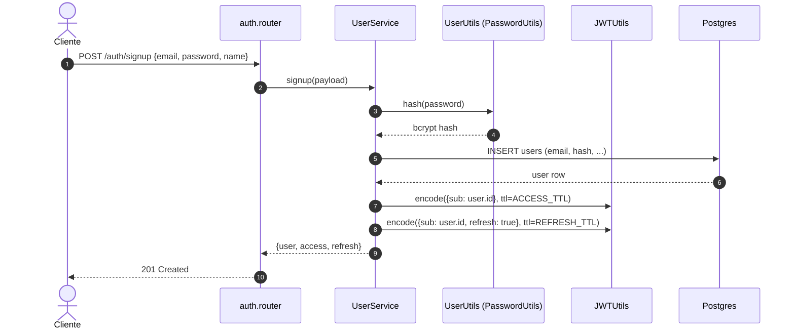
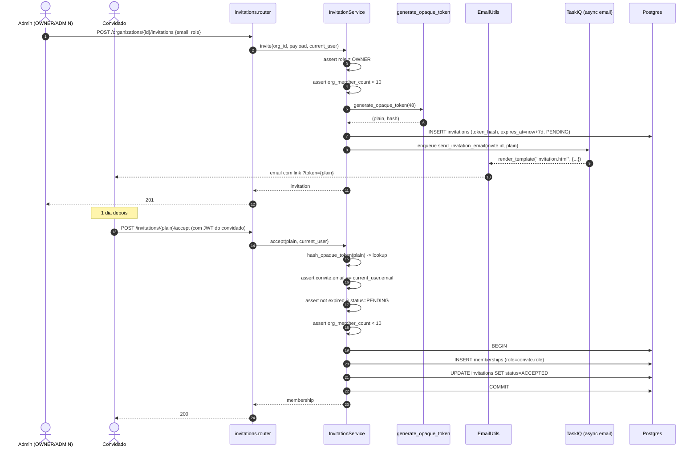
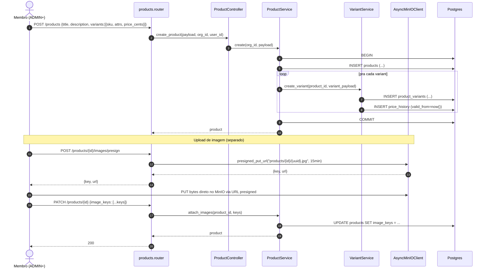
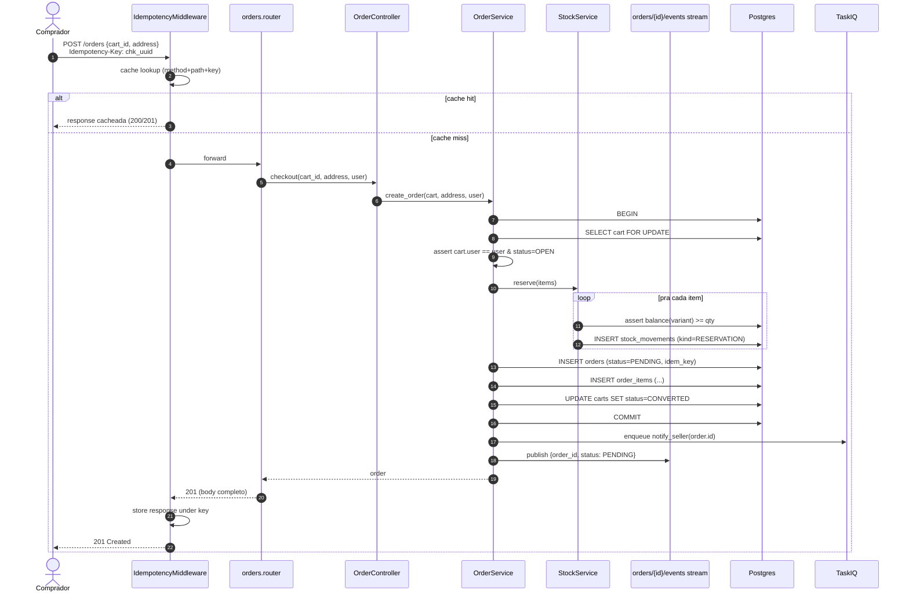
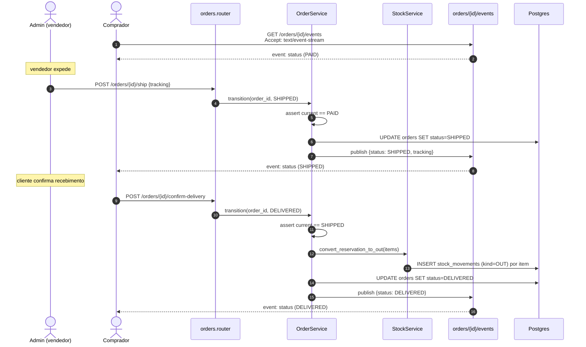
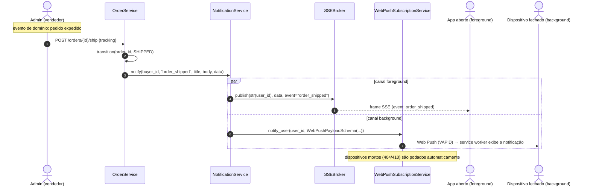
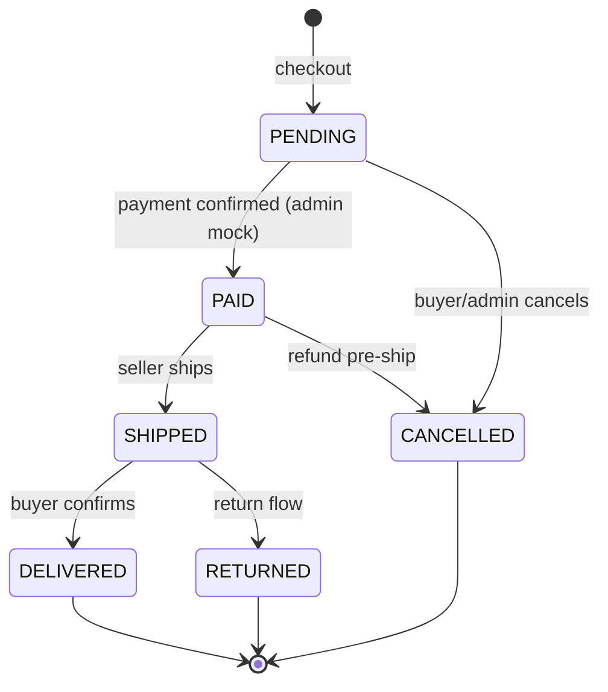
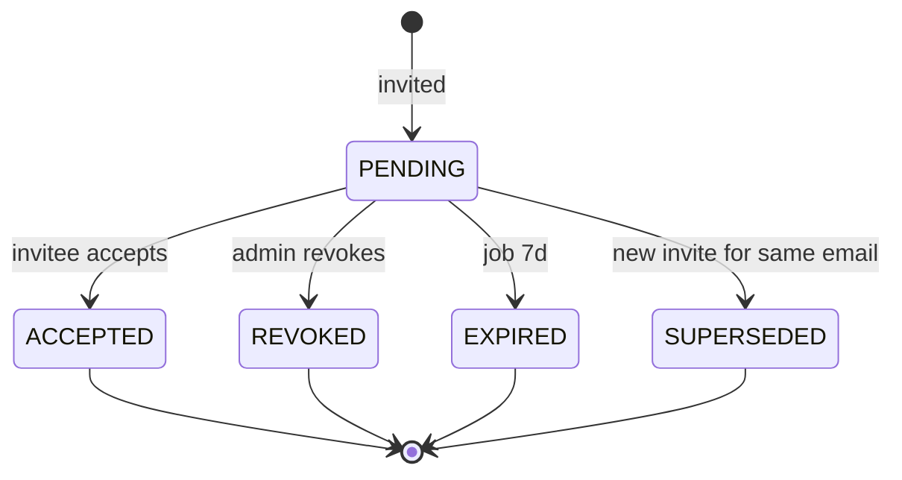

# Fluxos críticos

Diagramas de sequência para os fluxos que **mais erram na primeira implementação** — incluindo a mensageria em tempo real (SSE + Web Push) — junto com as máquinas de estado de `Order` e `Invitation`. Cada fluxo aponta os primitivos do SDK envolvidos.

## 1. Signup público + login



**Pontos do SDK:**

- Endpoint público — `auth.router` não usa `Depends(get_current_user)`.
- `PasswordUtils.hash` (bcrypt) + `JWTUtils.encode` (HS256).
- Falha de email duplicado **MUST** virar `ConflictException` → handler do SDK responde `409` com envelope padrão.

## 2. Convite de membro



**Pontos do SDK:**

- `generate_opaque_token(48)` retorna par `(plain, hash)`.
- `EmailUtils.render_template("invitation.html", ctx)` (v0.24+).
- O envio é assíncrono (TaskIQ) — endpoint retorna `201` sem esperar SMTP.
- Toda a aceitação é **uma única transação** — membership + status do convite são atomic.

!!! warning "O banco guarda só o hash"
    `generate_opaque_token(48)` devolve `(plain, hash)`: o valor `plain` só existe no email enviado ao convidado, e o banco persiste apenas `hash`. Na aceitação, o service faz `hash_opaque_token(plain)` e busca pelo hash — um vazamento da tabela `invitations` não expõe tokens utilizáveis.

## 3. Criar produto com variante + imagens



**Pontos do SDK:**

- Criação de produto é transação única — produto + variantes + primeira linha de `PriceHistory`.
- Imagens **não trafegam pela API** — cliente faz `PUT` direto no MinIO via URL presigned gerada por `AsyncMinIOClient.presigned_put_url` (o `MinIOUploadStorage.presigned_url` é GET/leitura, não serve pra upload).
- Catálogo público lê `image_keys` e gera URLs presigned de leitura (TTL 1h).

## 4. Checkout idempotente



**Pontos do SDK:**

- `IdempotencyMiddleware` cobre o endpoint sem o handler precisar saber.
- Reserva de estoque é **dentro da mesma transação** do `INSERT` do pedido. Falha em qualquer item aborta tudo.
- A `SSE` notifica o stream (cliente do comprador escutando em `/orders/{id}/events`).
- O notify_seller vai pra fila — não bloqueia a resposta do checkout.

!!! note "Idempotência evita decremento duplo de estoque"
    Se o comprador retentar com a mesma `Idempotency-Key` (reload, timeout de rede, double-tap), o middleware devolve a resposta original — o handler **não roda 2x**, então o estoque **não é decrementado 2x** e nenhum pedido duplicado é criado.

## 5. Expedição + atualização em tempo real



**Pontos do SDK:**

- `SSEBroker` mantém um canal por usuário — cada cliente conectado do comprador recebe o frame (ver fluxo 6 pro fan-out completo).
- Transição **MUST** validar o estado origem (state machine no service).
- Estoque vira `OUT` definitivo só na entrega — se cancelar antes, o `RESERVATION` vira `RELEASE`.

## 6. Notificações: SSE + Web Push (um evento, dois canais)

Todo evento de domínio relevante pro usuário — pedido pago, pedido expedido, convite recebido, novo review — é entregue em **dois canais que carregam o mesmo payload**: **SSE** (`SSEBroker`, canal = id do usuário) pros clientes com o app **aberto** (foreground, ao vivo) e **Web Push** (VAPID) pros dispositivos com o app/aba **fechado** (background). É "notificação como mensageria": um único `NotificationService.notify(...)` faz o fan-out pros dois.



O produtor (um controller/service) dispara o evento logo após a transição de domínio:

```python
await self.notifications.notify(
    order.buyer_id,
    event="order_shipped",
    title="Pedido a caminho",
    body=f"Pedido {order.code} saiu para entrega.",
    data={"order_id": str(order.id), "status": order.status},
)
```

O `NotificationService` é o único ponto que conhece os dois canais:

```python
# src/services/notification.py
from uuid import UUID

from tempest_fastapi_sdk import SSEBroker, WebPushPayloadSchema, WebPushSubscriptionService


class NotificationService:
    """Fan one domain event out to SSE (foreground) and Web Push (background)."""

    def __init__(self, broker: SSEBroker, push: WebPushSubscriptionService) -> None:
        self.broker = broker
        self.push = push

    async def notify(
        self, user_id: UUID, event: str, title: str, body: str, data: dict
    ) -> None:
        """Deliver one event on both channels with the same payload."""
        await self.broker.publish(str(user_id), data, event=event)
        await self.push.notify_user(
            user_id, WebPushPayloadSchema(title=title, body=body, tag=event, data=data)
        )
```

O cliente com o app aberto assina `GET /notifications/stream`, que devolve `broker.response(str(user.id))`. Um frame SSE que chega nele:

```text
event: order_shipped
id: 01J8Z9F2K7Q3M5R8T0W1X2Y3Z4
data: {"order_id": "9f8e7d6c-5b4a-3210-fedc-ba9876543210", "status": "SHIPPED"}

```

**Pontos do SDK:**

- **SSE é core** (sem extra): `SSEBroker()`, `await broker.publish(channel, data, event=..., id=..., retry=...)`, `broker.response(channel)` já monta a `StreamingResponse` que assina o canal e desregistra ao desconectar. SSE **multi-worker** precisa de `SSEBroker(redis=...)` + `broker.run()` no lifespan → extra `[cache]`.
- **Web Push precisa do extra `[webpush]`** (`uv add "tempest-fastapi-sdk[webpush]"`): monte `WebPushDispatcher(**settings.webpush_kwargs())`, passe-o pro `WebPushSubscriptionService(repository, dispatcher)`; `await service.notify_user(user_id, payload, *, ttl_seconds=None, exclude_endpoints=None)` envia pra todos os dispositivos do usuário e poda os mortos (404/410).
- O mesmo `data` viaja nos dois canais — o frontend trata SSE e Web Push com o mesmo handler.
- Detalhes dos primitivos: **[Receita SSE »](../../recipes/sse.md)** e **[Receita Web Push »](../../recipes/webpush.md)**.

## Máquina de estados — Order



!!! warning "Transições inválidas devem falhar com ConflictException"
    Transições proibidas (qualquer outra setinha) **MUST** falhar com `ConflictException("invalid state transition")`. Implementação típica num enum + `dict[from, set[to]]` no service.

## Máquina de estados — Invitation



`EXPIRED` é set por tarefa TaskIQ que roda de hora em hora varrendo convites com `expires_at < now()`.

## Próximo passo

Pula pro **[Mapa de endpoints](api.md)** ver a API REST completa pronta pra cabear contratos no frontend.
