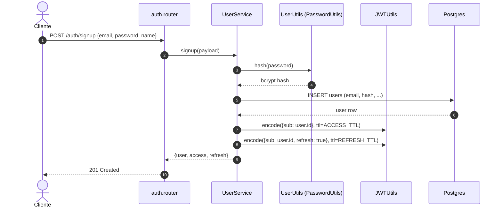
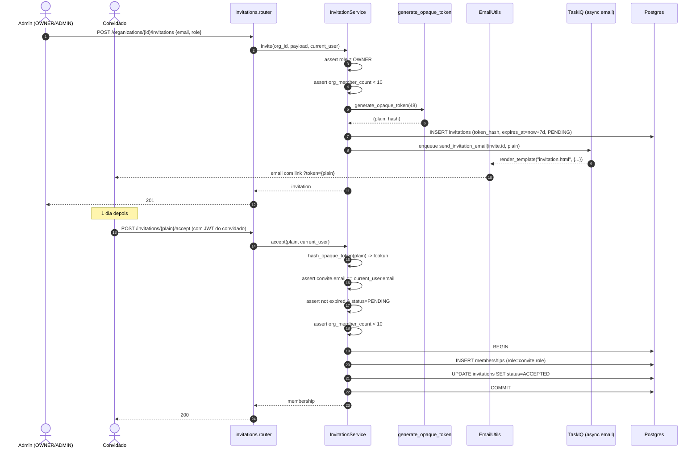
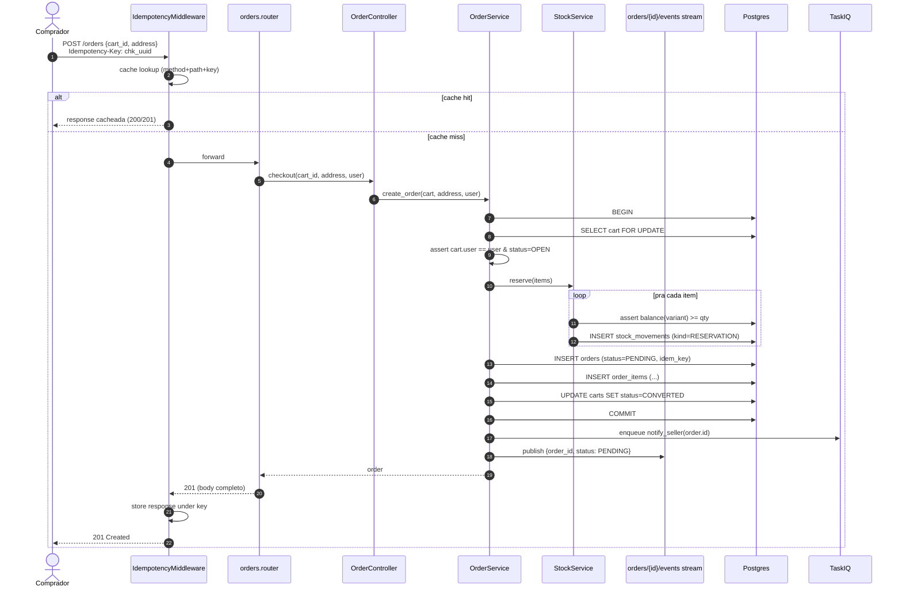
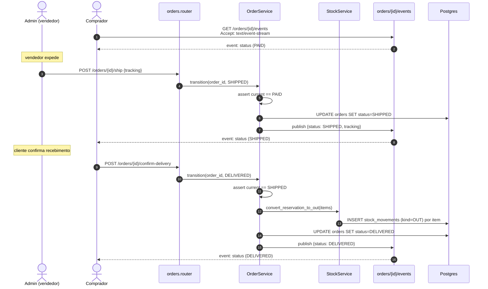
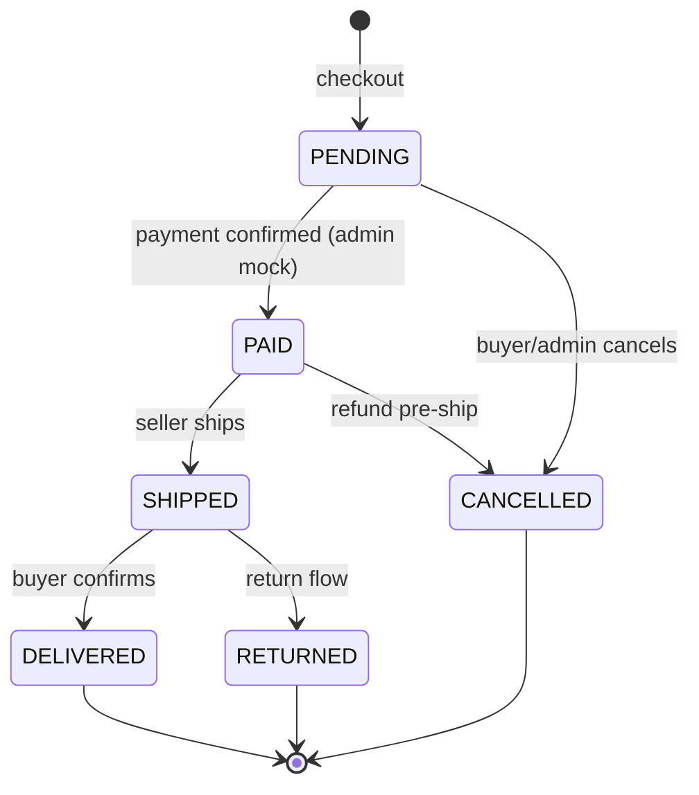
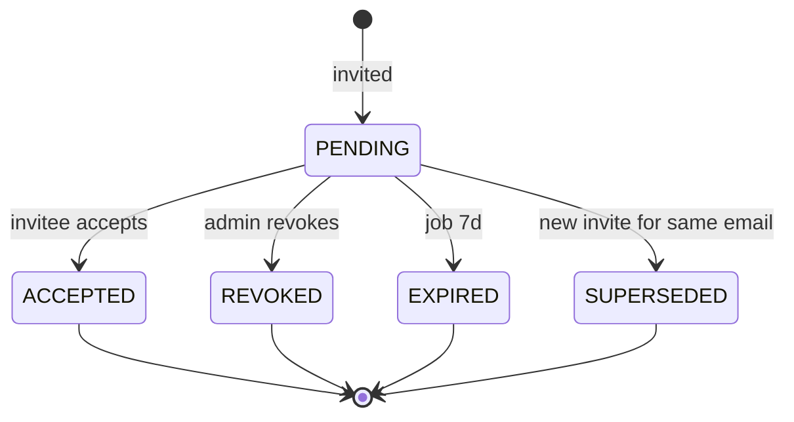

# Fluxos críticos

Diagramas de sequência para os 5 fluxos que **mais erram na primeira implementação**, junto com as máquinas de estado de `Order` e `Invitation`. Cada fluxo aponta os primitivos do SDK envolvidos.

## 1. Signup público + login

**Pontos do SDK:**

- Endpoint público — `auth.router` não usa `Depends(get_current_user)`.
- `PasswordUtils.hash` (bcrypt) + `JWTUtils.encode` (HS256).
- Falha de email duplicado **MUST** virar `ConflictException` → handler do SDK responde `409` com envelope padrão.

## 2. Convite de membro

**Pontos do SDK:**

- `generate_opaque_token(48)` retorna par `(plain, hash)`. Banco guarda só o hash.
- `EmailUtils.render_template("invitation.html", ctx)` (v0.24+).
- O envio é assíncrono (TaskIQ) — endpoint retorna `201` sem esperar SMTP.
- Toda a aceitação é **uma única transação** — membership + status do convite são atomic.

## 3. Criar produto com variante + imagens

**Pontos do SDK:**

- Criação de produto é transação única — produto + variantes + primeira linha de `PriceHistory`.
- Imagens **não trafegam pela API** — cliente faz `PUT` direto no MinIO via URL presigned (`MinIOUploadStorage.presigned_url` ou direto `AsyncMinIOClient.presigned_put_url`).
- Catálogo público lê `image_keys` e gera URLs presigned de leitura (TTL 1h).

## 4. Checkout idempotente

**Pontos do SDK:**

- `IdempotencyMiddleware` cobre o endpoint sem o handler precisar saber. Se o comprador retentar com a mesma `Idempotency-Key`, o middleware devolve a resposta original — handler não roda 2x, estoque não é decrementado 2x.
- Reserva de estoque é **dentro da mesma transação** do `INSERT` do pedido. Falha em qualquer item aborta tudo.
- A `SSE` notifica o stream (cliente do comprador escutando em `/orders/{id}/events`).
- O notify_seller vai pra fila — não bloqueia a resposta do checkout.

## 5. Expedição + atualização em tempo real

**Pontos do SDK:**

- `EventStream` mantém um broadcaster por `order_id` — cada cliente do comprador conectado recebe via SSE.
- Transição **MUST** validar o estado origem (state machine no service).
- Estoque vira `OUT` definitivo só na entrega — se cancelar antes, o `RESERVATION` vira `RELEASE`.

## Máquina de estados — Order

Transições proibidas (qualquer outra setinha) **MUST** falhar com `ConflictException("invalid state transition")`. Implementação típica num enum + `dict[from, set[to]]` no service.

## Máquina de estados — Invitation

`EXPIRED` é set por tarefa TaskIQ que roda de hora em hora varrendo convites com `expires_at < now()`.

## Próximo passo

Pula pro **[Mapa de endpoints](api.md)** ver a API REST completa pronta pra cabear contratos no frontend.
