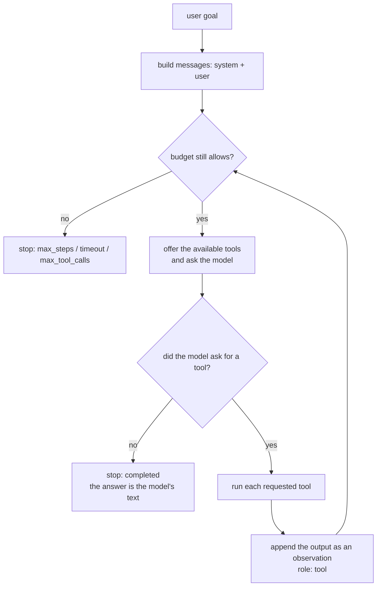

# Agents: how they work inside

The other pages show **what to write**. This one explains **what happens** when
you call `agent.run(...)`: the loop, what the model receives on each turn, what
grows, what it costs, and why the module's pieces have the shape they have.

Read it before designing a real agent. After it, the decisions usually made by
guesswork — tool or skill? agent or pipeline? how much budget? — have a
criterion.

!!! info "Everything here was measured, not deduced"
    Every transcript and every number on this page came from a real run
    against the SDK's `ScriptedBackend` — a test backend that replies what you
    wrote. No model weights are downloaded, and you can reproduce it in
    seconds. How, is in [Testing an agent](agents-testing.md).

## An agent is a loop, not a call

A chat call is one question and one answer. An agent is a **loop** that ends
only when the model stops asking for things:



Three things fall out of that picture, and they explain almost everything else:

1. **Your process runs the tools, not the model.** The model only emits a
   request — a name and arguments. If nobody runs it, nothing happens.
2. **The model decides when to stop.** It stops when it answers without asking
   for anything else. Every other ending is the agent cutting from outside.
3. **Every turn resends everything.** The model does not "remember" the
   previous turn: the whole history goes again, on every call.

### The vocabulary

| Term | What it is | Where it shows |
| --- | --- | --- |
| **Goal** | The text you passed to `run()` | `run.goal` |
| **Step** (`AgentStep`) | One turn of the loop: either the model speaking, or a tool running | `run.steps` |
| **Observation** | What a tool returned, handed to the model as a `tool` message | `step.output` |
| **Artifact** | Named bytes the run produced (image, PDF, WAV) | `run.artifacts` |
| **Budget** (`AgentBudget`) | The ceilings on steps, time and calls you imposed | passed to `Agent`; what was actually spent is `run.seconds` |
| **`stop_reason`** | Why the loop ended | `run.stop_reason` |
| **Trace** | The steps, in order, with timings and errors | `run.steps` |

!!! note "A step is not the same as a model turn"
    A turn with one tool call produces **two** steps: the `model` that asked
    and the `tool` that ran. A goal solved with three tools gives seven steps
    — four from the model, three from the tools. `max_steps` counts both
    kinds.

## What the model sees on each turn

This is the part most explanations skip, and it is what makes the rest obvious.
An agent with one tool, solving a goal in two turns — the literal transcript
that reached the backend:

```text title="call 1 to the model: 2 messages"
{"role": "system", "content": "You are a capable assistant working towards the user's goal. Use the available tools when they help and answer directly when they do not. When a tool fails, read the error and try a different approach rather than repeating the same call. When you have the answer, reply with it and stop calling tools."}
{"role": "user", "content": "Qual o tempo no Recife?"}
```

The model replied asking for `get_weather({"city": "Recife"})`. The agent ran
the tool and asked again — now with its own request and the result inside the
conversation:

```text title="call 2 to the model: 4 messages"
{"role": "system", "content": "You are a capable assistant working towards the user's goal. ..."}
{"role": "user", "content": "Qual o tempo no Recife?"}
{"role": "assistant", "content": "", "tool_calls": [{"function": {"name": "get_weather", "arguments": {"city": "Recife"}}}]}
{"role": "tool", "content": "Recife: 22 graus, ceu limpo"}
```

Four roles, each doing one job:

| Role | Who writes it | What for |
| --- | --- | --- |
| `system` | You (`system_prompt`), plus whatever memory and skills inject | The standing instruction: who the model is, how to behave |
| `user` | The goal passed to `run()` | What needs doing |
| `assistant` | The model | Its text **and** the tool requests for that turn |
| `tool` | The SDK, after executing | The result — or the error — the model reads on the next turn |

!!! tip "A tool's reply is text for the model to read"
    It is not a return value in a program: it is a message the model will
    **interpret**. `"ok"` says little; `"invoice 41...: R$ 1,240.50, issuer
    CNPJ 12..."` says what it needs for the next step. Write tool output for a
    reader, not for a parser.

## Tool calling: the model asks, the SDK executes

Alongside the messages, the agent sends the **list of available tools** — name,
description and a JSON schema of the arguments. That is all the model knows
about them:

```json
{"type": "function", "function": {"name": "get_weather", "description": "Get the current weather for a city.", "parameters": {"type": "object", "properties": {"city": {"type": "string"}}, "required": ["city"]}}}
```

Three practical consequences follow:

- **The `description` is the interface.** It is the only text the model reads
  to decide. It deserves more care than the implementation — which is why
  `@tool` derives the schema from your Pydantic model instead of letting you
  write the same thing twice ([Typed tools](agents.md#pydantic-typed-tools)).
- **A bad argument is normal, not exceptional.** The model sometimes invents a
  field. Validation runs **before** your handler and returns the error as an
  observation, so it can correct itself on the next turn.
- **A failing tool does not end the run.** A handler that raises becomes an
  observation. Measured: with a handler raising
  `AgentToolError("disco cheio")`, the message that reaches the model is

  ```json
  {"role": "tool", "content": "AgentToolError: disco cheio"}
  ```

  and the run continues, ending `completed`. Propagating the exception would
  throw away everything the run had already done.

!!! warning "Not every backend does tool calling"
    `chat_with_tools` is optional in the protocol. A backend that does not
    implement it falls back to plain `chat` — the agent answers in a single
    turn, with no tools at all. Measured: an agent **with no tools** ends in 1
    step, with an empty spec list. Useful as a one-shot answerer; silent if
    you expected tools.

## The context grows every turn — and you pay for it

Because every turn resends the whole history, the cost per call **rises** as
the run goes on. Measured on an agent with three tools, each returning 40
characters:

| Call | Messages | Conversation size | Roles |
| --- | --- | --- | --- |
| 1 | 2 | 384 chars | system, user |
| 2 | 4 | 557 chars | + assistant, tool |
| 3 | 6 | 729 chars | + assistant, tool |
| 4 | 8 | 902 chars | + assistant, tool |

Each cycle added two messages and ~172 characters — the model's request plus
the observation. The whole run cost 4 calls and 7 steps for 3 tools.

The number is small because the outputs are small. Swap in a tool returning
8 KB of JSON and the fourth call carries the three previous results along,
whether the model needed them or not.

!!! danger "This is how a run gets expensive without anyone noticing"
    A run's cost is not the sum of its calls: it is the **sum of its
    prefixes**. Doubling the number of turns more than doubles the cost. Three
    things hold it down, each a section on the other pages:

    - **Short, useful tool output** — return the summary, not the dump.
    - **[Skills](agents-advanced.md#skills-capabilities-loaded-on-demand)** —
      long instructions stay out of the prompt until they are needed.
    - **[Delegation](agents-advanced.md#delegating-to-another-agent)** — the
      specialist's history dies with it; the parent gets only the conclusion.

## Why the budget exists

A loop whose stopping condition is "the model decided" is a loop a confused
model does not close. `AgentBudget` cuts from outside, with three ceilings:

| Ceiling | Default | Protects against |
| --- | --- | --- |
| `max_steps` | 12 | The model asking for tools forever |
| `max_seconds` | 120 | A tool that hangs — no step is spent, the clock is |
| `max_tool_calls` | no limit | One expensive tool called ten times in a short run |

Measured with a model that **never** stops asking for a tool and
`max_steps=4`: the run ends with `stop_reason=max_steps`, `succeeded=False`, 4
steps — and an **empty** `output`, because the model never got around to
writing text.

!!! warning "A cut run is neither a failed run nor a finished one"
    `succeeded` is `True` only when the model decided to stop. A cut run may
    carry partial work in `output` — or an empty string, as above. Reading
    `output` without checking `stop_reason` is presenting a draft as a
    delivery.

Time is the ceiling that actually protects an HTTP request, which is why it has
a default instead of being optional. In a FastAPI route, the agent's budget is
what keeps the request from staying open indefinitely.

## How a run ends

| `stop_reason` | Who decided | What to do |
| --- | --- | --- |
| `completed` | The model | Use `output` |
| `max_steps` | The agent | Raise the ceiling, or simplify the goal |
| `timeout` | The agent | Check the trace for the slow step |
| `max_tool_calls` | The agent | Almost always a repeat-the-same-tool loop |
| `error` | The backend | The model failed; `output` carries the error |
| `blocked` | Moderation | Goal or answer refused |

## Agent, chat, pipeline or loop?

"Agent" has become a name for several different things. Here the choice is
concrete:

| You need… | Use | Why |
| --- | --- | --- |
| An answer to a question, no action | `TextGenerator` / [chat](chat.md) | A loop for a single turn is overhead and variance |
| **Known** steps, in the same order, always | Ordinary code calling the model | If you know the order, letting the model choose only adds variance |
| Steps that **depend** on what was discovered | `Agent` | That is exactly what the loop solves |
| A typed object at the end | `agent.run_structured(...)` | The answer becomes a validated tool argument |
| To insist until a criterion passes | `run_until` / `refine` | The criterion is yours, checked outside the model |

!!! tip "The honest test: can you draw the flowchart?"
    If you can draw the whole flow up front, **write the flow**. An agent beats
    code when the next step depends on the previous result in a way you cannot
    enumerate — and you pay for that with variance, latency and cost.

## Tool, skill, delegation or loop?

The four look like alternatives and are not: each solves a different problem,
and each costs somewhere different.

| Piece | When | What it costs | Where |
| --- | --- | --- | --- |
| **Tool** | A capability the agent uses directly | Name + description + schema, on **every** call | Context, always |
| **Skill** | A capability with long instructions, used sometimes | One line of description until it is loaded | Context, only after the load |
| **Delegation** | Big work with a history of its own | One tool call in the parent; the child has its own context | Time, and the child's trace |
| **Loop** (`run_until`) | The result must pass a checkable criterion | Whole runs, repeated | Time and money, multiplied |

Measured, for the skills row: an agent with one skill offers **only**
`load_skill` on the first call; once the model loads it, its tools appear:

```text
tools offered per call: [['load_skill'], ['load_skill', 'parse_nfe'], ['load_skill', 'parse_nfe']]
```

And what `load_skill` returns is the full instruction, as an observation — the
guide enters the context **once**, at the moment it became relevant:

```text
# Skill: invoicing

Ler e validar notas fiscais.

Guia completo, longo.

Tools now available: parse_nfe
```

In delegation, the step's kind is `agent` and the child's trace nests inside it:

```text
model  chat             children=0 total_steps=1
agent  ask_researcher   children=3 total_steps=4
model  chat             children=0 total_steps=1
```

An `agent` step can cost as much as a whole run — reading a trace without
noticing that is how you lose track of where the time went.

## Memory: three different tenses

"The agent needs to remember" means three things, and picking the wrong one is
the most common reason memory disappoints:

| Layer | Lives for | The question it answers |
| --- | --- | --- |
| **Scratchpad** | One run | "What have I already found in this task?" |
| **Facts** | Forever, editable | "What is true about this user?" |
| **Recall** | Forever, fuzzy | "What was said before that might help?" |

The difference between a **fact** and **recall** is auditability. A fact is a
key with a value: you list it, correct it, delete it, and show it to the user.
It enters the prompt as a block — measured:

```text
Você é um assistente.

What you already know:
- timezone: America/Recife
```

Recall surfaces text that *looks* related. It is powerful and nobody can
correct it. Storing "this user is on the enterprise plan" as recall creates a
belief support cannot change.

The details of each, with code, are in
[Memory](agents-advanced.md#memory-three-layers-and-which-to-pick).

## Structured output: why a tool and not a parse

Asking for "reply in JSON" and calling `json.loads` fails for a structural
reason: the model has **two** formats to get right at once — the conversation's
and the JSON's — and nothing validates the second one before you do.

`run_structured` uses the machinery that already exists: the agent gains a
temporary tool whose schema is **your** Pydantic model's, and **calling that
tool is how the model finishes**. The arguments arrive validated; a missing
field becomes a correctable error, not a `KeyError` three layers up in your
code.

Small models still answer in prose sometimes. That is why there is an extra
extraction pass whose only tool is the answer tool — described in
[Structured output](agents-advanced.md#structured-output-an-object-not-a-paragraph).

## Model size changes the design

| Symptom with a small model (0.5B–3B) | Why | What helps |
| --- | --- | --- |
| Ignores the tool and answers from memory | Few competing instructions beat many | Fewer tools at a time; skills |
| Calls the same tool in a loop | Did not notice it already had the answer | `max_tool_calls`; a more explicit observation |
| Answers in prose when you asked for an object | Format is the first thing to go | `run_structured` with the extraction pass |
| Gets the argument name wrong | Schema too long | Fewer fields, shorter descriptions |

None of that is a flaw in the module — it is what changes when the model fits
on your machine. Design for it: few well-described tools, short outputs, a
criterion checkable outside the model.

## Failure modes you will meet

| Symptom | Likely cause | Where to look |
| --- | --- | --- |
| Empty `output` | Cut before the model wrote anything | `stop_reason`, last step |
| Plausible and wrong answer | The tool returned too little context | The tool's `step.output` |
| Slow run without many steps | A tool hanging | `step.seconds` in the trace |
| Tool never called | Vague description, or skill not loaded | Offered specs, `run.tool_calls` |
| Cost rising with goal size | History resent every turn | The growth table above |

## Recap

- An agent is a **loop**: ask the model, run what it asked for, append the
  result, ask again — until it stops or the budget cuts.
- The model **executes nothing**: it asks. Your process runs it, and the result
  returns as a `tool` message.
- **Every turn resends the history**, so the cost is the sum of the prefixes —
  not the sum of the calls.
- **A budget is mandatory in practice**: `max_seconds` protects a request,
  `max_steps` stops a loop.
- **`stop_reason` before `output`.** A cut run may carry partial work, or
  nothing.
- **Tool, skill, delegation and loop** solve different problems and cost in
  different places.
- **A fact is auditable, recall is not.** Choose by the question you will need
  to answer later.

From here: [AI agents](agents.md) builds the first agent step by step,
[AI agents (advanced)](agents-advanced.md) covers structured output, memory,
skills, delegation and loops, and [Testing an agent](agents-testing.md)
shows how to assert all of it without downloading a model.
