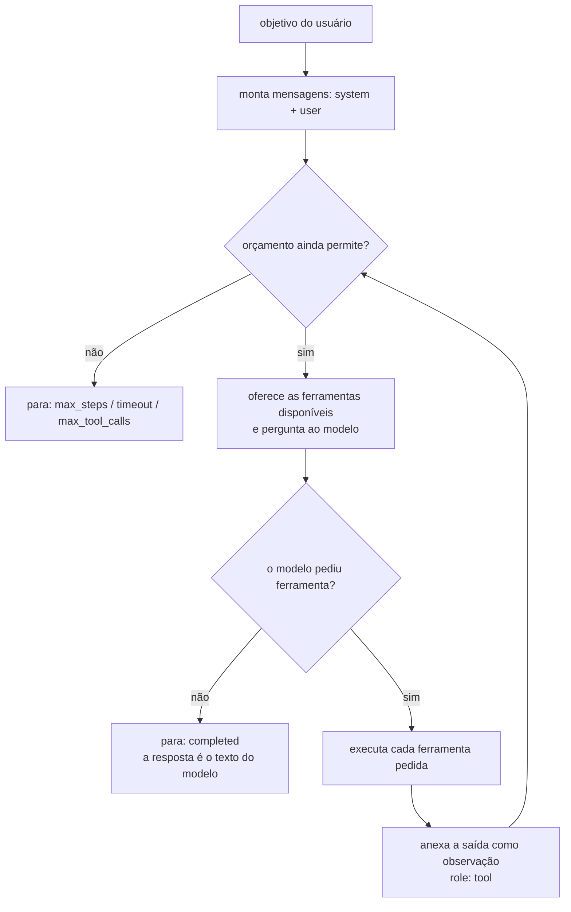

# Agentes: como funcionam por dentro

As outras páginas mostram **o que escrever**. Esta explica **o que acontece**
quando você chama `agent.run(...)`: o laço, o que o modelo recebe em cada
volta, o que cresce, o que custa e por que as peças do módulo existem na forma
em que existem.

Leia antes de projetar um agente de verdade. Depois dela, as decisões que
costumam ser tomadas no chute — ferramenta ou skill? agente ou pipeline?
quanto de orçamento? — passam a ter critério.

!!! info "Tudo aqui foi medido, não deduzido"
    Cada transcrição e cada número desta página saiu de uma execução real com
    o `ScriptedBackend` do SDK — um backend de teste que responde o que você
    escreveu. Nenhum peso de modelo é baixado, e você pode rodar o mesmo em
    segundos. Como, está em [Testar um agente](agents-testing.md).

## Um agente é um laço, não uma chamada

Uma chamada de chat é uma pergunta e uma resposta. Um agente é um **laço** que
só termina quando o modelo para de pedir coisas:



Três coisas caem desse desenho, e elas explicam quase tudo o mais:

1. **Quem executa ferramenta é o seu processo, não o modelo.** O modelo só
   emite um pedido — nome e argumentos. Se ninguém rodar, nada acontece.
2. **O modelo decide quando parar.** Ele para quando responde sem pedir mais
   nada. Todo outro final é o agente cortando por fora.
3. **Cada volta reenvia tudo.** O modelo não "lembra" da volta anterior: o
   histórico inteiro vai de novo, a cada chamada.

### O vocabulário

| Termo | O que é | Onde aparece |
| --- | --- | --- |
| **Objetivo** (`goal`) | O texto que você passou para `run()` | `run.goal` |
| **Passo** (`AgentStep`) | Uma volta do laço: ou o modelo falando, ou uma ferramenta rodando | `run.steps` |
| **Observação** | O que a ferramenta devolveu, entregue ao modelo como mensagem `tool` | `step.output` |
| **Artefato** | Bytes nomeados que a execução produziu (imagem, PDF, WAV) | `run.artifacts` |
| **Orçamento** (`AgentBudget`) | Os tetos de passos, tempo e chamadas que você impôs | passado ao `Agent`; o gasto real fica em `run.seconds` |
| **`stop_reason`** | Por que o laço acabou | `run.stop_reason` |
| **Traço** | A lista de passos, em ordem, com tempos e erros | `run.steps` |

!!! note "Passo não é o mesmo que turno do modelo"
    Uma volta com uma chamada de ferramenta gera **dois** passos: o `model`
    que pediu e o `tool` que rodou. Um objetivo resolvido com três ferramentas
    dá sete passos — quatro do modelo, três das ferramentas. `max_steps` conta
    os dois tipos.

## O que o modelo vê em cada volta

Este é o ponto que a maioria das explicações pula, e é o que torna o resto
óbvio. Um agente com uma ferramenta, resolvendo um objetivo em duas voltas —
a transcrição literal que chegou ao backend:

```text title="chamada 1 ao modelo: 2 mensagens"
{"role": "system", "content": "You are a capable assistant working towards the user's goal. Use the available tools when they help and answer directly when they do not. When a tool fails, read the error and try a different approach rather than repeating the same call. When you have the answer, reply with it and stop calling tools."}
{"role": "user", "content": "Qual o tempo no Recife?"}
```

O modelo respondeu pedindo `get_weather({"city": "Recife"})`. O agente rodou a
ferramenta e perguntou de novo — agora com o pedido dele e o resultado dentro
da conversa:

```text title="chamada 2 ao modelo: 4 mensagens"
{"role": "system", "content": "You are a capable assistant working towards the user's goal. ..."}
{"role": "user", "content": "Qual o tempo no Recife?"}
{"role": "assistant", "content": "", "tool_calls": [{"function": {"name": "get_weather", "arguments": {"city": "Recife"}}}]}
{"role": "tool", "content": "Recife: 22 graus, ceu limpo"}
```

Quatro papéis, e cada um faz uma coisa:

| Papel | Quem escreve | Para quê |
| --- | --- | --- |
| `system` | Você (`system_prompt`), mais o que a memória e as skills injetam | A instrução permanente: quem o modelo é, como se comportar |
| `user` | O objetivo passado a `run()` | O que precisa ser feito |
| `assistant` | O modelo | O texto dele **e** os pedidos de ferramenta daquela volta |
| `tool` | O SDK, depois de executar | O resultado — ou o erro — que o modelo lê na volta seguinte |

!!! tip "A resposta da ferramenta é texto para o modelo ler"
    Não é um valor de retorno num programa: é uma mensagem que o modelo vai
    **interpretar**. `"ok"` diz pouco; `"nota 41...: R$ 1.240,50, emitente
    CNPJ 12..."` diz o que ele precisa para o próximo passo. Escreva a saída
    de ferramenta como quem escreve para um leitor, não para um parser.

## Tool calling: o modelo pede, o SDK executa

Junto das mensagens, o agente manda a **lista de ferramentas disponíveis** —
nome, descrição e um JSON-schema dos argumentos. É só isso que o modelo sabe
sobre elas:

```json
{"type": "function", "function": {"name": "get_weather", "description": "Get the current weather for a city.", "parameters": {"type": "object", "properties": {"city": {"type": "string"}}, "required": ["city"]}}}
```

Daí três consequências práticas:

- **A `description` é a interface.** É o único texto que o modelo lê para
  decidir. Vale mais cuidado ali do que na implementação — e é por isso que
  `@tool` deriva o schema do seu modelo Pydantic em vez de deixar você
  escrever a mesma coisa duas vezes ([Ferramentas tipadas](agents.md#ferramentas-tipadas-com-pydantic)).
- **Argumento inválido é normal, não excepcional.** O modelo às vezes inventa
  um campo. A validação roda **antes** do seu handler e devolve o erro como
  observação, para ele se corrigir no turno seguinte.
- **Erro de ferramenta não derruba a execução.** Um handler que levanta vira
  observação. Foi medido: com um handler levantando
  `AgentToolError("disco cheio")`, a mensagem que chega ao modelo é

  ```json
  {"role": "tool", "content": "AgentToolError: disco cheio"}
  ```

  e a execução segue, terminando em `completed`. Propagar a exceção jogaria
  fora todo o trabalho já feito na execução.

!!! warning "Nem todo backend faz tool calling"
    `chat_with_tools` é opcional no protocolo. Um backend que não implementa
    cai para `chat` puro — o agente responde numa volta só, sem ferramenta
    nenhuma. Medido: um agente **sem ferramentas** termina em 1 passo, com a
    lista de specs vazia. Útil como respondedor de tiro único; silencioso se
    você esperava ferramentas.

## O contexto cresce a cada volta — e é você que paga

Como toda volta reenvia o histórico inteiro, o custo por chamada **sobe** ao
longo da execução. Medido num agente com três ferramentas, cada uma devolvendo
40 caracteres:

| Chamada | Mensagens | Tamanho da conversa | Papéis |
| --- | --- | --- | --- |
| 1 | 2 | 384 chars | system, user |
| 2 | 4 | 557 chars | + assistant, tool |
| 3 | 6 | 729 chars | + assistant, tool |
| 4 | 8 | 902 chars | + assistant, tool |

Cada ciclo acrescentou duas mensagens e ~172 caracteres — o pedido do modelo
mais a observação. A execução inteira custou 4 chamadas e 7 passos para 3
ferramentas.

O número é pequeno porque as saídas são pequenas. Troque por uma ferramenta
que devolve 8 KB de JSON e a quarta chamada carrega os três resultados
anteriores junto, tenha o modelo precisado deles ou não.

!!! danger "É assim que uma execução fica cara sem ninguém notar"
    O gasto de uma execução não é a soma das chamadas: é a **soma dos
    prefixos**. Dobrar o número de voltas mais que dobra o custo. Três coisas
    seguram isso, e cada uma é uma seção nas outras páginas:

    - **Saída de ferramenta curta e útil** — devolva o resumo, não o dump.
    - **[Skills](agents-advanced.md#skills-capacidades-carregadas-sob-demanda)**
      — instruções longas ficam fora do prompt até serem necessárias.
    - **[Delegação](agents-advanced.md#delegar-para-outro-agente)** — o
      histórico do especialista morre com ele; o pai recebe só a conclusão.

## Por que existe orçamento

Um laço cujo critério de parada é "o modelo decidiu" é um laço que um modelo
confuso não fecha. `AgentBudget` corta por fora, com três tetos:

| Teto | Padrão | Protege de |
| --- | --- | --- |
| `max_steps` | 12 | O modelo pedindo ferramenta para sempre |
| `max_seconds` | 120 | Uma ferramenta que trava — passo nenhum estoura, o relógio sim |
| `max_tool_calls` | sem teto | Uma ferramenta cara chamada dez vezes numa execução curta |

Medido com um modelo que **nunca** para de pedir ferramenta e `max_steps=4`:
a execução termina com `stop_reason=max_steps`, `succeeded=False`, 4 passos —
e `output` **vazio**, porque o modelo nunca chegou a escrever texto.

!!! warning "Execução cortada não é execução falhada, nem execução pronta"
    `succeeded` só é `True` quando o modelo decidiu terminar. Uma execução
    cortada pode trazer trabalho parcial no `output` — ou string vazia, como
    acima. Ler `output` sem olhar `stop_reason` é como apresentar rascunho
    como entrega.

O tempo é o teto que de fato protege uma requisição HTTP, e por isso ele tem
padrão em vez de ser opcional. Numa rota FastAPI, o orçamento do agente é o
que impede a requisição de ficar aberta indefinidamente.

## Como uma execução termina

| `stop_reason` | Quem decidiu | O que fazer |
| --- | --- | --- |
| `completed` | O modelo | Usar `output` |
| `max_steps` | O agente | Aumentar o teto, ou simplificar o objetivo |
| `timeout` | O agente | Ver no traço qual passo demorou |
| `max_tool_calls` | O agente | Quase sempre é laço de repetição da mesma ferramenta |
| `error` | O backend | O modelo caiu; `output` traz a mensagem do erro |
| `blocked` | A moderação | Objetivo ou resposta recusados |

## Agente, chat, pipeline ou laço?

"Agente" virou nome para coisas diferentes. Aqui a escolha é concreta:

| Você precisa de… | Use | Por quê |
| --- | --- | --- |
| Uma resposta a uma pergunta, sem ação | `TextGenerator` / [chat](chat.md) | Um laço para uma volta só é overhead e imprevisibilidade |
| Passos **conhecidos**, na mesma ordem, sempre | Código comum chamando o modelo | Se você sabe a ordem, deixar o modelo escolher só adiciona variância |
| Passos que **dependem** do que foi descoberto | `Agent` | É exatamente o que o laço resolve |
| Um objeto tipado no fim | `agent.run_structured(...)` | A resposta vira argumento de ferramenta validado |
| Insistir até um critério passar | `run_until` / `refine` | O critério é seu, verificado fora do modelo |

!!! tip "O teste honesto: você consegue desenhar o fluxograma?"
    Se consegue desenhar o fluxo inteiro de antemão, **escreva o fluxo**. Um
    agente ganha do código quando o próximo passo depende do resultado do
    anterior de um jeito que você não consegue enumerar — e paga por isso com
    variância, latência e custo.

## Ferramenta, skill, delegação ou laço?

As quatro parecem alternativas e não são: cada uma resolve um problema
diferente, e o custo de cada uma aparece em lugar diferente.

| Peça | Quando | O que custa | Onde custa |
| --- | --- | --- | --- |
| **Ferramenta** | Uma capacidade que o agente usa direto | Nome + descrição + schema, em **toda** chamada | Contexto, sempre |
| **Skill** | Uma capacidade com instruções longas, usada às vezes | Uma linha de descrição até ser carregada | Contexto, só depois do load |
| **Delegação** | Um trabalho grande com histórico próprio | Uma chamada de ferramenta no pai; o filho tem contexto separado | Tempo, e o traço do filho |
| **Laço** (`run_until`) | O resultado precisa passar num critério verificável | Execuções inteiras repetidas | Tempo e dinheiro, multiplicados |

Medido, para a linha das skills: um agente com uma skill oferece **só**
`load_skill` na primeira chamada; depois que o modelo a carrega, as
ferramentas dela aparecem:

```text
ferramentas oferecidas por chamada: [['load_skill'], ['load_skill', 'parse_nfe'], ['load_skill', 'parse_nfe']]
```

E o que o `load_skill` devolve é a instrução completa, como observação — ou
seja, o guia entra no contexto **uma vez**, no momento em que passou a ser
relevante:

```text
# Skill: invoicing

Ler e validar notas fiscais.

Guia completo, longo.

Tools now available: parse_nfe
```

Na delegação, o passo é de tipo `agent` e o traço do filho fica aninhado:

```text
model  chat             children=0 total_steps=1
agent  ask_researcher   children=3 total_steps=4
model  chat             children=0 total_steps=1
```

Um passo `agent` pode custar tanto quanto uma execução inteira — ler o traço
sem notar isso é como se perde de vista para onde o tempo foi.

## Memória: três tempos diferentes

"O agente precisa lembrar" quer dizer três coisas, e escolher errado é o motivo
mais comum de memória decepcionar:

| Camada | Vive por | A pergunta que ela responde |
| --- | --- | --- |
| **Scratchpad** | Uma execução | "O que eu já descobri nesta tarefa?" |
| **Fatos** | Para sempre, editável | "O que é verdade sobre este usuário?" |
| **Recall** | Para sempre, difuso | "O que já foi conversado que talvez ajude?" |

A diferença entre **fato** e **recall** é auditabilidade. Um fato é uma chave
com um valor: você lista, corrige, apaga e mostra ao usuário. Ele entra no
prompt como bloco — medido:

```text
Você é um assistente.

What you already know:
- timezone: America/Recife
```

Recall traz texto que *parece* relacionado. É poderoso e ninguém consegue
corrigir. Guardar "o plano do usuário é enterprise" como recall é criar uma
crença que o suporte não consegue mudar.

Os detalhes de cada uma, com código, estão em
[Memória](agents-advanced.md#memoria-tres-camadas-e-qual-escolher).

## Saída estruturada: por que ferramenta e não parse

Pedir "responda em JSON" e dar `json.loads` falha por um motivo estrutural: o
modelo tem **dois** formatos para acertar ao mesmo tempo — o da conversa e o
do JSON — e o segundo não tem quem valide antes de você.

`run_structured` usa a máquina que já existe: o agente ganha uma ferramenta
temporária cujo schema é o do **seu** modelo Pydantic, e **chamar essa
ferramenta é como o modelo termina**. Os argumentos já chegam validados; um
campo faltando vira erro corrigível, não um `KeyError` no seu código três
camadas acima.

Modelos pequenos ainda assim às vezes respondem em prosa. Por isso existe uma
passada extra de extração, cuja única ferramenta é a de resposta — descrita em
[Saída estruturada](agents-advanced.md#saida-estruturada-um-objeto-nao-um-paragrafo).

## O tamanho do modelo muda o projeto

| Sintoma com modelo pequeno (0.5B–3B) | Por quê | O que ajuda |
| --- | --- | --- |
| Ignora a ferramenta e responde de cabeça | Poucas instruções competindo é melhor que muitas | Menos ferramentas por vez; skills |
| Chama a mesma ferramenta em laço | Não percebeu que já tinha a resposta | `max_tool_calls`; observação mais explícita |
| Responde em prosa quando você pediu objeto | Formato é a primeira coisa que se perde | `run_structured` com a passada de extração |
| Erra o nome do argumento | Schema longo demais | Menos campos, descrições curtas |

Nada disso é defeito do módulo — é o que muda quando o modelo cabe na sua
máquina. Projete para isso: ferramentas poucas e bem descritas, saídas curtas,
critério verificável fora do modelo.

## Modos de falha que você vai encontrar

| Sintoma | Causa provável | Onde olhar |
| --- | --- | --- |
| `output` vazio | Cortado antes de o modelo escrever | `stop_reason`, último passo |
| Resposta plausível e errada | Ferramenta devolveu pouco contexto | `step.output` da ferramenta |
| Execução lenta sem passos demais | Uma ferramenta travando | `step.seconds` no traço |
| Ferramenta nunca chamada | Descrição vaga, ou skill não carregada | `specs` oferecidos, `run.tool_calls` |
| Custo subindo com o tamanho do objetivo | Histórico reenviado a cada volta | Tabela de crescimento acima |

## Recapitulando

- Um agente é um **laço**: pergunta ao modelo, executa o que ele pediu, anexa
  o resultado, pergunta de novo — até ele parar ou o orçamento cortar.
- O modelo **não executa nada**: ele pede. Quem roda é o seu processo, e o
  resultado volta como mensagem `tool`.
- **Toda volta reenvia o histórico**, então o custo é a soma dos prefixos —
  não a soma das chamadas.
- **Orçamento é obrigatório na prática**: `max_seconds` é o que protege uma
  requisição; `max_steps` é o que impede um laço.
- **`stop_reason` antes de `output`.** Cortada, uma execução pode trazer
  trabalho parcial ou nada.
- **Ferramenta, skill, delegação e laço** resolvem problemas diferentes e
  custam em lugares diferentes.
- **Fato é auditável, recall não é.** Escolha pela pergunta que você precisa
  responder depois.

Daqui: [Agentes de IA](agents.md) constrói o primeiro agente passo a passo,
[Agentes de IA (avançado)](agents-advanced.md) cobre saída estruturada,
memória, skills, delegação e laços, e [Testar um agente](agents-testing.md)
mostra como afirmar tudo isso sem baixar um modelo.
