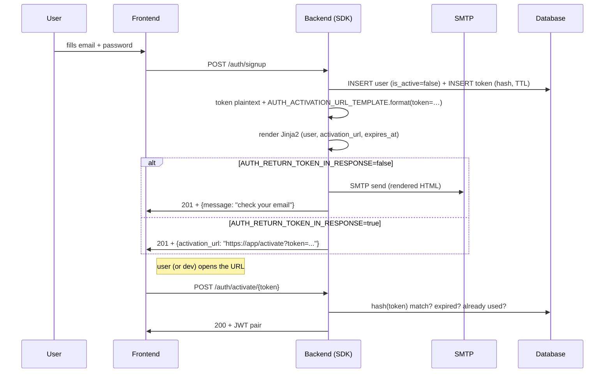

# Bundled auth flow (signup / activate / login / reset)

Since v0.31.0 the SDK ships the full local-account lifecycle — email + password signup, link-based activation, JWT-pair login, password reset — via `UserAuthService` + `make_auth_router`. **Five endpoints ready to mount**, Jinja2 templates bundled, settings flags decide whether the link is emailed or returned in the response body, and four pre-thought modes for dev / staging / production / CI.

## Recipe contents

1. **[Minimum setup](#minimum-setup)** — extras install + wiring four objects (`AsyncDatabaseManager`, `EmailUtils`, `UserAuthService`, `make_auth_router`).
2. **[Concrete UserTokenModel](#concrete-usertokenmodel)** — `BaseUserTokenModel` is abstract, your project owns the concrete table.
3. **[Endpoints](#endpoints)** — table of the 5 endpoints + payload + behavior.
4. **[Settings (`AuthSettings`)](#settings-authsettings)** — `.env` flag by flag.
5. **[Email anatomy: how link, template and URL fit together](#email-anatomy)** — disambiguates the three concepts that confuse readers the most.
6. **[Four operating modes](#four-operating-modes)** — production, dev with local SMTP (Mailhog / smtp4dev), dev without SMTP, CI without activation.
7. **[Mailhog vs smtp4dev — which to pick for local dev](#mailhog-vs-smtp4dev)** — comparison + copy-paste docker-compose snippets.
8. **[Customizing email templates](#customizing-templates)** — override `activation.html` and `password_reset.html` + variables exposed to the Jinja2 context.
9. **[Security](#security)** — token storage, TTL, anti-enumeration.
10. **[Next steps](#next-steps)**.

---

## Minimum setup

Requires:

- `[auth]` (bcrypt + PyJWT) — always required.
- `[email]` (aiosmtplib + Jinja2 + email-validator) — optional; when missing, the link lands in the response body instead of an email.

```bash
uv add "tempest-fastapi-sdk[auth,email]>=0.31.0"
```

```python
# src/api/app.py
from tempest_fastapi_sdk import (
    AsyncDatabaseManager,
    EmailUtils,
    UserAuthService,
    make_auth_router,
)
from src.core.settings import settings
from src.db.models import UserModel, UserTokenModel

db = AsyncDatabaseManager(settings.DATABASE_URL)

# EmailUtils — only instantiate when [email] is installed AND you want real
# email (modes A and B below). In modes C and D, pass email=None to the service.
emails = EmailUtils(
    host=settings.SMTP_HOST,
    port=settings.SMTP_PORT,
    username=settings.SMTP_USERNAME,
    password=settings.SMTP_PASSWORD,
    from_addr=settings.SMTP_FROM_ADDR,
    template_dir="emails",  # directory where your custom templates live
)

auth_service = UserAuthService(
    user_model=UserModel,
    token_model=UserTokenModel,
    auth_settings=settings,   # mixes AuthSettings (see section 4)
    jwt_settings=settings,    # mixes JWTSettings
    email=emails,             # or None — controls real send vs link in body
)

app.include_router(
    make_auth_router(
        auth_service,
        session_factory=db.session_dependency,
    ),
)
```

!!! tip "Four-object TL;DR"
    `AsyncDatabaseManager` → connection. `EmailUtils` → SMTP + Jinja2. `UserAuthService` → business rules (5 methods). `make_auth_router` → glues it all into 5 HTTP endpoints.

---

## Concrete UserTokenModel

`BaseUserTokenModel` is abstract — your project owns the concrete table because the FK to `users` needs your table name. Example `src/db/models/user_token.py`:

```python
from uuid import UUID

from sqlalchemy import ForeignKey
from sqlalchemy.orm import Mapped, mapped_column
from tempest_fastapi_sdk import BaseUserTokenModel


class UserTokenModel(BaseUserTokenModel):
    """Concrete token table for activation / reset / email-verification."""

    __tablename__ = "user_tokens"

    user_id: Mapped[UUID] = mapped_column(
        ForeignKey("users.id", ondelete="CASCADE"),
        nullable=False,
        index=True,
    )
```

Re-export from `src/db/models/__init__.py` so Alembic picks it up:

```python
from src.db.models.user import UserModel
from src.db.models.user_token import UserTokenModel

__all__: list[str] = ["UserModel", "UserTokenModel"]
```

Generate the migration:

```bash
uv run tempest db revision -m "users + user_tokens"
uv run tempest db upgrade
```

---

## Endpoints

| Method | Path | Body / Output | Behavior |
|--------|------|---------------|----------|
| POST | `/auth/signup` | `SignupSchema` → `SignupResponseSchema` | Creates user. Emits email (modes A/B) **or** returns the link in the body (mode C). With `AUTH_AUTO_ACTIVATE=True`, the user is born active and the JWT pair returns immediately (mode D). |
| POST | `/auth/activate/{token}` | — → `ActivationResponseSchema` | Consumes token + sets `is_active=True` + issues JWT pair. |
| POST | `/auth/login` | `LoginSchema` → `LoginResponseSchema` | Email + password → JWT pair. Generic errors (no account enumeration). |
| POST | `/auth/password-reset/request` | `PasswordResetRequestSchema` → `PasswordResetResponseSchema` | Always HTTP 202 + generic body. Link via email (A/B) or body (C). |
| POST | `/auth/password-reset/confirm` | `PasswordResetConfirmSchema` → `LoginResponseSchema` | Consumes token + writes new password + issues JWT pair. |

---

## Settings (`AuthSettings`)

Mix `AuthSettings` into your `Settings` class:

```python
# src/core/settings.py
from tempest_fastapi_sdk import (
    AuthSettings,
    BaseAppSettings,
    DatabaseSettings,
    EmailSettings,
    JWTSettings,
    ServerSettings,
)


class Settings(
    ServerSettings,
    DatabaseSettings,
    EmailSettings,
    JWTSettings,
    AuthSettings,
    BaseAppSettings,
):
    pass


settings = Settings()
```

Variables (with production-safe defaults):

```bash
# .env — email flow
AUTH_AUTO_ACTIVATE=false                # true = skip activation, return JWT immediately
AUTH_RETURN_TOKEN_IN_RESPONSE=false     # true = link in body instead of email
AUTH_PASSWORD_MIN_LENGTH=12

# .env — token TTL
AUTH_ACTIVATION_TTL_SECONDS=604800      # 7 days
AUTH_PASSWORD_RESET_TTL_SECONDS=3600    # 1 hour

# .env — URLs pointing to YOUR FRONTEND (NOT the backend)
AUTH_ACTIVATION_URL_TEMPLATE=https://app.example.com/activate?token={token}
AUTH_PASSWORD_RESET_URL_TEMPLATE=https://app.example.com/reset?token={token}

# .env — Jinja2 filenames inside EmailUtils.template_dir
AUTH_ACTIVATION_TEMPLATE=activation.html
AUTH_PASSWORD_RESET_TEMPLATE=password_reset.html
```

---

## Email anatomy

Three different concepts that look the same. Here's what each one does, exactly once, in pseudo-code:

```text
1. SDK generates a random opaque token (64-char string).
2. AUTH_ACTIVATION_URL_TEMPLATE.format(token=…)  →  link with the token embedded.
3. Renders AUTH_ACTIVATION_TEMPLATE (Jinja2 HTML) passing { user, activation_url, expires_at }.
4. EmailUtils.send(to=user.email, subject=..., html=<rendered HTML>).
```

In prose:

- **Opaque token** — random string the SDK generates, hashes (SHA-256), and stores in the `user_tokens` table. The plaintext leaves over email **only once**; the database keeps just the hash.
- **URL template** (`AUTH_ACTIVATION_URL_TEMPLATE`) — literal format string used to build the URL the user will click. **It points at the frontend, not the backend.** The frontend reads `?token=…` from the query string and calls `POST /auth/activate/{token}` on the backend.
- **Jinja2 template** (`AUTH_ACTIVATION_TEMPLATE`) — filename of the HTML template inside `EmailUtils.template_dir`. It's **the HTML body of the email**, not the URL. It receives the `{ user, activation_url, expires_at }` context and renders the final markup.

!!! warning "URL template ≠ Jinja2 template"
    `AUTH_ACTIVATION_URL_TEMPLATE` is a Python `.format()`-style string with just the `{token}` placeholder. **Don't confuse it** with the `.html` file Jinja2 renders. The formatted URL **is injected as a variable** into the Jinja2 context under the name `activation_url`, and the HTML template wraps it in a button.

Visual flow:



---

## Four operating modes

| Mode | When to use | Flags | Where the link appears |
|------|-------------|-------|------------------------|
| **A. Production** | Public SaaS, real email | `AUTH_AUTO_ACTIVATE=false`<br>`AUTH_RETURN_TOKEN_IN_RESPONSE=false`<br>Real SMTP (Mailgun, SES, Postmark…) | The user's actual inbox |
| **B. Local dev with fake SMTP** | Daily development without sending real email | `AUTH_AUTO_ACTIVATE=false`<br>`AUTH_RETURN_TOKEN_IN_RESPONSE=false`<br>SMTP pointing at Mailhog (`localhost:1025`) or smtp4dev (`localhost:2525`) | Mailhog/smtp4dev web UI at `localhost:8025` / `localhost:5000` |
| **C. Dev without SMTP** | Quick validation without spinning up any email container | `AUTH_AUTO_ACTIVATE=false`<br>`AUTH_RETURN_TOKEN_IN_RESPONSE=true`<br>`email=None` or invalid SMTP | HTTP signup response body |
| **D. CI / tests** | Test suite that doesn't exercise activation | `AUTH_AUTO_ACTIVATE=true` | Nowhere — signup returns the JWT pair directly |

### Mode A — production

```bash
AUTH_AUTO_ACTIVATE=false
AUTH_RETURN_TOKEN_IN_RESPONSE=false
SMTP_HOST=smtp.mailgun.org
SMTP_PORT=587
SMTP_USERNAME=postmaster@mg.example.com
SMTP_PASSWORD=...                          # secret, don't commit
SMTP_FROM_ADDR=noreply@example.com
AUTH_ACTIVATION_URL_TEMPLATE=https://app.example.com/activate?token={token}
AUTH_PASSWORD_RESET_URL_TEMPLATE=https://app.example.com/reset?token={token}
```

Flow: signup → real email lands in the inbox → user clicks → frontend calls `POST /auth/activate/{token}` → login.

### Mode B — dev with local SMTP (Mailhog or smtp4dev)

Same `.env` as mode A, but point SMTP at a local container that **intercepts** the emails instead of actually mailing them. **Use this mode in day-to-day dev** — the flow is identical to production, so you catch template bugs, encoding issues, charset problems, etc. while avoiding real-email spam.

```bash
# .env.dev
AUTH_AUTO_ACTIVATE=false
AUTH_RETURN_TOKEN_IN_RESPONSE=false
SMTP_HOST=localhost
SMTP_PORT=1025                             # Mailhog SMTP default
SMTP_USERNAME=                             # empty — Mailhog doesn't authenticate
SMTP_PASSWORD=
SMTP_FROM_ADDR=dev@local
AUTH_ACTIVATION_URL_TEMPLATE=http://localhost:5173/activate?token={token}
AUTH_PASSWORD_RESET_URL_TEMPLATE=http://localhost:5173/reset?token={token}
```

Open `http://localhost:8025` (Mailhog) or `http://localhost:5000` (smtp4dev) to inspect the intercepted emails. See **[Mailhog vs smtp4dev](#mailhog-vs-smtp4dev)** below.

### Mode C — dev without SMTP (link in body)

No SMTP container at all. Signup returns the activation link in the JSON body:

```bash
AUTH_AUTO_ACTIVATE=false
AUTH_RETURN_TOKEN_IN_RESPONSE=true
AUTH_ACTIVATION_URL_TEMPLATE=http://localhost:5173/activate?token={token}
```

Request:

```bash
curl -X POST localhost:8000/auth/signup \
  -H 'content-type: application/json' \
  -d '{"email":"dev@local","password":"abcdefghijkl","name":"Dev"}'
```

Response:

```json
{
  "user_id": "01HE...",
  "email": "dev@local",
  "is_active": false,
  "activation_url": "http://localhost:5173/activate?token=aBcD...xYz"
}
```

Paste the URL into the browser / curl to exercise `POST /auth/activate/{token}`.

### Mode D — CI / tests (skip everything)

```bash
AUTH_AUTO_ACTIVATE=true
```

Signup skips activation entirely and returns `{access_token, refresh_token}` straight away. Use **only in tests** or when the product is internal and every user is already trusted.

---

## Mailhog vs smtp4dev

Both intercept local SMTP and render emails in a web UI. Relevant differences:

| Aspect | Mailhog | smtp4dev |
|--------|---------|----------|
| Docker image | `mailhog/mailhog:latest` | `rnwood/smtp4dev:latest` |
| Default SMTP port | `1025` | `2525` (configurable) |
| UI port | `8025` | `5000` |
| Image size | ~10 MB | ~120 MB (.NET) |
| Multi-account / multi-inbox | no — single mailbox | yes — filters by recipient |
| HTTP / REST API | yes (`/api/v2/messages`) | yes (built-in Swagger) |
| DKIM / SPF validation | no | yes |
| Upstream maintenance | archived in 2020, still works | active |

**Suggestion:** start with Mailhog (lighter, zero-config) and switch to smtp4dev when you need multi-inbox or DKIM inspection. For the signup → activate → reset cycle, **Mailhog is enough**.

### `docker-compose.yaml` — Mailhog

```yaml
services:
  mailhog:
    image: mailhog/mailhog:latest
    container_name: mailhog
    ports:
      - "1025:1025"  # SMTP — point SMTP_HOST here
      - "8025:8025"  # web UI
```

`SMTP_PORT=1025`, open `http://localhost:8025`.

### `docker-compose.yaml` — smtp4dev

```yaml
services:
  smtp4dev:
    image: rnwood/smtp4dev:latest
    container_name: smtp4dev
    ports:
      - "2525:25"     # SMTP — point SMTP_HOST here
      - "5000:80"     # web UI
    environment:
      - ServerOptions__HostName=smtp4dev
```

`SMTP_PORT=2525`, open `http://localhost:5000`.

!!! tip "Already on `tempest generate --docker`?"
    In v0.32+ the docker-compose generator will accept `--with mailhog` as a shortcut. For now (v0.31.x) drop one of the blocks above into the `docker-compose.yaml` the CLI generates.

---

## Customizing templates

The SDK ships two bundled Jinja2 templates (`activation.html` + `password_reset.html`) — responsive HTML, inline styles, mobile-friendly. You never need to touch them for an MVP to work. When you want your own branding, drop a file with the **same name** into the `template_dir` you passed to `EmailUtils`:

```text
emails/                            # ← template_dir="emails"
├── activation.html                # overrides the SDK default
└── password_reset.html            # overrides the SDK default
```

`EmailUtils` uses a `ChoiceLoader` internally so Jinja2 looks **first** in your directory and **only falls back** to the bundled template if it can't find yours. Override one, the other, or both — no need to copy the entire template.

### Variables available in the Jinja2 context

| Variable | Type | In which templates | Example |
|----------|------|--------------------|---------|
| `user` | `UserModel` instance | both | `{{ user.email }}`, `{{ user.name }}` (when your model exposes the column) |
| `activation_url` | `str` | `activation.html` | `https://app.example.com/activate?token=aBcD...xYz` |
| `reset_url` | `str` | `password_reset.html` | `https://app.example.com/reset?token=aBcD...xYz` |
| `expires_at` | `datetime` (UTC, timezone-aware) | both | use `{{ expires_at.strftime("%Y-%m-%d %H:%M UTC") }}` |

### Example: lean `emails/activation.html`

```html
<!doctype html>
<html lang="en">
  <body style="font-family: sans-serif; max-width: 480px; margin: auto;">
    <h1>Welcome, {{ user.name }}!</h1>
    <p>To activate your account, click the button below:</p>
    <p>
      <a href="{{ activation_url }}"
         style="display: inline-block; padding: 12px 24px;
                background: #4f46e5; color: white;
                text-decoration: none; border-radius: 6px;">
        Activate account
      </a>
    </p>
    <p style="color: #6b7280; font-size: 12px;">
      Link valid until {{ expires_at.strftime("%Y-%m-%d %H:%M UTC") }}.
      If you didn't create this account, ignore this email.
    </p>
  </body>
</html>
```

!!! note "Jinja2 only runs when there's a real email"
    In modes C (`AUTH_RETURN_TOKEN_IN_RESPONSE=true`) and D (`AUTH_AUTO_ACTIVATE=true`) the Jinja2 template is **not rendered** — the link goes out raw in the JSON, no HTML. Only modes A and B (real or intercepted SMTP) exercise the template.

---

## Security

- **Token stored as SHA-256 hash.** Plaintext leaves via email only once; the database can never reproduce the original token. A leak of the `user_tokens` table does **not** enable retroactive activation.
- **One-shot.** `used_at` is stamped on consume; replay rejected with `UnauthorizedException`.
- **TTL-bounded.** `expires_at` computed from `AUTH_ACTIVATION_TTL_SECONDS` / `AUTH_PASSWORD_RESET_TTL_SECONDS`. Expired tokens rejected.
- **Anti-enumeration.** `POST /auth/password-reset/request` always returns HTTP 202 + a generic body, regardless of whether the email exists. `POST /auth/login` raises the same `UnauthorizedException` for wrong-email vs wrong-password.
- **Password floor enforced twice.** `SignupSchema` validates on input; `UserAuthService` re-validates before hashing — defense in depth in case anyone bypasses the schema.

---

## Next steps

- **[Idempotency »](idempotency.en.md)** — protect `POST /auth/signup` from retries that would duplicate the row.
- **[MinIO/S3 Storage »](storage.en.md)** — attach avatar / profile picture during signup.
- **[Logging »](logging.en.md)** — `request_id` propagates automatically across every log line emitted during the flow.
- **[Metrics »](metrics.en.md)** — `PrometheusMiddleware` counts `/auth/*` separately with no extra config.
