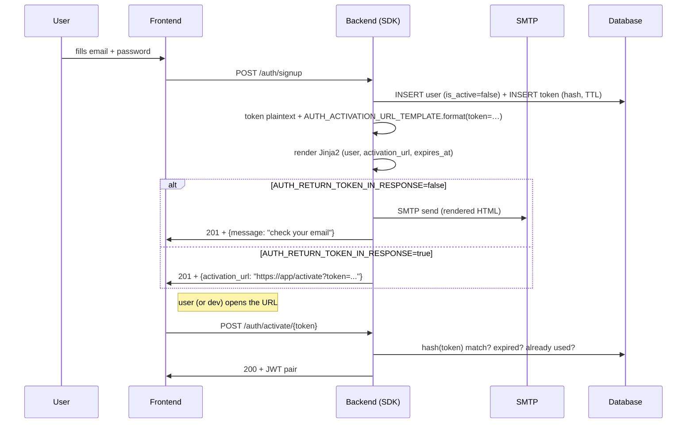
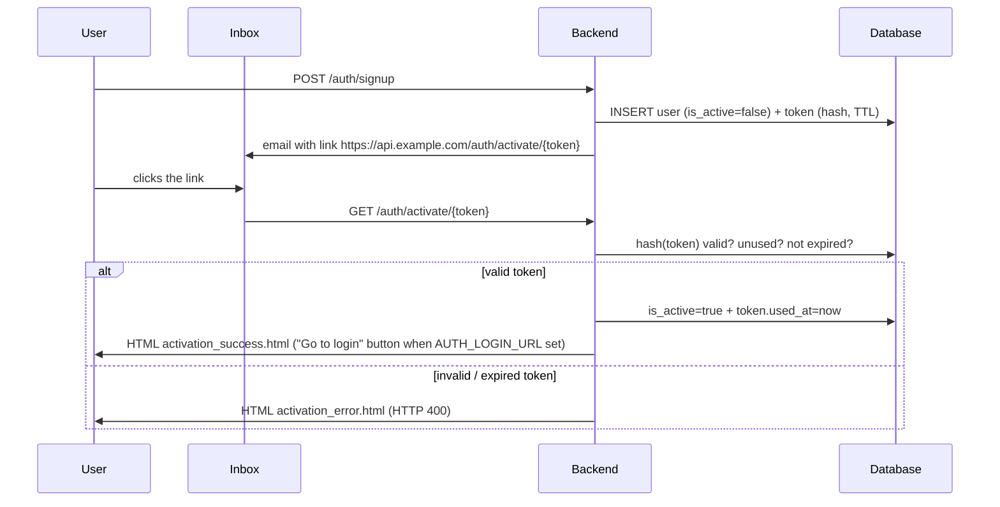

# Bundled auth flow (signup / activate / login / reset)

Since v0.31.0 the SDK ships the full local-account lifecycle — email + password signup, link-based activation, JWT-pair login, password reset — via `UserAuthService` + `make_auth_router`. **Endpoints ready to mount** (including `POST /auth/refresh` since v0.65.0), Jinja2 templates bundled, settings flags decide whether the link is emailed or returned in the response body, and four pre-thought modes for dev / staging / production / CI.

## Recipe contents

1. **[Minimum setup](#minimum-setup)** — extras install + wiring four objects (`AsyncDatabaseManager`, `EmailUtils`, `UserAuthService`, `make_auth_router`).
2. **[Concrete UserTokenModel](#concrete-usertokenmodel)** — `BaseUserTokenModel` is abstract, your project owns the concrete table.
3. **[Endpoints](#endpoints)** — table of the 5 endpoints + payload + behavior.
4. **[Settings — environment variables](#settings-environment-variables)** — env vars in **six groups** (JWT, password policy, email flow, TTL, URLs/templates, backend pages) — each in a typed table, not one blob.
5. **[Email anatomy: how link, template and URL fit together](#email-anatomy)** — disambiguates the three concepts that confuse readers the most.
6. **[Five operating modes](#five-operating-modes)** — production, dev with local SMTP (Mailhog / smtp4dev), dev without SMTP, CI without activation, and **backend-only** (links and pages served directly by the backend).
7. **[Mailhog vs smtp4dev — which to pick for local dev](#mailhog-vs-smtp4dev)** — comparison + copy-paste docker-compose snippets.
8. **[Customizing email templates](#customizing-templates)** — override `activation.html` and `password_reset.html` + variables exposed to the Jinja2 context.
9. **[Security](#security)** — token storage, TTL, anti-enumeration.
10. **[Next steps](#next-steps)**.

---

## Minimum setup

Requires:

- `[auth]` (bcrypt + PyJWT) — always required.
- `[email]` (aiosmtplib + Jinja2 + email-validator) — optional; when missing, the link lands in the response body instead of an email.

```bash
uv add "tempest-fastapi-sdk[auth,email]>=0.31.0"
```

```python
# src/api/app.py
from tempest_fastapi_sdk import (
    AsyncDatabaseManager,
    EmailUtils,
    UserAuthService,
    make_auth_router,
)
from src.core.settings import settings
from src.db.models import UserModel, UserTokenModel

db = AsyncDatabaseManager(settings.DATABASE_URL)

# EmailUtils — only instantiate when [email] is installed AND you want real
# email (modes A and B below). In modes C and D, pass email=None to the service.
emails = EmailUtils(
    host=settings.SMTP_HOST,
    port=settings.SMTP_PORT,
    username=settings.SMTP_USERNAME,
    password=settings.SMTP_PASSWORD,
    from_addr=settings.SMTP_FROM_ADDR,
    template_dir="emails",  # directory where your custom templates live
)

auth_service = UserAuthService(
    db=db,                    # required for current_user_dependency (see final section)
    user_model=UserModel,
    token_model=UserTokenModel,
    auth_settings=settings,   # mixes AuthSettings (see section 4)
    jwt_settings=settings,    # mixes JWTSettings
    email=emails,             # or None — controls real send vs link in body
)

app.include_router(
    make_auth_router(
        auth_service,
        session_factory=db.session_dependency,
    ),
)
```

!!! tip "Four-object TL;DR"
    `AsyncDatabaseManager` → connection. `EmailUtils` → SMTP + Jinja2. `UserAuthService` → business rules (5 methods). `make_auth_router` → glues it all into 5 HTTP endpoints.

---

## Concrete UserTokenModel

`BaseUserTokenModel` is abstract — your project owns the concrete table because the FK to `users` needs your table name. Example `src/db/models/user_token.py`:

```python
from uuid import UUID

from sqlalchemy import ForeignKey
from sqlalchemy.orm import Mapped, mapped_column
from tempest_fastapi_sdk import BaseUserTokenModel


class UserTokenModel(BaseUserTokenModel):
    """Concrete token table for activation / reset / email-verification."""

    __tablename__ = "user_tokens"

    user_id: Mapped[UUID] = mapped_column(
        ForeignKey("users.id", ondelete="CASCADE"),
        nullable=False,
        index=True,
    )
```

Re-export from `src/db/models/__init__.py` so Alembic picks it up:

```python
from src.db.models.user import UserModel
from src.db.models.user_token import UserTokenModel

__all__: list[str] = ["UserModel", "UserTokenModel"]
```

Generate the migration (first time round, bootstrap Alembic with `tempest db init`):

```bash
# First time only — generates alembic/, alembic.ini and env.py:
uv run tempest db init

# Then the usual revision cycle:
uv run tempest db revision -m "users + user_tokens"
uv run tempest db upgrade
```

---

## Endpoints

| Method | Path | Body / Output | Behavior |
|--------|------|---------------|----------|
| POST | `/auth/signup` | `SignupSchema` → `SignupResponseSchema` | Creates user. Emits email (modes A/B) **or** returns the link in the body (mode C). With `AUTH_AUTO_ACTIVATE=True`, the user is born active and the JWT pair returns immediately (mode D). |
| POST | `/auth/activate/{token}` | — → `ActivationResponseSchema` | Consumes token + sets `is_active=True` + issues JWT pair. |
| POST | `/auth/login` | `LoginSchema` → `LoginResponseSchema` | Email + password → JWT pair. Generic errors (no account enumeration). |
| POST | `/auth/password-reset/request` | `PasswordResetRequestSchema` → `PasswordResetResponseSchema` | Always HTTP 202 + generic body. Link via email (A/B) or body (C). |
| POST | `/auth/password-reset/confirm` | `PasswordResetConfirmSchema` → `LoginResponseSchema` | Consumes token + writes new password + issues JWT pair. |
| POST | `/auth/password-change` | `PasswordChangeSchema` → `204` | **Authenticated** (bearer token). Change your own password: confirm the current password + write the new one. No email token. |
| POST | `/auth/refresh` *(v0.65.0+)* | `RefreshSchema` → `LoginResponseSchema` | Exchange a valid **refresh token** for a fresh JWT pair. **No email/password.** Rejects a replayed access token (401) and inactive accounts (403). |

!!! tip "`password-reset/confirm` vs `password-change` — which is which?"
    These are **different** flows, don't mix them up:

    - **`/auth/password-reset/confirm`** — the user **forgot** their
      password. They're not logged in; they prove identity with the
      **token** emailed to them. (See `/auth/password-reset/request`
      first.)
    - **`/auth/password-change`** — the user **remembers** their password
      and is **logged in**. They send the `access_token` in the
      `Authorization: Bearer …` header and re-confirm their
      `current_password`. No email or reset token involved. Returns
      **204** and the current tokens stay valid.

### Renewing the session with the refresh token

The `access_token` is short-lived by design (`JWT_ACCESS_TTL_SECONDS`,
1 h default). When it expires, **don't force the user to log in again** —
exchange the `refresh_token` (long-lived, 7 days default) for a fresh
pair at `POST /auth/refresh`:

```bash
curl -X POST localhost:8000/auth/refresh \
  -H "Content-Type: application/json" \
  -d '{"refresh_token": "eyJhbGciOi…"}'
```

```json
{
  "user_id": "7d8e4d5a-9f4b-4c3a-bd0a-1234567890ab",
  "access_token": "eyJhbGciOi…(new)",
  "refresh_token": "eyJhbGciOi…(new)",
  "mfa_required": false,
  "mfa_token": null
}
```

The endpoint decodes the token, requires it to actually carry the
`refresh` claim (a replayed **access** token is rejected with **401**),
resolves the `sub` to an **active** user and mints a new pair.

!!! warning "Both tokens rotate"
    The response carries a **new** `refresh_token`. Persist that one and
    discard the token you sent. In **stateless** mode (the default) the
    SDK issues JWTs, so the old pair is not revoked — it stays valid
    until its own `exp`.

!!! tip "Need real revocation? The SDK already ships it"
    Don't write your own refresh-token table — since **v0.66.0** the SDK
    offers **opaque DB-backed** refresh tokens with single-use rotation,
    **reuse detection** (a stolen token revokes the whole family) and
    `POST /auth/logout`. It is opt-in: pass a `refresh_token_model` to
    `UserAuthService`. See the
    [Refresh tokens (rotation/revocation)](refresh-tokens.md) recipe.

!!! tip "When the refresh token expires too"
    Then no renewal is possible — the **401** is final and the client
    falls back to `POST /auth/login` with email + password.

No frontend? The service method behind the endpoint is public —
`await service.refresh_tokens(session, refresh_token=...)` returns
`(user, access_token, refresh_token)`.

---

## Settings — environment variables

Every knob in the flow comes from settings mixins. Mix them into your `Settings` class:

```python
# src/core/settings.py
from tempest_fastapi_sdk import (
    AuthSettings,
    BaseAppSettings,
    DatabaseSettings,
    EmailSettings,
    JWTSettings,
    ServerSettings,
)


class Settings(
    ServerSettings,
    DatabaseSettings,
    EmailSettings,
    JWTSettings,
    AuthSettings,
    BaseAppSettings,
):
    pass


settings: Settings = Settings()
```

!!! info "The attribute name **is** the env var name"
    Every attribute in the tables below is read from an environment variable of the **same name**, case-sensitive, **no prefix**. `AUTH_PASSWORD_MIN_LENGTH` in `.env` → `settings.AUTH_PASSWORD_MIN_LENGTH`. They all have defaults — you only set what you want to change.

The variables split across **two mixins** and **six concern groups**. They're separated on purpose: a password is not the same thing as an email, and authentication (JWT) is not the same thing as account activation.

### Group 1 — Authentication / JWT (`JWTSettings`)

Controls the signing and lifetime of the tokens login returns. **It's the same `JWT_SECRET` the `get_current_user` dependency uses to verify** (see [Getting the `current_user`](#getting-the-current_user-from-the-request)).

| Env var | Type | Default | What it does |
|---------|------|---------|--------------|
| `JWT_SECRET` | `str` (≥32 bytes) | `change-me-…-32` | HMAC secret that signs the JWT. **Must be overridden in production.** |
| `JWT_ALGORITHM` | `str` | `HS256` | JOSE algorithm. `HS256`/`HS512` (symmetric secret) or `RS256` (key pair). |
| `JWT_ACCESS_TTL_SECONDS` | `int` (≥1) | `3600` | **Access token** lifetime (1 h). Short by design — renew via refresh. |
| `JWT_REFRESH_TTL_SECONDS` | `int` (≥1) | `604800` | **Refresh token** lifetime (7 days). |
| `JWT_ISSUER` | `str \| None` | `None` | `iss` claim. `None` omits the claim. |

!!! danger "The default `JWT_SECRET` leaks tokens"
    The default `change-me-change-me-change-me-32` exists only to boot locally. In production, **anyone** with the default can forge a valid JWT. Generate a strong secret (`openssl rand -base64 48`) and inject it via a secret manager — never commit it.

### Group 2 — Password policy (`AuthSettings`)

| Env var | Type | Default | What it does |
|---------|------|---------|--------------|
| `AUTH_PASSWORD_MIN_LENGTH` | `int` (≥1) | `12` | Minimum length accepted on signup **and** reset. |
| `AUTH_PASSWORD_REQUIRE_COMPLEXITY` | `bool` | `false` | `true` = require 1 lowercase + 1 uppercase + 1 digit + 1 special character. |

These two interact — **this is where it usually gets confusing**. The exact rule:

- **`complexity=false` (default):** only length matters. Any password with `≥ AUTH_PASSWORD_MIN_LENGTH` characters passes, with no composition requirement.
- **`complexity=true`:** on top of the 4 character classes, the **effective** length floor becomes `max(AUTH_PASSWORD_MIN_LENGTH, 8)`. That is, an `AUTH_PASSWORD_MIN_LENGTH` below 8 is **ignored** while complexity is on.

Decision table:

| `MIN_LENGTH` | `REQUIRE_COMPLEXITY` | Password accepted when |
|--------------|----------------------|------------------------|
| `12` | `false` | `≥ 12` chars, any composition |
| `4` | `false` | `≥ 4` chars, any composition (low floor, dev-only) |
| `4` | `true` | `≥ 8` chars (floor 8 **overrides** the 4) **+** the 4 classes |
| `16` | `true` | `≥ 16` chars **+** the 4 classes |

!!! warning "The floor is the single source of truth"
    The request schemas (`SignupSchema`, `PasswordResetConfirmSchema`) impose **no** length bound of their own — they delegate to these two vars. Lowering `AUTH_PASSWORD_MIN_LENGTH` to `4` genuinely relaxes validation on the route too. There is no hidden second limit in the schema "protecting" you.

### Group 3 — Email flow control (`AuthSettings`)

Decide **whether** and **how** the link reaches the user. They map directly to the [five operating modes](#five-operating-modes).

| Env var | Type | Default | What it does |
|---------|------|---------|--------------|
| `AUTH_AUTO_ACTIVATE` | `bool` | `false` | `true` = user is born active, skips activation, signup returns the JWT pair directly (Mode D). **Never in production.** |
| `AUTH_RETURN_TOKEN_IN_RESPONSE` | `bool` | `false` | `true` = activation/reset link goes in the JSON body instead of the email (Mode C). |

### Group 4 — Account token TTL (`AuthSettings`)

Lifetime of the **single-use** tokens (activation / reset) — distinct from the Group 1 JWTs.

| Env var | Type | Default | What it does |
|---------|------|---------|--------------|
| `AUTH_ACTIVATION_TTL_SECONDS` | `int` (≥60) | `604800` | Activation token lifetime (7 days). |
| `AUTH_PASSWORD_RESET_TTL_SECONDS` | `int` (≥60) | `3600` | Reset token lifetime (1 h). Shorter is safer. |

### Group 5 — Email URLs and templates (`AuthSettings`)

| Env var | Type | Default | What it does |
|---------|------|---------|--------------|
| `AUTH_ACTIVATION_URL_TEMPLATE` | `str` | `http://localhost:3000/activate?token={token}` | URL that goes in the email; `{token}` is substituted. **Points at the frontend** (except in Mode E). |
| `AUTH_PASSWORD_RESET_URL_TEMPLATE` | `str` | `http://localhost:3000/reset-password?token={token}` | Same, for reset. |
| `AUTH_ACTIVATION_TEMPLATE` | `str` | `activation.html` | Jinja2 filename of the activation **email HTML**, resolved against `EmailUtils.template_dir`. |
| `AUTH_PASSWORD_RESET_TEMPLATE` | `str` | `password_reset.html` | Same, for reset. |

!!! warning "URL template ≠ Jinja2 template"
    `*_URL_TEMPLATE` is a `.format()` string with `{token}` — it's the **link**. `*_TEMPLATE` is the name of an `.html` file — it's the **email that wraps the link**. Confusing the two is the #1 mistake. Full detail in [Email anatomy](#email-anatomy).

### Group 6 — Backend-rendered pages (Mode E, `AuthSettings`)

Only relevant when `AUTH_BACKEND_LINKS=true`. See [Mode E](#five-operating-modes) for the full flow.

| Env var | Type | Default | What it does |
|---------|------|---------|--------------|
| `AUTH_BACKEND_LINKS` | `bool` | `false` | `true` = mounts 3 extra HTML endpoints; the email link points at the **backend**, not the frontend. |
| `AUTH_LOGIN_URL` | `str \| None` | `None` | Login URL on the "go to login" button of success pages. `None` hides the button. |
| `AUTH_ACTIVATION_SUCCESS_TEMPLATE` | `str` | `activation_success.html` | Activation OK HTML page. |
| `AUTH_ACTIVATION_ERROR_TEMPLATE` | `str` | `activation_error.html` | Activation error HTML page. |
| `AUTH_PASSWORD_RESET_FORM_TEMPLATE` | `str` | `password_reset_form.html` | New-password HTML form. |
| `AUTH_PASSWORD_RESET_SUCCESS_TEMPLATE` | `str` | `password_reset_success.html` | Reset OK HTML page. |
| `AUTH_PASSWORD_RESET_ERROR_TEMPLATE` | `str` | `password_reset_error.html` | Reset error HTML page. |

### Group 7 — Language of emails and pages (`AuthSettings`)

| Env var | Type | Default | What it does |
|---------|------|---------|--------------|
| `AUTH_DEFAULT_LOCALE` | `str` | `pt-BR` | Language of the bundled **emails** and **HTML pages**. Accepts `pt-BR` and `en-US` (normalized: `PT-BR`, `pt_br`, `ptbr` → `pt-BR`). |

There's a whole section dedicated to this, explained step by step:
[Email and page language (i18n)](#email-and-page-language-i18n).

### Group 8 — Token delivery: bearer / cookie / both (`AuthSettings`) *(v0.87.0+)*

| Env var | Type | Default | What it does |
|---------|------|---------|--------------|
| `AUTH_TOKEN_DELIVERY` | `"bearer" \| "cookie" \| "both"` | `bearer` | How login/refresh return the JWT pair. See [Token delivery](#token-delivery). |
| `AUTH_COOKIE_SECURE` | `bool` | `true` | Flag cookies as `Secure` (HTTPS only). **Turn off only on plain HTTP** — otherwise the browser drops the cookie. |
| `AUTH_COOKIE_SAMESITE` | `"lax" \| "strict" \| "none"` | `lax` | A cross-site SPA needs `none` (+ `Secure=true`). |
| `AUTH_COOKIE_DOMAIN` | `str \| None` | `None` | Cookie `Domain`. `None` = exact host. Use `.example.com` to share across subdomains. |
| `AUTH_ACCESS_COOKIE_NAME` | `str` | `access_token` | Access-token cookie name. |
| `AUTH_REFRESH_COOKIE_NAME` | `str` | `refresh_token` | Refresh-token cookie name (scoped to the refresh endpoint path). |

!!! note "MFA / TOTP has its own vars"
    When `AUTH_MFA_ENABLED=true`, `AuthSettings` also exposes `AUTH_MFA_ISSUER`, `AUTH_MFA_RECOVERY_CODES_COUNT`, `AUTH_MFA_TOKEN_TTL_SECONDS` and `AUTH_MFA_VERIFY_WINDOW`. They're out of scope for this recipe (signup/activate/login/reset) — covered in the MFA recipe.

---

## Email anatomy

Three different concepts that look the same. Here's what each one does, exactly once, in pseudo-code:

```text
1. SDK generates a random opaque token (64-char string).
2. AUTH_ACTIVATION_URL_TEMPLATE.format(token=…)  →  link with the token embedded.
3. Renders AUTH_ACTIVATION_TEMPLATE (Jinja2 HTML) passing { user, activation_url, expires_at, expires_at_str }.
4. EmailUtils.send(to=user.email, subject=..., html=<rendered HTML>).
```

In prose:

- **Opaque token** — random string the SDK generates, hashes (SHA-256), and stores in the `user_tokens` table. The plaintext leaves over email **only once**; the database keeps just the hash.
- **URL template** (`AUTH_ACTIVATION_URL_TEMPLATE`) — literal format string used to build the URL the user will click. **It points at the frontend, not the backend.** The frontend reads `?token=…` from the query string and calls `POST /auth/activate/{token}` on the backend.
- **Jinja2 template** (`AUTH_ACTIVATION_TEMPLATE`) — filename of the HTML template inside `EmailUtils.template_dir`. It's **the HTML body of the email**, not the URL. It receives the `{ user, activation_url, expires_at, expires_at_str }` context and renders the final markup. Use `{{ expires_at_str }}` in the template — it's the expiry already formatted short (e.g. `2026-06-21 23:25 (UTC)`, no seconds); `expires_at` is still available as the raw `datetime` if you want to format it yourself.

!!! warning "URL template ≠ Jinja2 template"
    `AUTH_ACTIVATION_URL_TEMPLATE` is a Python `.format()`-style string with just the `{token}` placeholder. **Don't confuse it** with the `.html` file Jinja2 renders. The formatted URL **is injected as a variable** into the Jinja2 context under the name `activation_url`, and the HTML template wraps it in a button.

Visual flow:



---

## Email and page language (i18n)

Since **v0.59.0**, the emails and HTML pages the SDK ships out of the box
speak **two languages**: 🇧🇷 **Brazilian Portuguese (`pt-BR`)** — which is
the **default** — and 🇺🇸 **US English (`en-US`)**. You don't need to
create any template for this to work. 🚀

### The golden rule (memorize just this)

There are **two different things** that pick the language, and they work
differently. Pay attention:

| What | How the language is chosen |
|------|----------------------------|
| **Emails** (activation, reset) | **Always** use `AUTH_DEFAULT_LOCALE`. Full stop. |
| **HTML pages** (Mode E, backend) | Use the **browser's** `Accept-Language`; if the browser says nothing, fall back to `AUTH_DEFAULT_LOCALE`. |

!!! info "Why doesn't the email negotiate the language?"
    When the SDK **builds** the email there's no browser asking for
    anything — it's a server process sending a message. There's nothing
    to "guess" the language from. That's why the email is always fixed to
    `AUTH_DEFAULT_LOCALE`. An **HTML page**, on the other hand, is opened
    by a real browser, which sends the `Accept-Language` header saying "I
    prefer Portuguese" — so the person's preference can be honored.

### Step 1 — choose the default language

Just one environment variable. That's it:

```env
# .env
AUTH_DEFAULT_LOCALE=pt-BR   # default — you can even omit it
```

Want everything in English? Switch to:

```env
AUTH_DEFAULT_LOCALE=en-US
```

!!! tip "You don't need the exact case/format"
    The value is normalized for you. All of these become `pt-BR`:
    `pt-BR`, `PT-BR`, `pt_br`, `ptbr`, `pt`. And all of these become
    `en-US`: `en-US`, `EN_us`, `enus`, `en`. If you type something the
    SDK doesn't know (like `klingon`), it falls back to the `pt-BR`
    default instead of crashing.

### Step 2 — (optional) let the HTML page follow the browser

This is **already on for free** in Mode E (`AUTH_BACKEND_LINKS=true`).
You do nothing. When the user clicks the email link and their browser is
in Portuguese, they see the page in Portuguese; if it's in English, they
see English. If the browser sends no `Accept-Language`, the page uses
`AUTH_DEFAULT_LOCALE`.

```text
Browser in pt-BR   →  Accept-Language: pt-BR  →  page in Portuguese
Browser in en-US   →  Accept-Language: en-US  →  page in English
Browser w/o header →  falls back to AUTH_DEFAULT_LOCALE
```

### Step 3 — (optional) translate/customize it yourself

The bundled templates live in per-language subfolders (`pt-BR/`,
`en-US/`). To change the text/look of **just** one language, drop a file
with the same name into the right subfolder of your `template_dir`
(e.g. `template_dir/en-US/activation_success.html`). The full lookup
order is in the "Override per language" tip further down, under
**Mode E**.

### Bonus — short, readable expiry timestamp

The email used to show the raw, ugly expiry like this:

```text
This link expires at 2026-06-21 23:25:49.742054+00:00
```

Now the SDK injects an `expires_at_str` variable into the template,
already formatted and **without seconds**, in the language's format:

| Language | How it looks |
|----------|--------------|
| `pt-BR` | `21/06/2026 23:25 (UTC)` |
| `en-US` | `2026-06-21 23:25 (UTC)` |

In your custom templates, use `{{ expires_at_str }}` (short and pretty).
If you want to format it yourself, the raw `datetime` is still available
in `{{ expires_at }}`.

!!! check "Recap"
    - **One variable** drives the email language: `AUTH_DEFAULT_LOCALE`.
    - **HTML pages** follow the browser (Accept-Language) and fall back
      to `AUTH_DEFAULT_LOCALE` when there's no header.
    - **The default is `pt-BR`.** Set `en-US` if you want English.
    - Use `{{ expires_at_str }}` to show the expiry without seconds.

---

## Five operating modes

| Mode | When to use | Flags | Where the link appears |
|------|-------------|-------|------------------------|
| **A. Production (SPA)** | Public SaaS, real email, frontend SPA owns the pages | `AUTH_AUTO_ACTIVATE=false`<br>`AUTH_RETURN_TOKEN_IN_RESPONSE=false`<br>`AUTH_BACKEND_LINKS=false`<br>Real SMTP (Mailgun, SES, Postmark…) | The user's inbox → frontend processes the token |
| **B. Local dev with fake SMTP** | Daily development without sending real email | `AUTH_AUTO_ACTIVATE=false`<br>`AUTH_RETURN_TOKEN_IN_RESPONSE=false`<br>SMTP pointing at Mailhog (`localhost:1025`) or smtp4dev (`localhost:2525`) | Mailhog/smtp4dev web UI at `localhost:8025` / `localhost:5000` |
| **C. Dev without SMTP** | Quick validation without spinning up any email container | `AUTH_AUTO_ACTIVATE=false`<br>`AUTH_RETURN_TOKEN_IN_RESPONSE=true`<br>`email=None` or invalid SMTP | HTTP signup response body |
| **D. CI / tests** | Test suite that doesn't exercise activation | `AUTH_AUTO_ACTIVATE=true` | Nowhere — signup returns the JWT pair directly |
| **E. Backend-only** *(v0.32.0+)* | You want 100% control on the backend — zero responsibility on the frontend. Ideal for APIs without a SPA, MVPs, internal tools. | `AUTH_BACKEND_LINKS=true`<br>URL templates point at the **backend** (`https://api.example.com/auth/activate/{token}`)<br>`AUTH_LOGIN_URL=https://app.example.com/login` (optional — shows a "Go to login" button on the HTML pages) | The backend renders HTML success/error directly — the user only clicks the link in the email |

### Mode A — production

```bash
AUTH_AUTO_ACTIVATE=false
AUTH_RETURN_TOKEN_IN_RESPONSE=false
SMTP_HOST=smtp.mailgun.org
SMTP_PORT=587
SMTP_USERNAME=postmaster@mg.example.com
SMTP_PASSWORD=...                          # secret, don't commit
SMTP_FROM_ADDR=noreply@example.com
AUTH_ACTIVATION_URL_TEMPLATE=https://app.example.com/activate?token={token}
AUTH_PASSWORD_RESET_URL_TEMPLATE=https://app.example.com/reset?token={token}
```

Flow: signup → real email lands in the inbox → user clicks → frontend calls `POST /auth/activate/{token}` → login.

### Mode B — dev with local SMTP (Mailhog or smtp4dev)

Same `.env` as mode A, but point SMTP at a local container that **intercepts** the emails instead of actually mailing them. **Use this mode in day-to-day dev** — the flow is identical to production, so you catch template bugs, encoding issues, charset problems, etc. while avoiding real-email spam.

```bash
# .env.dev
AUTH_AUTO_ACTIVATE=false
AUTH_RETURN_TOKEN_IN_RESPONSE=false
SMTP_HOST=localhost
SMTP_PORT=1025                             # Mailhog SMTP default
SMTP_USERNAME=                             # empty — Mailhog doesn't authenticate
SMTP_PASSWORD=
SMTP_FROM_ADDR=dev@local
AUTH_ACTIVATION_URL_TEMPLATE=http://localhost:5173/activate?token={token}
AUTH_PASSWORD_RESET_URL_TEMPLATE=http://localhost:5173/reset?token={token}
```

Open `http://localhost:8025` (Mailhog) or `http://localhost:5000` (smtp4dev) to inspect the intercepted emails. See **[Mailhog vs smtp4dev](#mailhog-vs-smtp4dev)** below.

### Mode C — dev without SMTP (link in body)

No SMTP container at all. Signup returns the activation link in the JSON body:

```bash
AUTH_AUTO_ACTIVATE=false
AUTH_RETURN_TOKEN_IN_RESPONSE=true
AUTH_ACTIVATION_URL_TEMPLATE=http://localhost:5173/activate?token={token}
```

Request:

```bash
curl -X POST localhost:8000/auth/signup \
  -H 'content-type: application/json' \
  -d '{"email":"dev@local","password":"abcdefghijkl","name":"Dev"}'
```

Response (the actual `SignupResponseSchema` shape):

```json
{
  "user_id": "0193e9ea-7c4b-7c8e-bc05-2a3a8d9f7e10",
  "activation_required": true,
  "activation_url": "http://localhost:5173/activate?token=aBcD...xYz",
  "access_token": null,
  "refresh_token": null
}
```

Paste the URL into the browser / curl to exercise `POST /auth/activate/{token}`.

### Mode D — CI / tests (skip everything)

```bash
AUTH_AUTO_ACTIVATE=true
```

Signup skips activation entirely and returns `{access_token, refresh_token}` straight away. Use **only in tests** or when the product is internal and every user is already trusted.

### Mode E — backend-only (v0.32.0+)

When you'd rather have the **whole** link experience happen on the backend, with no frontend page in the loop, flip `AUTH_BACKEND_LINKS=True`. The router then mounts **three extra HTML endpoints** — `GET /auth/activate/{token}`, `GET /auth/password-reset/{token}` and `POST /auth/password-reset/{token}` (form-encoded). The email points the user straight at those endpoints; the backend activates the account / processes the reset / renders HTML success or error — using bundled Jinja2 templates you can shadow.

```bash
# .env — Mode E (backend-only)
AUTH_BACKEND_LINKS=true
AUTH_AUTO_ACTIVATE=false
AUTH_RETURN_TOKEN_IN_RESPONSE=false

# IMPORTANT: URL templates point at the BACKEND, not the frontend.
AUTH_ACTIVATION_URL_TEMPLATE=https://api.example.com/auth/activate/{token}
AUTH_PASSWORD_RESET_URL_TEMPLATE=https://api.example.com/auth/password-reset/{token}

# Optional: your login URL. When set, the backend-rendered success/error
# pages display a "Go to login" button. When null, the button is hidden
# (pure server-side, zero coupling with any frontend).
AUTH_LOGIN_URL=https://app.example.com/login

SMTP_HOST=smtp.mailgun.org
SMTP_PORT=587
SMTP_FROM_ADDR=noreply@example.com
```

!!! danger "Link returns 404? Align the template with the router's mount prefix"
    The endpoints above are **relative to wherever you mount `make_auth_router`**.
    If you include the router under a prefix — common to separate business routes:

    ```python
    app.include_router(make_auth_router(...), prefix="/api")
    ```

    then the real activation route becomes `GET /api/auth/activate/{token}`, **not**
    `/auth/activate/{token}`. But `AUTH_ACTIVATION_URL_TEMPLATE` is a literal string
    — it has **no** idea about the prefix. If the template points at
    `.../auth/activate/{token}` (without `/api`), the email link hits a
    non-existent route and returns **404**, even though signup returned `201`.

    ```bash
    # ❌ router mounted with prefix="/api", but the template lacks /api → 404
    AUTH_ACTIVATION_URL_TEMPLATE=https://api.example.com/auth/activate/{token}

    # ✅ template aligned with the actual mount prefix
    AUTH_ACTIVATION_URL_TEMPLATE=https://api.example.com/api/auth/activate/{token}
    ```

    Two checks when configuring Mode E: **(1)** the host is the backend's
    **public domain** (never `localhost` — the link runs in the user's browser,
    not on the server); **(2)** the path includes **every prefix** you mounted the
    router under.

Flow:



Password reset follows the same pattern: GET renders an HTML form; POST (form-encoded) consumes the token and renders success/error.

**Bundled HTML templates (shadow by dropping the same filename under `template_dir`):**

| Template | Endpoint that renders it | Jinja2 variables exposed |
|----------|--------------------------|--------------------------|
| `activation_success.html` | `GET /auth/activate/{token}` (success) | `user`, `login_url` |
| `activation_error.html` | `GET /auth/activate/{token}` (failure) | `reason`, `login_url` |
| `password_reset_form.html` | `GET /auth/password-reset/{token}` | `user`, `form_action`, `min_length`, `error`, `login_url` |
| `password_reset_success.html` | `POST /auth/password-reset/{token}` (success) | `user`, `login_url` |
| `password_reset_error.html` | `POST /auth/password-reset/{token}` (bad token) | `reason`, `login_url` |

**To override:** pass `template_dir` to `make_auth_router` and add files with the same filenames.

```python
app.include_router(
    make_auth_router(
        auth_service,
        session_factory=db.session_dependency,
        template_dir="src/templates/auth",   # optional
    ),
)
```

!!! tip "Override per language (since v0.59.0)"
    The bundled templates now live in **per-language subfolders**
    (`pt-BR/` and `en-US/`). You have two ways to override, and the SDK
    searches in this order (the first that exists wins):

    1. `template_dir/<locale>/activation_success.html` — override **just
       that language** (e.g. `src/templates/auth/pt-BR/...`).
    2. `template_dir/activation_success.html` — **flat** override, applies
       to every language (backward compatible with pre-0.59.0; keeps
       working with no changes).

    In short: if you already had flat templates, **you don't need to
    change anything**. If you want a different look per language, create
    the subfolder.

**Mode E trade-offs:**

- ✅ **Zero frontend dependency** — the backend is the single source of truth for the auth flow.
- ✅ **MVP in minutes** — no need to create SPA routes to process tokens.
- ✅ **Works in frontend-less projects** — public APIs, intranets, internal tooling.
- ⚠️ **JWT is not auto-delivered** — after activation, the user signs in manually (clicking "Go to login" and entering credentials). By design: zero token leak via URL, history, or server logs.
- ⚠️ **Requires the `[email]` extra** (Jinja2) to render the HTML pages — same dependency as the email template renderer.
- ⚠️ **No CSRF on the reset form** — the HTML form posts traditionally without a CSRF token. The reset token is one-shot + short TTL + bound to a single user, but consider plugging in `CSRFMiddleware` if attackers can predict active URLs.

The **JSON** endpoints (`POST /auth/activate/{token}`, `POST /auth/password-reset/confirm`) are still mounted — you can mix Mode E with SPA endpoints.

---

## Token delivery

*(v0.87.0+)*

By default login returns `access_token` / `refresh_token` **in the body** and the client replays them as `Authorization: Bearer <token>`. Great for mobile/API clients, but a browser SPA has to stash the token somewhere JS can reach — exposed to XSS. `AUTH_TOKEN_DELIVERY` lets you choose.

| Mode | What changes | For whom |
|------|--------------|----------|
| `bearer` *(default)* | Tokens **in the body only**. Historical, backward-compatible behaviour. | Mobile, APIs, clients that send `Authorization`. |
| `cookie` | Tokens set as **`HttpOnly`** cookies on the same paths (`/auth/login`, `/auth/refresh`, `/auth/logout`); the body returns the tokens as `null`. | Browser SPAs — the token is never visible to JS (XSS defense). |
| `both` | Bearer endpoints stay at `/auth/*` **and** a parallel cookie set is mounted at `/auth/cookie/*`. | One backend serving web (cookie) **and** mobile (bearer) at once. |

!!! danger "The cookie `Secure` flag requires HTTPS"
    With `AUTH_COOKIE_SECURE=true` (default) the browser **only** sends the cookie back over HTTPS. If the backend is served over **plain HTTP**, the cookie is dropped and the session never persists (login looks like it works but nothing stays logged in). In production, put TLS in front and keep it `true`; on local HTTP dev use `AUTH_COOKIE_SECURE=false`.

### Cookie mode

```bash
# .env
AUTH_TOKEN_DELIVERY=cookie
AUTH_COOKIE_SECURE=true          # false only on plain HTTP
AUTH_COOKIE_SAMESITE=lax         # "none" (+Secure) if the SPA is cross-site
```

```python
app.include_router(make_auth_router(auth_service, session_factory=db.session_dependency))
```

Frontend flow — **stores no token at all**, just calls the endpoints with `credentials: "include"`:

```javascript
// login: the browser stores the HttpOnly cookies itself
await fetch("/auth/login", {
  method: "POST",
  credentials: "include",
  headers: { "Content-Type": "application/json" },
  body: JSON.stringify({ email, password }),
});

// authenticated requests: the access cookie rides along automatically
await fetch("/api/me", { credentials: "include" });

// renew the session: the refresh cookie is read on the backend, no body
await fetch("/auth/refresh", { method: "POST", credentials: "include" });

// logout: clears the cookies (and revokes the refresh family if a refresh_token_model is wired)
await fetch("/auth/logout", { method: "POST", credentials: "include" });
```

The `current_user` dependency (see [Getting the `current_user`](#getting-the-current_user-from-the-request)) now **reads the access token from the cookie** automatically whenever delivery involves cookies — the `Authorization` header still wins if present.

### Both mode

```bash
AUTH_TOKEN_DELIVERY=both
```

Mounts both sets, no route collision:

```text
# bearer (body):
POST /auth/login
POST /auth/refresh
POST /auth/logout

# cookie (HttpOnly):
POST /auth/cookie/login
POST /auth/cookie/refresh
POST /auth/cookie/logout
```

!!! info "What stays in the body"
    Cookie delivery covers the **login / refresh / logout** lifecycle. Activation (`POST /auth/activate/{token}`), signup auto-login (`AUTH_AUTO_ACTIVATE`) and `POST /auth/mfa/verify` still return the JWT pair in the body, regardless of `AUTH_TOKEN_DELIVERY`.

!!! tip "CORS with credentials"
    For a cross-origin SPA to send/receive cookies, the backend needs `allow_credentials=True` in CORS **and** `AUTH_COOKIE_SAMESITE=none` + `AUTH_COOKIE_SECURE=true` (hence HTTPS). Same-origin (frontend served from the API's domain) works with the default `lax`.

---

## Mailhog vs smtp4dev

Both intercept local SMTP and render emails in a web UI. Relevant differences:

| Aspect | Mailhog | smtp4dev |
|--------|---------|----------|
| Docker image | `mailhog/mailhog:latest` | `rnwood/smtp4dev:latest` |
| Default SMTP port | `1025` | `2525` (configurable) |
| UI port | `8025` | `5000` |
| Image size | ~10 MB | ~120 MB (.NET) |
| Multi-account / multi-inbox | no — single mailbox | yes — filters by recipient |
| HTTP / REST API | yes (`/api/v2/messages`) | yes (built-in Swagger) |
| DKIM / SPF validation | no | yes |
| Upstream maintenance | archived in 2020, still works | active |

**Suggestion:** start with Mailhog (lighter, zero-config) and switch to smtp4dev when you need multi-inbox or DKIM inspection. For the signup → activate → reset cycle, **Mailhog is enough**.

### `docker-compose.yaml` — Mailhog

```yaml
services:
  mailhog:
    image: mailhog/mailhog:latest
    container_name: mailhog
    ports:
      - "1025:1025"  # SMTP — point SMTP_HOST here
      - "8025:8025"  # web UI
```

`SMTP_PORT=1025`, open `http://localhost:8025`.

### `docker-compose.yaml` — smtp4dev

```yaml
services:
  smtp4dev:
    image: rnwood/smtp4dev:latest
    container_name: smtp4dev
    ports:
      - "2525:25"     # SMTP — point SMTP_HOST here
      - "5000:80"     # web UI
    environment:
      - ServerOptions__HostName=smtp4dev
```

`SMTP_PORT=2525`, open `http://localhost:5000`.

!!! tip "Already on `tempest generate --docker`?"
    In v0.32+ the docker-compose generator will accept `--with mailhog` as a shortcut. For now (v0.31.x) drop one of the blocks above into the `docker-compose.yaml` the CLI generates.

---

## Customizing templates

The SDK ships two bundled Jinja2 templates (`activation.html` + `password_reset.html`) — responsive HTML, inline styles, mobile-friendly. You never need to touch them for an MVP to work. When you want your own branding, drop a file with the **same name** into the `template_dir` you passed to `EmailUtils`:

```text
emails/                            # ← template_dir="emails"
├── activation.html                # overrides the SDK default
└── password_reset.html            # overrides the SDK default
```

`EmailUtils` uses a `ChoiceLoader` internally so Jinja2 looks **first** in your directory and **only falls back** to the bundled template if it can't find yours. Override one, the other, or both — no need to copy the entire template.

### Variables available in the Jinja2 context

| Variable | Type | In which templates | Example |
|----------|------|--------------------|---------|
| `user` | `UserModel` instance | both | `{{ user.email }}`, `{{ user.name }}` (when your model exposes the column) |
| `activation_url` | `str` | `activation.html` | `https://app.example.com/activate?token=aBcD...xYz` |
| `reset_url` | `str` | `password_reset.html` | `https://app.example.com/reset?token=aBcD...xYz` |
| `expires_at` | `datetime` (UTC, timezone-aware) | both | the raw value, if you want to format it yourself |
| `expires_at_str` | `str` | both | **recommended** — already formatted short, no seconds: `2026-06-21 23:25 (UTC)` |

!!! tip "Prefer `expires_at_str`"
    Use `{{ expires_at_str }}` instead of `{{ expires_at }}` — the
    bundled templates do. It's localized (per `AUTH_DEFAULT_LOCALE`) and
    drops the noisy seconds/microseconds. The raw `expires_at` is still
    there if you need a custom format.

### Example: lean `emails/activation.html`

```html
<!doctype html>
<html lang="en">
  <body style="font-family: sans-serif; max-width: 480px; margin: auto;">
    <h1>Welcome, {{ user.name }}!</h1>
    <p>To activate your account, click the button below:</p>
    <p>
      <a href="{{ activation_url }}"
         style="display: inline-block; padding: 12px 24px;
                background: #4f46e5; color: white;
                text-decoration: none; border-radius: 6px;">
        Activate account
      </a>
    </p>
    <p style="color: #6b7280; font-size: 12px;">
      Link valid until {{ expires_at_str }}.
      If you didn't create this account, ignore this email.
    </p>
  </body>
</html>
```

!!! note "Jinja2 only runs when there's a real email"
    In modes C (`AUTH_RETURN_TOKEN_IN_RESPONSE=true`) and D (`AUTH_AUTO_ACTIVATE=true`) the Jinja2 template is **not rendered** — the link goes out raw in the JSON, no HTML. Only modes A and B (real or intercepted SMTP) exercise the template.

---

## Security

- **Token stored as SHA-256 hash.** Plaintext leaves via email only once; the database can never reproduce the original token. A leak of the `user_tokens` table does **not** enable retroactive activation.
- **One-shot.** `used_at` is stamped on consume; replay rejected with `UnauthorizedException`.
- **TTL-bounded.** `expires_at` computed from `AUTH_ACTIVATION_TTL_SECONDS` / `AUTH_PASSWORD_RESET_TTL_SECONDS`. Expired tokens rejected.
- **Anti-enumeration.** `POST /auth/password-reset/request` always returns HTTP 202 + a generic body, regardless of whether the email exists. `POST /auth/login` raises the same `UnauthorizedException` for wrong-email vs wrong-password.
- **Password floor enforced twice.** `SignupSchema` validates on input; `UserAuthService` re-validates before hashing — defense in depth in case anyone bypasses the schema.

---

## Getting the `current_user` from the request

`make_auth_router` **issues** the JWT pair (login/activate return `access_token` + `refresh_token`). But what next? When the frontend sends `Authorization: Bearer <access_token>` to **your own** routes, you need a dependency that decodes the token and resolves the user.

Since v0.49.0, `UserAuthService` builds that dependency for you — `current_user_dependency()`. It:

1. Reads `Authorization: Bearer <jwt>` via `HTTPBearer`.
2. Decodes and verifies the JWT with **the same `JWTUtils` the service signs with** — no second secret to keep in sync.
3. Pulls the `sub` (user id) from the payload, opens a session from `db=`, and returns the persisted `UserModel`.

### 1. Declare the dependency once

The service already has `user_model`, `JWTUtils` and the session — so you don't write `load_user` by hand. Group both variants in `src/api/dependencies/auth.py`:

```python
# src/api/dependencies/auth.py
from src.api.app import auth_service

get_current_user = auth_service.current_user_dependency()
get_current_user_or_none = auth_service.current_user_dependency(soft=True)
```

!!! info "Requires `db=` on `UserAuthService`"
    `current_user_dependency` resolves the user by opening its own session, so the service must have been created with `db=` (the `AsyncDatabaseManager` from [Minimum setup](#minimum-setup)). Because it reuses the internal `self.jwt`, the token is verified with the **same** secret that signed it — the divergent-`JWT_SECRET` footgun is gone.

??? note "No `UserAuthService`? Build the dependency by hand"
    If your service doesn't use the bundled flow, the `make_jwt_user_dependency` primitive accepts any `JWTUtils` + a one-argument async `user_loader`:

    ```python
    from uuid import UUID

    from tempest_fastapi_sdk import JWTUtils, make_jwt_user_dependency

    from src.api.app import db
    from src.core.settings import settings
    from src.db.models import UserModel
    from src.db.repositories import UserRepository

    tokens: JWTUtils = JWTUtils(
        secret=settings.JWT_SECRET,
        algorithm=settings.JWT_ALGORITHM,
    )


    async def load_user(subject: str) -> UserModel:
        """Resolve the JWT subject (a UUID string) to the persisted user."""
        async with db.get_session_context() as session:
            repo: UserRepository = UserRepository(session)
            return await repo.get_by_id(UUID(subject))


    get_current_user = make_jwt_user_dependency(tokens, load_user)
    get_current_user_or_none = make_jwt_user_dependency(tokens, load_user, soft=True)
    ```

    Heads up: here `tokens` **must** use the same `JWT_SECRET` / `JWT_ALGORITHM` as login, otherwise every valid token is rejected.

### 2. Inject it on the route with `Depends`

```python
# src/api/routers/users.py
from fastapi import APIRouter, Depends

from src.api.dependencies.auth import get_current_user
from src.db.models import UserModel
from src.schemas import UserResponseSchema

router: APIRouter = APIRouter(prefix="/users", tags=["users"])


@router.get("/me")
async def me(current: UserModel = Depends(get_current_user)) -> UserResponseSchema:
    """Return the user who owns the request's bearer token."""
    return UserResponseSchema.model_validate(current)
```

`current` **is** the `UserModel` the service resolved — typed, persisted, ready to use. Missing or invalid token → `401 UnauthorizedException` before the route body runs.

### 3. Optional auth — `soft=True`

For routes that work both authenticated **and** anonymous (e.g. a public feed that personalizes when logged in), use the `soft` variant — it returns `None` instead of raising:

```python
@router.get("/feed")
async def feed(
    current: UserModel | None = Depends(get_current_user_or_none),
) -> list[PostResponseSchema]:
    """Public feed; personalizes the ranking when a user is logged in."""
    if current is None:
        return await feed_service.public()
    return await feed_service.personalized(current.id)
```

!!! tip "Role and permission are the next step"
    When the route needs a **role** (`admin`) or **permission** (`users:write`) and not just "logged in", swap for `make_role_dependency` / `make_permission_dependency`. See the [HTTP recipe »](http.en.md) — same `JWTUtils`, same `Depends` pattern.

### 4. Imperative guards — checks inside the service / controller

The dependencies above gate the **route** (before the handler runs). But what about when you already hold the user deeper in the stack (service, controller) and just want to **assert** a condition before continuing? Since v0.50.0 the SDK ships three ready-made guards — no rewriting `if user is None: raise ...` in every service:

```python
from tempest_fastapi_sdk import (
    require_active,
    require_admin,
    require_authenticated,
)
```

| Guard | Raises when | HTTP status |
|-------|-------------|-------------|
| `require_authenticated(user)` | `user is None` | 401 `UnauthorizedException` |
| `require_active(user)` | `None`, or `not user.is_active` | 401 / 403 `ForbiddenException` |
| `require_admin(user)` | `None`, or `not user.is_admin` | 401 / 403 `ForbiddenException` |

The detail that matters: each one **returns the user already narrowed** — non-`None`, with the concrete type preserved — so the rest of the function stops seeing `| None`:

```python
class ReportService:
    async def delete_all(self, current: UserModel | None) -> None:
        """Only an admin may purge reports."""
        admin: UserModel = require_admin(current)  # 401/403, or returns typed
        await self.repository.purge(by=admin.id)   # `admin` is no longer `| None`
```

It pairs directly with `current_user_dependency(soft=True)`: the route passes `UserModel | None`, and the guard decides in the service.

!!! tip "Already have `auth_service`? Use the static mirrors"
    The same guards exist as static methods on `UserAuthService` — `auth_service.require_admin(current)` — for when you already inject the service and don't want an extra import. Same semantics, same exception.

---

## Next steps

- **[Idempotency »](idempotency.en.md)** — protect `POST /auth/signup` from retries that would duplicate the row.
- **[MinIO/S3 Storage »](storage.en.md)** — attach avatar / profile picture during signup.
- **[Logging »](logging.en.md)** — `request_id` propagates automatically across every log line emitted during the flow.
- **[Metrics »](metrics.en.md)** — `PrometheusMiddleware` counts `/auth/*` separately with no extra config.
