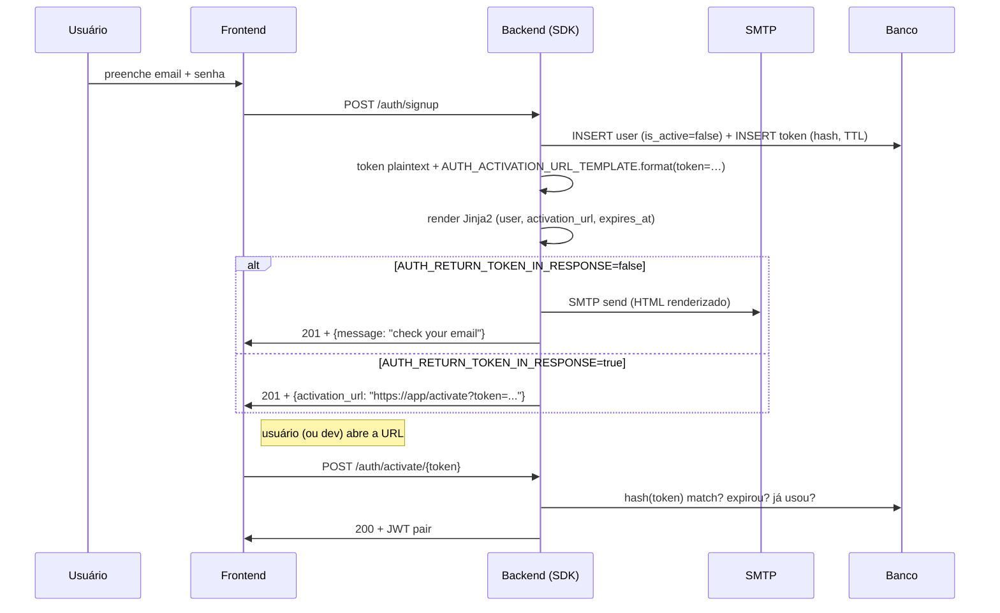
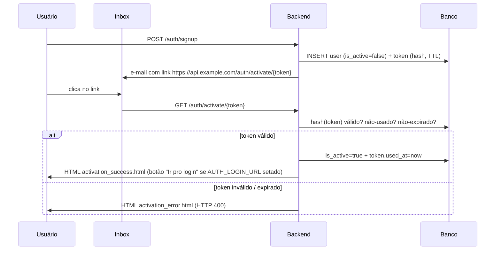

# Bundled auth flow (signup / activate / login / reset)

Desde v0.31.0 o SDK fornece o ciclo completo de conta local — signup com email/senha, ativação por link, login com JWT pair, reset de senha — via `UserAuthService` + `make_auth_router`. **Cinco endpoints prontos pra mount**, templates Jinja2 bundled, settings flags controlando se o link sai por e-mail ou no body da resposta, e quatro modos pré-pensados pra dev / staging / produção / CI.

## Conteúdo da receita

1. **[Setup mínimo](#setup-minimo)** — instalação dos extras + wiring de quatro objetos (`AsyncDatabaseManager`, `EmailUtils`, `UserAuthService`, `make_auth_router`).
2. **[UserTokenModel concreto](#usertokenmodel-concreto)** — `BaseUserTokenModel` é abstrato, projeto cria a tabela final.
3. **[Endpoints](#endpoints)** — tabela dos 5 endpoints + payload + comportamento.
4. **[Settings (`AuthSettings`)](#settings-authsettings)** — `.env` flag a flag.
5. **[Anatomia de um e-mail: como link, template e URL se encaixam](#anatomia-de-um-e-mail)** — desambigua os três conceitos que mais confundem.
6. **[Cinco modos de operação](#cinco-modos-de-operacao)** — produção, dev com SMTP local (Mailhog / smtp4dev), dev sem SMTP, CI sem ativação e **backend-only** (links e páginas servidas direto pelo backend).
7. **[Mailhog vs smtp4dev — qual escolher pra dev local](#mailhog-vs-smtp4dev)** — comparativo + receitas docker-compose copy-paste.
8. **[Customizando os templates de e-mail](#customizando-templates)** — override do `activation.html` e `password_reset.html` + variáveis disponíveis no contexto Jinja2.
9. **[Segurança](#seguranca)** — como o token é armazenado, TTL, anti-enumeração.
10. **[Próximos passos](#proximos-passos)**.

---

## Setup mínimo

Requer:

- `[auth]` (bcrypt + PyJWT) — obrigatório, sempre.
- `[email]` (aiosmtplib + Jinja2 + email-validator) — opcional; quando ausente, os links vão no body da resposta em vez de e-mail.

```bash
uv add "tempest-fastapi-sdk[auth,email]>=0.31.0"
```

```python
# src/api/app.py
from tempest_fastapi_sdk import (
    AsyncDatabaseManager,
    EmailUtils,
    UserAuthService,
    make_auth_router,
)
from src.core.settings import settings
from src.db.models import UserModel, UserTokenModel

db = AsyncDatabaseManager(settings.DATABASE_URL)

# EmailUtils — só instancie se [email] estiver instalado E você quiser e-mail
# real (modos A e B abaixo). Nos modos C e D, passe email=None pro service.
emails = EmailUtils(
    host=settings.SMTP_HOST,
    port=settings.SMTP_PORT,
    username=settings.SMTP_USERNAME,
    password=settings.SMTP_PASSWORD,
    from_addr=settings.SMTP_FROM_ADDR,
    template_dir="emails",  # diretório onde seus templates custom moram
)

auth_service = UserAuthService(
    user_model=UserModel,
    token_model=UserTokenModel,
    auth_settings=settings,   # mistura AuthSettings (ver seção 4)
    jwt_settings=settings,    # mistura JWTSettings
    email=emails,             # ou None — controla envio real vs link no body
)

app.include_router(
    make_auth_router(
        auth_service,
        session_factory=db.session_dependency,
    ),
)
```

!!! tip "TL;DR de quatro objetos"
    `AsyncDatabaseManager` → conexão. `EmailUtils` → SMTP + Jinja2. `UserAuthService` → regras de negócio (5 métodos). `make_auth_router` → cola tudo em 5 endpoints HTTP.

---

## UserTokenModel concreto

`BaseUserTokenModel` é abstrato — projeto cria a tabela concreta porque a FK pra `users` precisa do nome da sua tabela. Exemplo `src/db/models/user_token.py`:

```python
from uuid import UUID

from sqlalchemy import ForeignKey
from sqlalchemy.orm import Mapped, mapped_column
from tempest_fastapi_sdk import BaseUserTokenModel


class UserTokenModel(BaseUserTokenModel):
    """Concrete token table for activation / reset / email-verification."""

    __tablename__ = "user_tokens"

    user_id: Mapped[UUID] = mapped_column(
        ForeignKey("users.id", ondelete="CASCADE"),
        nullable=False,
        index=True,
    )
```

E importar em `src/db/models/__init__.py` pra Alembic ver:

```python
from src.db.models.user import UserModel
from src.db.models.user_token import UserTokenModel

__all__: list[str] = ["UserModel", "UserTokenModel"]
```

Gerar migration:

```bash
uv run tempest db revision -m "users + user_tokens"
uv run tempest db upgrade
```

---

## Endpoints

| Método | Path | Body / Output | Comportamento |
|--------|------|---------------|---------------|
| POST | `/auth/signup` | `SignupSchema` → `SignupResponseSchema` | Cria user. Emite e-mail (modos A/B) **ou** devolve link no body (modo C). Se `AUTH_AUTO_ACTIVATE=True`, user nasce ativo e JWT pair volta direto (modo D). |
| POST | `/auth/activate/{token}` | — → `ActivationResponseSchema` | Consome token + `is_active=True` + emite JWT pair. |
| POST | `/auth/login` | `LoginSchema` → `LoginResponseSchema` | Email + senha → JWT pair. Erros genéricos (não enumera contas). |
| POST | `/auth/password-reset/request` | `PasswordResetRequestSchema` → `PasswordResetResponseSchema` | Sempre HTTP 202 + corpo genérico. Link via e-mail (A/B) ou no body (C). |
| POST | `/auth/password-reset/confirm` | `PasswordResetConfirmSchema` → `LoginResponseSchema` | Consome token + grava nova senha + emite JWT pair. |

---

## Settings (`AuthSettings`)

Mixe `AuthSettings` na sua classe `Settings`:

```python
# src/core/settings.py
from tempest_fastapi_sdk import (
    AuthSettings,
    BaseAppSettings,
    DatabaseSettings,
    EmailSettings,
    JWTSettings,
    ServerSettings,
)


class Settings(
    ServerSettings,
    DatabaseSettings,
    EmailSettings,
    JWTSettings,
    AuthSettings,
    BaseAppSettings,
):
    pass


settings = Settings()
```

Variáveis (com defaults seguros pra produção):

```bash
# .env — fluxo de e-mail
AUTH_AUTO_ACTIVATE=false                # true = pula activation, devolve JWT direto
AUTH_RETURN_TOKEN_IN_RESPONSE=false     # true = link no body em vez de e-mail
AUTH_PASSWORD_MIN_LENGTH=12

# .env — TTL dos tokens
AUTH_ACTIVATION_TTL_SECONDS=604800      # 7 dias
AUTH_PASSWORD_RESET_TTL_SECONDS=3600    # 1 hora

# .env — URLs apontando para SEU FRONTEND (NÃO o backend)
AUTH_ACTIVATION_URL_TEMPLATE=https://app.example.com/activate?token={token}
AUTH_PASSWORD_RESET_URL_TEMPLATE=https://app.example.com/reset?token={token}

# .env — nomes dos arquivos Jinja2 dentro do template_dir do EmailUtils
AUTH_ACTIVATION_TEMPLATE=activation.html
AUTH_PASSWORD_RESET_TEMPLATE=password_reset.html
```

---

## Anatomia de um e-mail

Três conceitos diferentes que parecem o mesmo. Eis o que cada um faz, exatamente uma vez, em pseudo-código:

```text
1. SDK gera um token opaco aleatório (string de 64 chars).
2. AUTH_ACTIVATION_URL_TEMPLATE.format(token=…)  →  link com o token embutido.
3. Renderiza AUTH_ACTIVATION_TEMPLATE (Jinja2 HTML) passando { user, activation_url, expires_at }.
4. EmailUtils.send(to=user.email, subject=..., html=<HTML renderizado>).
```

Em prosa:

- **Token opaco** — string aleatória que o SDK gera, hasheia (SHA-256) e grava na tabela `user_tokens`. O plaintext sai pelo e-mail **uma única vez**; o banco só guarda o hash.
- **URL template** (`AUTH_ACTIVATION_URL_TEMPLATE`) — formato literal pra montar a URL que vai pro usuário clicar. **Aponta pro frontend, não pro backend.** O frontend recebe `?token=…`, capta da query string e chama `POST /auth/activate/{token}` no backend.
- **Jinja2 template** (`AUTH_ACTIVATION_TEMPLATE`) — nome do arquivo HTML dentro do `template_dir` do `EmailUtils`. É **o HTML do e-mail**, não a URL. Recebe o contexto `{ user, activation_url, expires_at }` e renderiza o markup final.

!!! warning "URL template ≠ Jinja2 template"
    `AUTH_ACTIVATION_URL_TEMPLATE` é uma string Python `.format()`-style — só tem o placeholder `{token}`. **Não confunda** com o arquivo `.html` que o Jinja2 renderiza. A URL formatada **é injetada como variável** no contexto do Jinja2 sob o nome `activation_url`, e o template HTML embrulha ela num botão.

Fluxo visual:



---

## Cinco modos de operação

| Modo | Quando usar | Flags | Onde o link aparece |
|------|-------------|-------|--------------------|
| **A. Produção (SPA)** | SaaS público, e-mail real, frontend SPA dono das páginas | `AUTH_AUTO_ACTIVATE=false`<br>`AUTH_RETURN_TOKEN_IN_RESPONSE=false`<br>`AUTH_BACKEND_LINKS=false`<br>SMTP real (Mailgun, SES, Postmark…) | Inbox real → frontend processa o token |
| **B. Dev local com SMTP fake** | Desenvolvimento diário sem mandar e-mail real | `AUTH_AUTO_ACTIVATE=false`<br>`AUTH_RETURN_TOKEN_IN_RESPONSE=false`<br>SMTP apontando pra Mailhog (`localhost:1025`) ou smtp4dev (`localhost:2525`) | UI web do Mailhog/smtp4dev em `localhost:8025` / `localhost:5000` |
| **C. Dev sem SMTP** | Validação rápida sem subir nenhum container de e-mail | `AUTH_AUTO_ACTIVATE=false`<br>`AUTH_RETURN_TOKEN_IN_RESPONSE=true`<br>`email=None` ou SMTP inválido | Body da resposta HTTP do signup |
| **D. CI / testes** | Suite de testes que não exercita activation | `AUTH_AUTO_ACTIVATE=true` | Nenhum — signup já devolve JWT pair |
| **E. Backend-only** *(v0.32.0+)* | Quer 100% de controle no backend — sem responsabilidade no frontend. Ideal pra APIs sem SPA, MVPs, intranets. | `AUTH_BACKEND_LINKS=true`<br>URL templates apontam pro **backend** (`https://api.example.com/auth/activate/{token}`)<br>`AUTH_LOGIN_URL=https://app.example.com/login` (opcional, mostra botão "Ir pro login" nas páginas HTML) | Backend renderiza HTML success/error direto — usuário só clica no link do e-mail |

### Modo A — produção

```bash
AUTH_AUTO_ACTIVATE=false
AUTH_RETURN_TOKEN_IN_RESPONSE=false
SMTP_HOST=smtp.mailgun.org
SMTP_PORT=587
SMTP_USERNAME=postmaster@mg.example.com
SMTP_PASSWORD=...                          # secret, não commitar
SMTP_FROM_ADDR=noreply@example.com
AUTH_ACTIVATION_URL_TEMPLATE=https://app.example.com/activate?token={token}
AUTH_PASSWORD_RESET_URL_TEMPLATE=https://app.example.com/reset?token={token}
```

Fluxo: signup → e-mail real chega no inbox → usuário clica → frontend chama `POST /auth/activate/{token}` → login.

### Modo B — dev com SMTP local (Mailhog ou smtp4dev)

Mesmo `.env` do modo A, mas apontando o SMTP para um container local que **intercepta** os e-mails em vez de mandar de verdade. **Use este modo no dia-a-dia** — o fluxo é idêntico ao de produção, então você pega bugs de template, encoding, charset, etc. ao mesmo tempo que evita spammar e-mail real.

```bash
# .env.dev
AUTH_AUTO_ACTIVATE=false
AUTH_RETURN_TOKEN_IN_RESPONSE=false
SMTP_HOST=localhost
SMTP_PORT=1025                             # Mailhog SMTP padrão
SMTP_USERNAME=                             # vazio — Mailhog não autentica
SMTP_PASSWORD=
SMTP_FROM_ADDR=dev@local
AUTH_ACTIVATION_URL_TEMPLATE=http://localhost:5173/activate?token={token}
AUTH_PASSWORD_RESET_URL_TEMPLATE=http://localhost:5173/reset?token={token}
```

Abra `http://localhost:8025` (Mailhog) ou `http://localhost:5000` (smtp4dev) pra ver os e-mails interceptados. Veja a seção **[Mailhog vs smtp4dev](#mailhog-vs-smtp4dev)** abaixo.

### Modo C — dev sem SMTP (link no body)

Sem container de SMTP nenhum. O signup devolve o link de ativação no JSON da resposta:

```bash
AUTH_AUTO_ACTIVATE=false
AUTH_RETURN_TOKEN_IN_RESPONSE=true
AUTH_ACTIVATION_URL_TEMPLATE=http://localhost:5173/activate?token={token}
```

Request:

```bash
curl -X POST localhost:8000/auth/signup \
  -H 'content-type: application/json' \
  -d '{"email":"dev@local","password":"abcdefghijkl","name":"Dev"}'
```

Resposta:

```json
{
  "user_id": "01HE...",
  "email": "dev@local",
  "is_active": false,
  "activation_url": "http://localhost:5173/activate?token=aBcD...xYz"
}
```

Cole a URL no navegador / curl pra exercitar `POST /auth/activate/{token}`.

### Modo D — CI / testes (skip total)

```bash
AUTH_AUTO_ACTIVATE=true
```

Signup pula ativação inteira e devolve `{access_token, refresh_token}` direto. Use **só em testes** ou quando o produto for interno e cada usuário já é confiável.

### Modo E — backend-only (v0.32.0+)

Quando você prefere que **toda** a experiência do link aconteça no backend, sem nenhuma página no frontend, ative `AUTH_BACKEND_LINKS=True`. O router passa a montar **três endpoints HTML** adicionais — `GET /auth/activate/{token}`, `GET /auth/password-reset/{token}` e `POST /auth/password-reset/{token}` (form-encoded). O e-mail aponta o usuário direto pra esses endpoints; o backend ativa a conta / processa o reset / renderiza HTML success ou error — usando templates Jinja2 bundled que você pode shadowar.

```bash
# .env — Modo E (backend-only)
AUTH_BACKEND_LINKS=true
AUTH_AUTO_ACTIVATE=false
AUTH_RETURN_TOKEN_IN_RESPONSE=false

# IMPORTANTE: URL templates apontam pro BACKEND, não pro frontend.
AUTH_ACTIVATION_URL_TEMPLATE=https://api.example.com/auth/activate/{token}
AUTH_PASSWORD_RESET_URL_TEMPLATE=https://api.example.com/auth/password-reset/{token}

# Opcional: URL do seu login. Quando setado, aparece um botão "Ir pro login"
# nas páginas de success/error renderizadas pelo backend. Quando null,
# o botão é omitido (puro server-side, zero acoplamento com frontend).
AUTH_LOGIN_URL=https://app.example.com/login

SMTP_HOST=smtp.mailgun.org
SMTP_PORT=587
SMTP_FROM_ADDR=noreply@example.com
```

Fluxo:



Password reset segue padrão similar: GET renderiza form HTML; POST (form-encoded) consome o token e renderiza success/error.

**Templates HTML bundled (override droppando o mesmo nome no `template_dir`):**

| Template | Endpoint que renderiza | Variáveis Jinja2 disponíveis |
|----------|------------------------|------------------------------|
| `activation_success.html` | `GET /auth/activate/{token}` (sucesso) | `user`, `login_url` |
| `activation_error.html` | `GET /auth/activate/{token}` (falha) | `reason`, `login_url` |
| `password_reset_form.html` | `GET /auth/password-reset/{token}` | `user`, `form_action`, `min_length`, `error`, `login_url` |
| `password_reset_success.html` | `POST /auth/password-reset/{token}` (sucesso) | `user`, `login_url` |
| `password_reset_error.html` | `POST /auth/password-reset/{token}` (token inválido) | `reason`, `login_url` |

**Pra override:** passe `template_dir` no `make_auth_router` e crie arquivos de mesmo nome.

```python
app.include_router(
    make_auth_router(
        auth_service,
        session_factory=db.session_dependency,
        template_dir="src/templates/auth",   # opcional
    ),
)
```

**Trade-offs do Modo E:**

- ✅ **Zero dependência do frontend** — backend é fonte única da verdade do fluxo de auth.
- ✅ **MVP em minutos** — sem precisar criar rotas SPA pra processar tokens.
- ✅ **Funciona em projetos sem frontend** — APIs públicas, intranets, ferramentas internas.
- ⚠️ **JWT não é entregue automaticamente** — após ativação, o usuário precisa fazer login manualmente (clicando em "Ir pro login" e usando as credenciais). Por design: zero leak de token em URL, history, ou server logs.
- ⚠️ **Requer `[email]` extra** (Jinja2) pra renderizar as páginas HTML — mesma dependência do template de e-mail.
- ⚠️ **CSRF na form de reset** — o form HTML usa POST tradicional sem token CSRF. Aceita a request porque o token de reset é one-shot + TTL curto + bound a um user específico, mas considere acoplar `CSRFMiddleware` se atacantes conseguirem prever URLs ativas.

Os endpoints **JSON** (`POST /auth/activate/{token}`, `POST /auth/password-reset/confirm`) continuam montados — você pode usar Modo E + manter SPA endpoints ao mesmo tempo.

---

## Mailhog vs smtp4dev

Os dois interceptam SMTP local e renderizam os e-mails numa UI web. Diferenças relevantes:

| Aspecto | Mailhog | smtp4dev |
|---------|---------|----------|
| Imagem Docker | `mailhog/mailhog:latest` | `rnwood/smtp4dev:latest` |
| Porta SMTP padrão | `1025` | `2525` (configurável) |
| Porta da UI | `8025` | `5000` |
| Tamanho da imagem | ~10 MB | ~120 MB (.NET) |
| Multi-conta / multi-inbox | não — uma única caixa | sim — filtra por destinatário |
| API HTTP / REST | sim (`/api/v2/messages`) | sim (Swagger built-in) |
| Validação de DKIM / SPF | não | sim |
| Manutenção upstream | arquivado em 2020, ainda funciona | ativa |

**Sugestão:** comece com Mailhog (mais leve, zero-config) e migre pra smtp4dev quando precisar de multi-inbox ou inspeção de DKIM. Para o ciclo signup → activate → reset, **Mailhog é suficiente**.

### `docker-compose.yaml` — Mailhog

```yaml
services:
  mailhog:
    image: mailhog/mailhog:latest
    container_name: mailhog
    ports:
      - "1025:1025"  # SMTP — aponte SMTP_HOST aqui
      - "8025:8025"  # UI web
```

`SMTP_PORT=1025`, abra `http://localhost:8025`.

### `docker-compose.yaml` — smtp4dev

```yaml
services:
  smtp4dev:
    image: rnwood/smtp4dev:latest
    container_name: smtp4dev
    ports:
      - "2525:25"     # SMTP — aponte SMTP_HOST aqui
      - "5000:80"     # UI web
    environment:
      - ServerOptions__HostName=smtp4dev
```

`SMTP_PORT=2525`, abra `http://localhost:5000`.

!!! tip "Já tem `tempest generate --docker`?"
    Em v0.32+ o gerador de docker-compose vai aceitar `--with mailhog` como atalho. Hoje (v0.31.x) você cola um dos blocos acima no `docker-compose.yaml` gerado pela CLI.

---

## Customizando templates

O SDK ship dois templates Jinja2 bundled (`activation.html` + `password_reset.html`) — HTML responsivo, inline styles, mobile-friendly. Você nunca precisa mexer neles pra um MVP funcionar. Quando quiser branding próprio, basta criar um arquivo com o **mesmo nome** dentro do `template_dir` que você passou no `EmailUtils`:

```text
emails/                            # ← template_dir="emails"
├── activation.html                # override do default do SDK
└── password_reset.html            # override do default do SDK
```

`EmailUtils` usa um `ChoiceLoader` interno do Jinja2 que procura **primeiro** no seu diretório e **só cai** no template bundled se não achar. Você pode sobrescrever um, o outro, ou ambos — sem precisar copiar o template inteiro.

### Variáveis disponíveis no contexto Jinja2

| Variável | Tipo | Em quais templates | Exemplo |
|----------|------|--------------------|---------|
| `user` | instância de `UserModel` | ambos | `{{ user.email }}`, `{{ user.name }}` (quando seu modelo expõe a coluna) |
| `activation_url` | `str` | `activation.html` | `https://app.example.com/activate?token=aBcD...xYz` |
| `reset_url` | `str` | `password_reset.html` | `https://app.example.com/reset?token=aBcD...xYz` |
| `expires_at` | `datetime` (UTC, timezone-aware) | ambos | use `{{ expires_at.strftime("%d/%m/%Y %H:%M UTC") }}` |

### Exemplo: `emails/activation.html` enxuto

```html
<!doctype html>
<html lang="pt-BR">
  <body style="font-family: sans-serif; max-width: 480px; margin: auto;">
    <h1>Bem-vindo(a), {{ user.name }}!</h1>
    <p>Para ativar sua conta, clique no botão abaixo:</p>
    <p>
      <a href="{{ activation_url }}"
         style="display: inline-block; padding: 12px 24px;
                background: #4f46e5; color: white;
                text-decoration: none; border-radius: 6px;">
        Ativar conta
      </a>
    </p>
    <p style="color: #6b7280; font-size: 12px;">
      Link válido até {{ expires_at.strftime("%d/%m/%Y %H:%M UTC") }}.
      Se você não criou esta conta, ignore este e-mail.
    </p>
  </body>
</html>
```

!!! note "O Jinja2 só roda quando há e-mail real"
    Nos modos C (`AUTH_RETURN_TOKEN_IN_RESPONSE=true`) e D (`AUTH_AUTO_ACTIVATE=true`) o template Jinja2 **não é renderizado** — o link sai cru no JSON, sem HTML. Só os modos A e B (e-mail SMTP real ou interceptado) exercitam o template.

---

## Segurança

- **Token armazenado como hash SHA-256.** O plaintext sai pelo e-mail uma única vez; o banco nunca tem como reproduzir o token original. Vazamento da tabela `user_tokens` **não** permite ativação retroativa.
- **One-shot.** `used_at` é carimbado no consume; replay rejeitado com `UnauthorizedException`.
- **TTL-bounded.** `expires_at` calculado a partir de `AUTH_ACTIVATION_TTL_SECONDS` / `AUTH_PASSWORD_RESET_TTL_SECONDS`. Tokens expirados rejeitados.
- **Anti-enumeração.** `POST /auth/password-reset/request` retorna sempre HTTP 202 + corpo genérico, independente de o e-mail existir ou não. `POST /auth/login` levanta a mesma `UnauthorizedException` para email-errado vs senha-errada.
- **Password floor aplicado duas vezes.** `SignupSchema` valida no input; `UserAuthService` revalida antes do hash — defesa em profundidade caso alguém bypasse o schema.

---

## Próximos passos

- **[Idempotência »](idempotency.md)** — proteja `POST /auth/signup` de retentativas que duplicariam linha.
- **[Storage MinIO/S3 »](storage.md)** — anexar avatar / foto de perfil já no signup.
- **[Logging »](logging.md)** — `request_id` já propaga automaticamente em cada log emitido durante o flow.
- **[Métricas »](metrics.md)** — `PrometheusMiddleware` conta `/auth/*` separadamente sem config extra.
