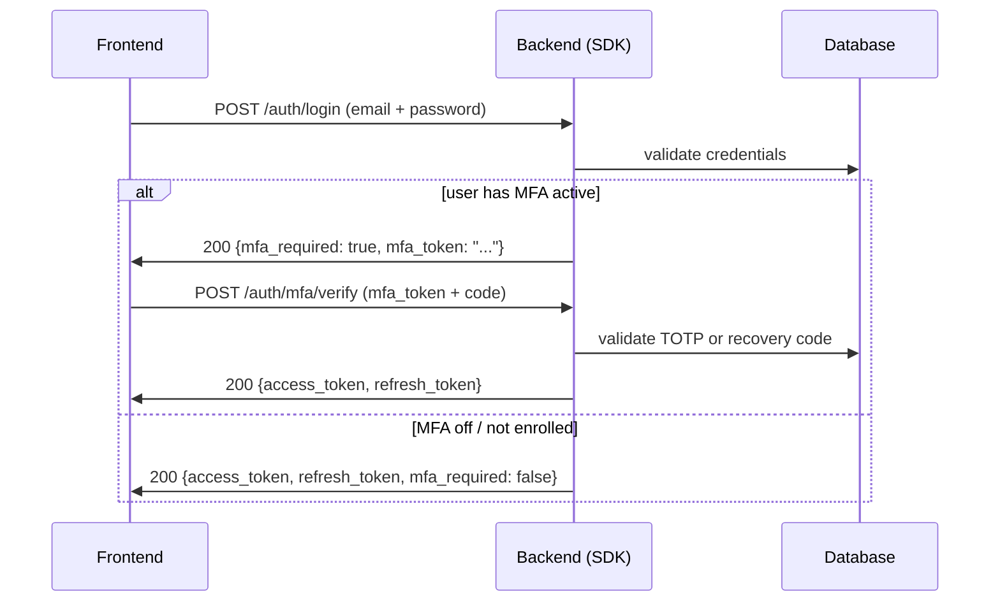

# MFA / 2FA with TOTP (Authenticator)

Since **v0.35.0** the bundled auth flow supports **two-factor authentication** with Authenticator apps (Google Authenticator, 1Password, Authy, etc.) following the **TOTP (RFC 6238)** standard. You get four ready-to-mount endpoints, single-use recovery codes, and a two-step login — all behind a global kill-switch.

## What's in this recipe

1. **[How it works in 30 seconds](#how-it-works)** — the mental model of the two-step flow.
2. **[Setup](#setup)** — the `[mfa]` extra, new `UserModel` columns, recovery-code table.
3. **[Wiring](#wiring)** — passing `recovery_code_model` to `make_auth_router`.
4. **[The four endpoints](#endpoints)** — enroll / confirm / verify / disable.
5. **[Two-step login](#two-step-login)** — how `POST /auth/login` changes when MFA is active.
6. **[Settings (`AuthSettings`)](#settings)** — flag by flag.
7. **[Using just `UserAuthService` (no router)](#service-direct)** — for hand-rolled endpoints.
8. **[Security](#security)**.
9. **[Next steps](#next-steps)**.

---

## How it works

TOTP is the 6-digit code that rolls over every 30 seconds in your Authenticator app. The server and the app share a **secret** (generated at enrollment); both derive the same code from the current clock. No SMS, no network — pure local math.

The flow has two moments:

- **Enrollment (once)** — the logged-in user requests a secret, scans the QR code, and confirms by typing the first code. From there MFA is active.
- **Login (every time)** — the password validates step 1, but instead of the JWT pair the backend returns a short-lived `mfa_token`. The user types the Authenticator code; step 2 swaps `mfa_token` + code for the real JWT pair.

!!! info "Why two steps and not all at once?"
    Splitting keeps the password and the second factor decoupled. The `mfa_token` (5-min TTL by default) carries only the user's `sub` — intercepting it alone is not enough to log in, because the Authenticator code is still missing.

---

## Setup

Requires the `[mfa]` extra (installs `pyotp`), on top of `[auth]`:

```bash
uv add "tempest-fastapi-sdk[auth,mfa]>=0.35.0"
```

### Columns via `MFAMixin`

The MFA columns (`totp_secret`, `totp_enabled_at`) do **not** live on `BaseUserModel` — they come from an opt-in mixin, `MFAMixin`. Mix it into your `UserModel` only when you adopt MFA, so projects that never enable the feature carry no dead columns:

```python
# src/db/models/user.py
from tempest_fastapi_sdk import BaseUserModel, MFAMixin


class UserModel(MFAMixin, BaseUserModel):
    """Concrete user table — MFAMixin adds totp_secret / totp_enabled_at."""

    __tablename__ = "users"
```

!!! note "MRO order"
    The mixin comes **before** `BaseUserModel` in the base list — same pattern as `AuditMixin` / `SoftDeleteMixin`. The mixin also exposes an `is_mfa_active` property (`totp_enabled_at is not None`).

!!! warning "Migration required"
    `totp_secret` and `totp_enabled_at` are new columns. Run `uv run tempest db revision -m "mfa columns"` + `uv run tempest db upgrade` before flipping the flag.

### Recovery-code table

Recovery codes save the user who lost their phone. They are **single-use**, shown **once** at enrollment, and the database stores only the SHA-256 hash of each. `BaseUserRecoveryCodeModel` is abstract — use the `make_user_recovery_code_model` helper to build the concrete table bound to your users table:

```python
# src/db/models/__init__.py
from tempest_fastapi_sdk import make_user_recovery_code_model

from src.db.models.user import UserModel
from src.db.models.user_token import UserTokenModel

UserRecoveryCodeModel = make_user_recovery_code_model(
    user_table="users",
    tablename="user_recovery_codes",
    class_name="UserRecoveryCodeModel",
)

__all__: list[str] = [
    "UserModel",
    "UserTokenModel",
    "UserRecoveryCodeModel",
]
```

??? note "Prefer subclassing by hand?"
    The helper is just sugar. The explicit equivalent:

    ```python
    from uuid import UUID

    from sqlalchemy import ForeignKey
    from sqlalchemy.orm import Mapped, mapped_column
    from tempest_fastapi_sdk import BaseUserRecoveryCodeModel


    class UserRecoveryCodeModel(BaseUserRecoveryCodeModel):
        __tablename__ = "user_recovery_codes"

        user_id: Mapped[UUID] = mapped_column(
            ForeignKey("users.id", ondelete="CASCADE"),
            nullable=False,
            index=True,
        )
    ```

---

## Wiring

Turn on the `AUTH_MFA_ENABLED` flag and pass the `recovery_code_model` to the router. Without the model, the router raises `RuntimeError` at build time — a deliberate guard:

```python
# src/api/app.py
from tempest_fastapi_sdk import (
    AsyncDatabaseManager,
    UserAuthService,
    make_auth_router,
)
from src.core.settings import settings
from src.db.models import UserModel, UserTokenModel, UserRecoveryCodeModel

db = AsyncDatabaseManager(settings.DATABASE_URL)

auth_service = UserAuthService(
    user_model=UserModel,
    token_model=UserTokenModel,
    auth_settings=settings,   # mixes in AuthSettings (AUTH_MFA_* below)
    jwt_settings=settings,
    email=None,
)

app.include_router(
    make_auth_router(
        auth_service,
        session_factory=db.session_dependency,
        recovery_code_model=UserRecoveryCodeModel,   # required when MFA is on
    ),
)
```

!!! tip "Global kill-switch"
    With `AUTH_MFA_ENABLED=False` (default), the `/auth/mfa/*` endpoints respond `404` and login ignores any persisted `totp_secret` — handy to disable MFA during an Authenticator outage without touching the database.

---

## Endpoints

The four are only mounted when `AUTH_MFA_ENABLED=True`:

| Method | Path | Auth | Body / Output | Behavior |
|--------|------|------|---------------|----------|
| POST | `/auth/mfa/enroll` | Bearer JWT | — → `MFAEnrollResponseSchema` | Generates secret + QR URI + N recovery codes. **Shown only once.** Does NOT activate MFA yet. |
| POST | `/auth/mfa/confirm` | Bearer JWT | `MFAConfirmSchema` | Confirms enrollment with the first code. From here MFA is active. |
| POST | `/auth/mfa/verify` | — | `MFAVerifySchema` → `LoginResponseSchema` | Login step 2: swaps `mfa_token` + code for the JWT pair. |
| POST | `/auth/mfa/disable` | Bearer JWT | `MFADisableSchema` | Disables MFA. Requires password **and** an active code (TOTP or recovery). |

### Enrollment flow

```python
import httpx

BASE = "http://localhost:8000"
access = "<logged-in user's JWT>"
headers = {"Authorization": f"Bearer {access}"}

# 1. Enroll — returns secret, QR URI and the recovery codes (once!)
r = httpx.post(f"{BASE}/auth/mfa/enroll", headers=headers)
data = r.json()
print(data["provisioning_uri"])   # render as a QR code
print(data["recovery_codes"])     # show the user — save OFFLINE

# 2. User scans the QR in the Authenticator and types the generated code:
code = input("Authenticator code: ")
httpx.post(f"{BASE}/auth/mfa/confirm", headers=headers, json={"code": code})
# 204 No Content → MFA active
```

!!! danger "Recovery codes appear ONCE"
    The `enroll` response is the only time `secret` and `recovery_codes` leave in plaintext. Calling `enroll` again **rotates** the secret and **invalidates** every previous code. Show them prominently and tell the user to store them offline.

---

## Two-step login

When the user has MFA active, `POST /auth/login` no longer returns the JWT pair directly — it returns `mfa_required=True` + a short-lived `mfa_token`:

```python
import httpx

BASE = "http://localhost:8000"

# Step 1 — password
r1 = httpx.post(
    f"{BASE}/auth/login",
    json={"email": "ana@example.com", "password": "strong-pass-12-chars"},
)
body = r1.json()
# {
#   "user_id": "...",
#   "access_token": null,
#   "refresh_token": null,
#   "mfa_required": true,
#   "mfa_token": "eyJhbGciOi..."
# }

# Step 2 — Authenticator code (or a recovery code)
code = input("Authenticator code: ")
r2 = httpx.post(
    f"{BASE}/auth/mfa/verify",
    json={"mfa_token": body["mfa_token"], "code": code},
)
tokens = r2.json()
# { "access_token": "...", "refresh_token": "...", "mfa_required": false }
```

For users **without** MFA (or with the kill-switch off), `POST /auth/login` keeps returning the JWT pair directly, with `mfa_required=False` — the frontend just checks that field and branches.



---

## Settings

Mix `AuthSettings` into your `Settings` class (as in the [auth flow recipe](auth-flow.md#settings-environment-variables)) and configure via env:

```bash
# .env — MFA
AUTH_MFA_ENABLED=true                   # global kill-switch (default false)
AUTH_MFA_ISSUER=Acme Inc.               # name shown in the Authenticator
AUTH_MFA_RECOVERY_CODES_COUNT=10        # codes generated at enroll (2..50)
AUTH_MFA_TOKEN_TTL_SECONDS=300          # mfa_token TTL between step 1 and 2 (30..900)
AUTH_MFA_VERIFY_WINDOW=1                # drift tolerance, in 30s steps (0..4)
```

| Setting | Default | What it does |
|---------|---------|--------------|
| `AUTH_MFA_ENABLED` | `False` | Mounts the `/auth/mfa/*` endpoints and the two-step login. |
| `AUTH_MFA_ISSUER` | `"Tempest"` | Label next to the email in the Authenticator app. Use your product name. |
| `AUTH_MFA_RECOVERY_CODES_COUNT` | `10` | Number of recovery codes generated at enrollment. |
| `AUTH_MFA_TOKEN_TTL_SECONDS` | `300` | Lifetime of the intermediate `mfa_token` (5 min). |
| `AUTH_MFA_VERIFY_WINDOW` | `1` | Tolerance for the user's clock. `1` accepts previous + current + next step (90s). `0` is strict; above `2` weakens it. |

---

## Service direct

If you mount your own endpoints (no `make_auth_router`), the six `UserAuthService` methods cover the whole cycle:

```python
from sqlalchemy.ext.asyncio import AsyncSession

from src.db.models import UserModel, UserRecoveryCodeModel


async def enroll_user(service: UserAuthService, session: AsyncSession, user: UserModel) -> None:
    """Generate secret + recovery codes and show them to the user (once)."""
    secret, provisioning_uri, recovery_codes = await service.mfa_enroll(
        session,
        user=user,
        recovery_code_model=UserRecoveryCodeModel,
    )
    await session.commit()
    # render provisioning_uri as a QR; show recovery_codes


async def confirm_user(
    service: UserAuthService, session: AsyncSession, user: UserModel, code: str
) -> None:
    """Activate MFA after the user proves they scanned the QR."""
    await service.mfa_confirm(session, user=user, code=code)
    await session.commit()
```

Full surface:

| Method | Signature (abridged) | Returns |
|--------|----------------------|---------|
| `is_mfa_enrolled` | `(user) -> bool` | `True` if MFA active (and kill-switch on). |
| `issue_mfa_token` | `(user) -> str` | Short JWT bridging step 1 and step 2. |
| `mfa_enroll` | `(session, *, user, recovery_code_model) -> tuple[str, str, list[str]]` | `(secret, provisioning_uri, recovery_codes)`. |
| `mfa_confirm` | `(session, *, user, code) -> None` | Activates MFA. |
| `mfa_verify` | `(session, *, mfa_token, code, recovery_code_model) -> UserModel` | Authenticated user (mint the JWT next). |
| `mfa_disable` | `(session, *, user, password, code, recovery_code_model) -> None` | Clears secret + codes. |

---

## Security

- **TOTP secret persisted on the `UserModel`.** Consider encrypting the `totp_secret` column at rest (Postgres `pgcrypto` or an application-level Fernet wrapper).
- **Recovery codes stored as SHA-256 hashes.** The plaintext leaves only once at enrollment; a table leak yields no usable codes.
- **Recovery codes are single-use.** `used_at` is stamped on consume; replay is rejected.
- **`disable` requires password + code.** A hijacked session cannot disable MFA on its own — it needs the password **and** an active factor.
- **`mfa_token` is short and user-bound.** 5-min TTL by default; carries `purpose: "mfa_pending"` + the `sub`. Tokens of any other purpose are rejected in `mfa_verify`.
- **Constant-time verification.** `TOTPHelper.verify` delegates to `pyotp`, which compares the code with `hmac.compare_digest`.

---

## Next steps

- **[Auth flow (signup/reset) »](auth-flow.md)** — the local-account flow MFA extends.
- **[Server-side sessions »](sessions.md)** — JWT alternative, combinable with MFA at step 1.
- **[Security »](security.md)** — CSRF, rate-limit and body-size limit for the auth endpoints.
