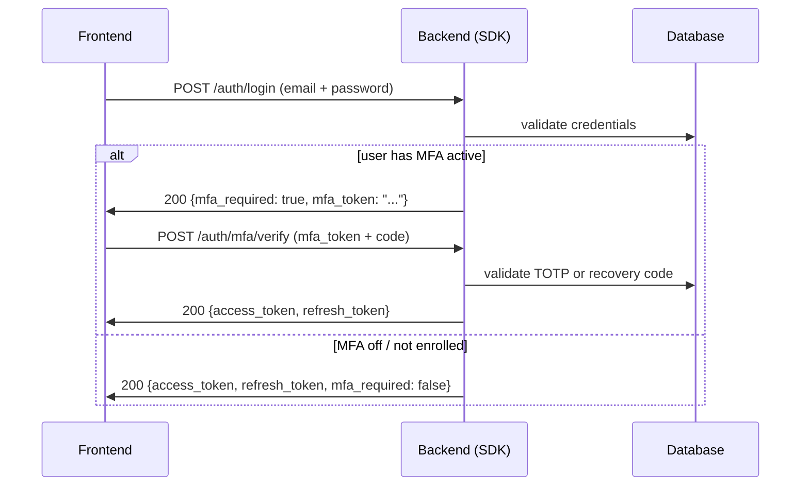

# MFA / 2FA with TOTP (Authenticator)

Since **v0.35.0** the bundled auth flow supports **two-factor authentication** with Authenticator apps (Google Authenticator, 1Password, Authy, etc.) following the **TOTP (RFC 6238)** standard. You get four ready-to-mount endpoints, single-use recovery codes, and a two-step login — all behind a global kill-switch.

## What's in this recipe

1. **[How it works in 30 seconds](#how-it-works)** — the mental model of the two-step flow.
2. **[Setup](#setup)** — the `[mfa]` extra, new `UserModel` columns, recovery-code table.
3. **[Wiring](#wiring)** — passing `recovery_code_model` to `make_auth_router`.
4. **[The four endpoints](#endpoints)** — enroll / confirm / verify / disable.
5. **[Two-step login](#two-step-login)** — how `POST /auth/login` changes when MFA is active.
6. **[Settings (`AuthSettings`)](#settings)** — flag by flag.
7. **[Attempt limit](#attempt-limit)** — `429` after five failures, and single-use TOTP codes.
8. **[Using just `UserAuthService` (no router)](#service-direct)** — for hand-rolled endpoints.
9. **[Security](#security)**.
10. **[Next steps](#next-steps)**.

---

## How it works

TOTP is the 6-digit code that rolls over every 30 seconds in your Authenticator app. The server and the app share a **secret** (generated at enrollment); both derive the same code from the current clock. No SMS, no network — pure local math.

The flow has two moments:

- **Enrollment (once)** — the logged-in user requests a secret, scans the QR code, and confirms by typing the first code. From there MFA is active.
- **Login (every time)** — the password validates step 1, but instead of the JWT pair the backend returns a short-lived `mfa_token`. The user types the Authenticator code; step 2 swaps `mfa_token` + code for the real JWT pair.

!!! info "Why two steps and not all at once?"
    Splitting keeps the password and the second factor decoupled. The `mfa_token` (5-min TTL by default) carries only the user's `sub` — intercepting it alone is not enough to log in, because the Authenticator code is still missing.

---

## Setup

Requires the `[mfa]` extra (installs `pyotp`), on top of `[auth]`:

```bash
uv add "tempest-fastapi-sdk[auth,mfa]>=0.151.1"
```

### Columns via `MFAMixin`

The MFA columns (`totp_secret`, `totp_enabled_at`, `totp_last_step`) do **not** live on `BaseUserModel` — they come from an opt-in mixin, `MFAMixin`. Mix it into your `UserModel` only when you adopt MFA, so projects that never enable the feature carry no dead columns:

```python
# src/db/models/user.py
from tempest_fastapi_sdk import BaseUserModel, MFAMixin


class UserModel(MFAMixin, BaseUserModel):
    """Concrete user table — MFAMixin adds the totp_* columns."""

    __tablename__ = "users"
```

!!! note "MRO order"
    The mixin comes **before** `BaseUserModel` in the base list — same pattern as `AuditMixin` / `SoftDeleteMixin`. The mixin also exposes an `is_mfa_active` property (`totp_enabled_at is not None`).

!!! warning "Migration required"
    `totp_secret`, `totp_enabled_at` and `totp_last_step` are new columns. Run `uv run tempest db revision -m "mfa columns"` + `uv run tempest db upgrade` before flipping the flag.

### Recovery-code table

Recovery codes save the user who lost their phone. They are **single-use**, shown **once** at enrollment, and the database stores only the SHA-256 hash of each. `BaseUserRecoveryCodeModel` is abstract — use the `make_user_recovery_code_model` helper to build the concrete table bound to your users table:

```python
# src/db/models/__init__.py
from tempest_fastapi_sdk import make_user_recovery_code_model

from src.db.models.user import UserModel
from src.db.models.user_token import UserTokenModel

UserRecoveryCodeModel = make_user_recovery_code_model(
    user_table="users",
    tablename="user_recovery_codes",
    class_name="UserRecoveryCodeModel",
)

__all__: list[str] = [
    "UserModel",
    "UserTokenModel",
    "UserRecoveryCodeModel",
]
```

??? note "Prefer subclassing by hand?"
    The helper is just sugar. The explicit equivalent:

    ```python
    from uuid import UUID

    from sqlalchemy import ForeignKey
    from sqlalchemy.orm import Mapped, mapped_column
    from tempest_fastapi_sdk import BaseUserRecoveryCodeModel


    class UserRecoveryCodeModel(BaseUserRecoveryCodeModel):
        __tablename__ = "user_recovery_codes"

        user_id: Mapped[UUID] = mapped_column(
            ForeignKey("users.id", ondelete="CASCADE"),
            nullable=False,
            index=True,
        )
    ```

---

## Wiring

Turn on the `AUTH_MFA_ENABLED` flag and pass the `recovery_code_model` to the router. Without the model, the router raises `RuntimeError` at build time — a deliberate guard:

```python
# src/api/app.py

from fastapi import FastAPI

from tempest_fastapi_sdk import AsyncDatabaseManager, UserAuthService, make_auth_router

from src.core.settings import settings
from src.db.models import UserModel, UserRecoveryCodeModel, UserTokenModel

app = FastAPI()


db = AsyncDatabaseManager(settings.DATABASE_URL)

auth_service = UserAuthService(
    user_model=UserModel,
    token_model=UserTokenModel,
    auth_settings=settings,   # mixes in AuthSettings (AUTH_MFA_* below)
    jwt_settings=settings,
    email=None,
)

app.include_router(
    make_auth_router(
        auth_service,
        session_factory=db.session_dependency,
        recovery_code_model=UserRecoveryCodeModel,   # required when MFA is on
    ),
)
```

!!! tip "Global kill-switch"
    With `AUTH_MFA_ENABLED=False` (default), the `/auth/mfa/*` endpoints respond `404` and login ignores any persisted `totp_secret` — handy to disable MFA during an Authenticator outage without touching the database.

---

## Endpoints

The four are only mounted when `AUTH_MFA_ENABLED=True`:

| Method | Path | Auth | Body / Output | Behavior |
|--------|------|------|---------------|----------|
| POST | `/auth/mfa/enroll` | Bearer JWT | — → `MFAEnrollResponseSchema` | Generates secret + QR URI + N recovery codes. **Shown only once.** Does NOT activate MFA yet. With MFA already active, answers `409` (`MFA_ALREADY_ENROLLED`) and changes nothing. |
| POST | `/auth/mfa/confirm` | Bearer JWT | `MFAConfirmSchema` | Confirms enrollment with the first code. From here MFA is active. |
| POST | `/auth/mfa/verify` | — | `MFAVerifySchema` → `LoginResponseSchema` | Login step 2: swaps `mfa_token` + code for the JWT pair. Five wrong codes per account in 15 min give `429` ([attempt limit](#attempt-limit)). |
| POST | `/auth/mfa/disable` | Bearer JWT | `MFADisableSchema` | Disables MFA. Requires password **and** an active code (TOTP or recovery). |

### Enrollment flow

```python
import httpx

BASE = "http://localhost:8000"
access = "<logged-in user's JWT>"
headers = {"Authorization": f"Bearer {access}"}

# 1. Enroll — returns secret, QR URI and the recovery codes (once!)
r = httpx.post(f"{BASE}/auth/mfa/enroll", headers=headers)
data = r.json()
print(data["provisioning_uri"])   # render as a QR code
print(data["recovery_codes"])     # show the user — save OFFLINE

# 2. User scans the QR in the Authenticator and types the generated code:
code = input("Authenticator code: ")
httpx.post(f"{BASE}/auth/mfa/confirm", headers=headers, json={"code": code})
# 204 No Content → MFA active
```

!!! danger "Recovery codes appear ONCE"
    The `enroll` response is the only time `secret` and `recovery_codes` leave in plaintext. Show them prominently and tell the user to store them offline.

### Rotating the secret: `disable`, then `enroll`

Calling `enroll` again **before** `confirm` replaces the pending secret and codes: the enrollment is not active yet, so there is no factor to protect. After `confirm`, `enroll` refuses with `409` and touches nothing:

```json
{"detail":"MFA is already active — disable it before enrolling again","code":"MFA_ALREADY_ENROLLED","details":{}}
```

That is the body with `register_exception_handlers` mounted. The refusal exists because `enroll` only asks for the bearer token and wipes the recovery codes: accepting a second `enroll` over active MFA let whoever held just the access token switch the second factor off, without the password and the code `disable` demands. To rotate the secret (new phone, leaked secret), the user goes through `POST /auth/mfa/disable` with password + code and then redoes `enroll` + `confirm`. In the service, the same refusal is the `MFAAlreadyEnrolledException` exception (a `ConflictException` subclass), raised by `mfa_enroll` even with the `AUTH_MFA_ENABLED` kill-switch off.

---

## Two-step login

When the user has MFA active, `POST /auth/login` no longer returns the JWT pair directly — it returns `mfa_required=True` + a short-lived `mfa_token`:

```python
import httpx

BASE = "http://localhost:8000"

# Step 1 — password
r1 = httpx.post(
    f"{BASE}/auth/login",
    json={"email": "ana@example.com", "password": "strong-pass-12-chars"},
)
body = r1.json()
# {
#   "user_id": "...",
#   "access_token": null,
#   "refresh_token": null,
#   "mfa_required": true,
#   "mfa_token": "eyJhbGciOi..."
# }

# Step 2 — Authenticator code (or a recovery code)
code = input("Authenticator code: ")
r2 = httpx.post(
    f"{BASE}/auth/mfa/verify",
    json={"mfa_token": body["mfa_token"], "code": code},
)
tokens = r2.json()
# { "access_token": "...", "refresh_token": "...", "mfa_required": false }
```

For users **without** MFA (or with the kill-switch off), `POST /auth/login` keeps returning the JWT pair directly, with `mfa_required=False` — the frontend just checks that field and branches.


```mermaid
sequenceDiagram
    participant F as Frontend
    participant API as Backend (SDK)
    participant DB as Database

    F->>API: POST /auth/login (email + password)
    API->>DB: validate credentials
    alt user has MFA active
        API->>F: 200 {mfa_required: true, mfa_token: "..."}
        F->>API: POST /auth/mfa/verify (mfa_token + code)
        API->>DB: validate TOTP or recovery code
        API->>F: 200 {access_token, refresh_token}
    else MFA off / not enrolled
        API->>F: 200 {access_token, refresh_token, mfa_required: false}
    end
```

---

## Settings

Mix `AuthSettings` into your `Settings` class (as in the [auth flow recipe](auth-flow.md#settings-environment-variables)) and configure via env:

```bash
# .env — MFA
AUTH_MFA_ENABLED=true                   # global kill-switch (default false)
AUTH_MFA_ISSUER=Acme Inc.               # name shown in the Authenticator
AUTH_MFA_RECOVERY_CODES_COUNT=10        # codes generated at enroll (2..50)
AUTH_MFA_TOKEN_TTL_SECONDS=300          # mfa_token TTL between step 1 and 2 (30..900)
AUTH_MFA_VERIFY_WINDOW=1                # drift tolerance, in 30s steps (0..4)
```

| Setting | Default | What it does |
|---------|---------|--------------|
| `AUTH_MFA_ENABLED` | `False` | Mounts the `/auth/mfa/*` endpoints and the two-step login. |
| `AUTH_MFA_ISSUER` | `"Tempest"` | Label next to the email in the Authenticator app. Use your product name. |
| `AUTH_MFA_RECOVERY_CODES_COUNT` | `10` | Number of recovery codes generated at enrollment. |
| `AUTH_MFA_TOKEN_TTL_SECONDS` | `300` | Lifetime of the intermediate `mfa_token` (5 min). |
| `AUTH_MFA_VERIFY_WINDOW` | `1` | Tolerance for the user's clock. `1` accepts previous + current + next step (90s). `0` is strict; above `2` weakens it. |

## Attempt limit

Since **0.306.0** step 2 of the login has two brakes you do not have to write.

### Five wrong codes, and the account waits

`POST /auth/mfa/verify` counts wrong codes **per account**, not per `mfa_token`. After five failures within fifteen minutes, the sixth attempt answers `429` without looking at the code, **even when it is right**:

```json
{"detail":"too many invalid MFA codes, try again later","code":"TOO_MANY_REQUESTS","details":{"retry_after_seconds":900}}
```

The response carries a `Retry-After` header with the seconds left in the window. That is the body with `register_exception_handlers` mounted.

The key is the account because the `mfa_token` holds nothing back: whoever has the password asks `POST /auth/login` for another one at will. A fresh token keeps getting `429` until the window passes. A right code before the limit logs in normally and clears the count, so someone who mistypes a digit twice owes nothing.

!!! warning "More than one worker? Pass Redis"
    The default limit keeps the counter in an `InMemoryThrottleBackend`, which lives **in the process**. With `uvicorn --workers 4`, gunicorn or more than one pod, each process has its own counter, and the account reaches `5 * processes` attempts per window. In that case, pass an `AttemptThrottle` over the Redis your processes share:

    ```python
    from fastapi import FastAPI
    from redis.asyncio import Redis

    from tempest_fastapi_sdk import AttemptThrottle, UserAuthService, make_auth_router

    from src.api.dependencies import get_session
    from src.db.models import UserRecoveryCodeModel


    def mount_auth(app: FastAPI, auth_service: UserAuthService, redis: Redis) -> None:
        """Mount the auth router with the MFA limit on Redis."""
        mfa_throttle = AttemptThrottle(redis, max_attempts=5, window_seconds=900)
        app.include_router(
            make_auth_router(
                auth_service,
                session_factory=get_session,
                recovery_code_model=UserRecoveryCodeModel,
                mfa_throttle=mfa_throttle,
            ),
        )
    ```

    The same parameter changes the budget (`max_attempts`, `window_seconds`).

### One code, one login

A TOTP code stays valid for the whole drift window (`AUTH_MFA_VERIFY_WINDOW=1` gives 90 seconds). With nothing else, anyone who saw the code go by (over a shoulder, in a log, at a proxy) could log in with it again inside those 90 seconds.

The SDK now stores the 30-second step of the last accepted code in the `totp_last_step` column and refuses any code from the same step or an earlier one as if it were a wrong code (at `verify`, the same `401`). It holds for `confirm`, `verify`, `disable` and email recovery (`request_email_recovery`): the code used to activate MFA no longer works for the first login, and the user waits for the next one to show in the app.

The write is a conditional `UPDATE`: the stored row decides, not the loaded object, so a second session that read the user before the first acceptance is refused too (measured with SQLite, two sessions open over the same row).

!!! warning "New column: `totp_last_step`"
    Projects already on `MFAMixin` need the migration before running 0.306.0 — see the [migration guide](../migration.md#03060-single-use-totp-codes-need-the-totp_last_step-column).

---

## Service direct

If you mount your own endpoints (no `make_auth_router`), the six `UserAuthService` methods cover the whole cycle:

```python
from sqlalchemy.ext.asyncio import AsyncSession

from tempest_fastapi_sdk import UserAuthService

from src.db.models import UserModel, UserRecoveryCodeModel


async def enroll_user(service: UserAuthService, session: AsyncSession, user: UserModel) -> None:
    """Generate secret + recovery codes and show them to the user (once)."""
    secret, provisioning_uri, recovery_codes = await service.mfa_enroll(
        session,
        user=user,
        recovery_code_model=UserRecoveryCodeModel,
    )
    await session.commit()
    # render provisioning_uri as a QR; show recovery_codes


async def confirm_user(
    service: UserAuthService, session: AsyncSession, user: UserModel, code: str
) -> None:
    """Activate MFA after the user proves they scanned the QR."""
    await service.mfa_confirm(session, user=user, code=code)
    await session.commit()
```

Full surface:

| Method | Signature (abridged) | Returns |
|--------|----------------------|---------|
| `is_mfa_enrolled` | `(user) -> bool` | `True` if MFA active (and kill-switch on). |
| `issue_mfa_token` | `(user) -> str` | Short JWT bridging step 1 and step 2. |
| `mfa_enroll` | `(session, *, user, recovery_code_model) -> tuple[str, str, list[str]]` | `(secret, provisioning_uri, recovery_codes)`. Raises `MFAAlreadyEnrolledException` while MFA is active. |
| `mfa_confirm` | `(session, *, user, code) -> None` | Activates MFA. |
| `mfa_verify` | `(session, *, mfa_token, code, recovery_code_model, throttle=None) -> UserModel` | Authenticated user (mint the JWT next). |
| `mfa_disable` | `(session, *, user, password, code, recovery_code_model) -> None` | Clears secret + codes. |

---

## Security

- **TOTP secret persisted on the `UserModel`.** Consider encrypting the `totp_secret` column at rest (Postgres `pgcrypto` or an application-level Fernet wrapper).
- **Recovery codes stored as SHA-256 hashes.** The plaintext leaves only once at enrollment; a table leak yields no usable codes.
- **Recovery codes are single-use.** `used_at` is stamped on consume; replay is rejected.
- **`disable` requires password + code, and `enroll` is not a shortcut around it.** A hijacked session cannot disable MFA on its own — it needs the password **and** an active factor. `enroll` over active MFA answers `409` instead of wiping the recovery codes, so the access token alone cannot reset the factor.
- **`mfa_token` is short and user-bound.** 5-min TTL by default; carries `purpose: "mfa_pending"` + the `sub`. Tokens of any other purpose are rejected in `mfa_verify`.
- **Constant-time verification.** `TOTPHelper.matching_step` (and `verify`, which calls it) compares the code of each step in the window with `hmac.compare_digest`.
- **Single-use TOTP codes and a per-account limit.** See [Attempt limit](#attempt-limit).

---

## Recap

- TOTP is the 6-digit code in an Authenticator app: the server and the app
  share a secret, and the code is derived from it plus the clock.
- The extra is `[mfa]` (it brings `pyotp`) on top of `[auth]`, and nothing is
  mounted unless `AUTH_MFA_ENABLED=True`.
- The router requires `recovery_code_model`: without it, it raises
  `RuntimeError` at wiring time rather than in production — losing the phone
  with no recovery code means losing the account.
- With MFA on, `POST /auth/login` stops returning the JWT pair: it returns
  `mfa_required=True` plus an intermediate token, and the second step trades a
  code for the JWTs.
- If you mount your own endpoints, the six `UserAuthService` methods cover the
  whole cycle without the router.
- The TOTP secret lives on `UserModel` — consider encrypting that column at
  rest.
- `/auth/mfa/verify` answers `429` after five wrong codes per account in 15
  minutes, and each TOTP code is worth one login. With more than one worker,
  pass `mfa_throttle=` over Redis.

## Next steps

- **[Auth flow (signup/reset) »](auth-flow.md)** — the local-account flow MFA extends.
- **[Server-side sessions »](sessions.md)** — JWT alternative, combinable with MFA at step 1.
- **[Security »](security.md)** — CSRF, rate-limit and body-size limit for the auth endpoints.
