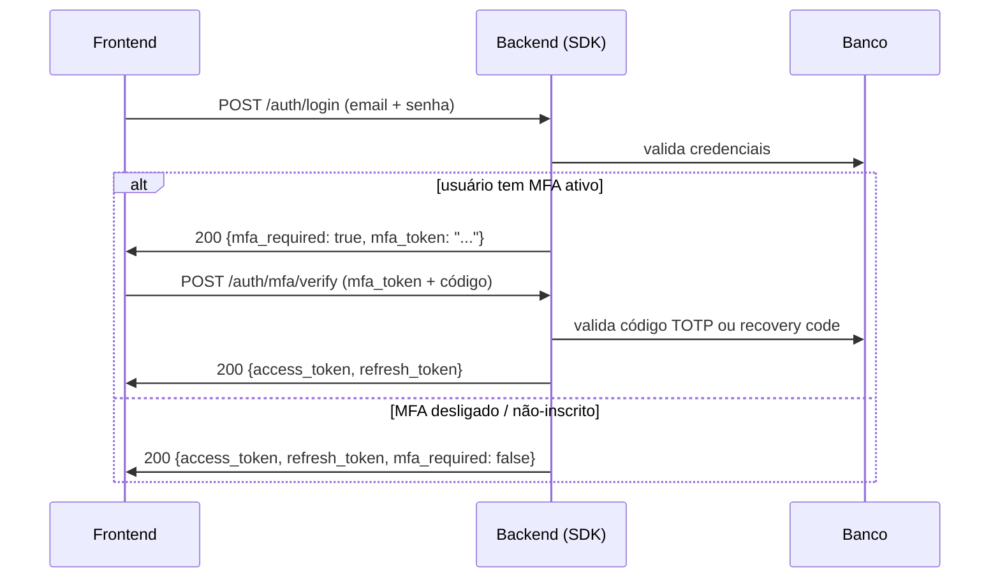

# MFA / 2FA com TOTP (Authenticator)

Desde **v0.35.0** o fluxo de auth bundled suporta **autenticação de dois fatores** com apps Authenticator (Google Authenticator, 1Password, Authy, etc.) seguindo o padrão **TOTP (RFC 6238)**. Você ganha quatro endpoints prontos, códigos de recuperação single-use, e um login de dois passos — tudo controlado por um kill-switch global.

## Conteúdo da receita

1. **[Como funciona em 30 segundos](#como-funciona)** — o modelo mental do fluxo de dois passos.
2. **[Setup](#setup)** — extra `[mfa]`, colunas novas no `UserModel`, tabela de recovery codes.
3. **[Wiring](#wiring)** — passar `recovery_code_model` pro `make_auth_router`.
4. **[Os quatro endpoints](#endpoints)** — enroll / confirm / verify / disable.
5. **[Login de dois passos](#login-de-dois-passos)** — como `POST /auth/login` muda quando MFA está ativo.
6. **[Settings (`AuthSettings`)](#settings)** — flag a flag.
7. **[Usando só o `UserAuthService` (sem o router)](#service-direto)** — pra quem monta os próprios endpoints.
8. **[Segurança](#seguranca)**.
9. **[Próximos passos](#proximos-passos)**.

---

## Como funciona

TOTP é o código de 6 dígitos que rola a cada 30 segundos no seu app Authenticator. O servidor e o app compartilham um **segredo** (gerado no enrollment); ambos derivam o mesmo código do relógio atual. Nenhum SMS, nenhuma rede — pura matemática local.

O fluxo tem dois momentos:

- **Enrollment (uma vez)** — o usuário logado pede um segredo, escaneia o QR code, e confirma digitando o primeiro código. A partir daí MFA está ativo.
- **Login (toda vez)** — senha valida o passo 1, mas em vez do JWT pair o backend devolve um `mfa_token` curto. O usuário digita o código do Authenticator; o passo 2 troca `mfa_token` + código pelo JWT pair real.

!!! info "Por que dois passos e não tudo de uma vez?"
    Separar mantém a senha e o segundo fator desacoplados. O `mfa_token` (TTL de 5 min por padrão) carrega só o `sub` do usuário — interceptá-lo sozinho não basta pra logar, porque ainda falta o código do Authenticator.

---

## Setup

Requer o extra `[mfa]` (instala `pyotp`), por cima de `[auth]`:

```bash
uv add "tempest-fastapi-sdk[auth,mfa]>=0.35.0"
```

### Colunas via `MFAMixin`

As colunas do MFA (`totp_secret`, `totp_enabled_at`) **não** moram no `BaseUserModel` — elas vêm de um mixin opt-in, `MFAMixin`. Misture-o no seu `UserModel` só quando for adotar MFA, assim projetos que nunca ligam a feature não carregam colunas mortas:

```python
# src/db/models/user.py
from tempest_fastapi_sdk import BaseUserModel, MFAMixin


class UserModel(MFAMixin, BaseUserModel):
    """Concrete user table — MFAMixin adiciona totp_secret / totp_enabled_at."""

    __tablename__ = "users"
```

!!! note "Ordem do MRO"
    O mixin vem **antes** do `BaseUserModel` na lista de bases — mesmo padrão de `AuditMixin` / `SoftDeleteMixin`. O mixin também expõe a property `is_mfa_active` (`totp_enabled_at is not None`).

!!! warning "Migration obrigatória"
    `totp_secret` e `totp_enabled_at` são colunas novas. Rode `uv run tempest db revision -m "mfa columns"` + `uv run tempest db upgrade` antes de ligar a flag.

### Tabela de recovery codes

Códigos de recuperação salvam o usuário que perdeu o celular. São **single-use**, mostrados **uma vez** no enrollment, e o banco guarda só o hash SHA-256 de cada um. `BaseUserRecoveryCodeModel` é abstrato — use o helper `make_user_recovery_code_model` pra criar a tabela concreta amarrada à sua tabela de users:

```python
# src/db/models/__init__.py
from tempest_fastapi_sdk import make_user_recovery_code_model

from src.db.models.user import UserModel
from src.db.models.user_token import UserTokenModel

UserRecoveryCodeModel = make_user_recovery_code_model(
    user_table="users",
    tablename="user_recovery_codes",
    class_name="UserRecoveryCodeModel",
)

__all__: list[str] = [
    "UserModel",
    "UserTokenModel",
    "UserRecoveryCodeModel",
]
```

??? note "Prefere subclassar à mão?"
    O helper é só açúcar. O equivalente explícito:

    ```python
    from uuid import UUID

    from sqlalchemy import ForeignKey
    from sqlalchemy.orm import Mapped, mapped_column
    from tempest_fastapi_sdk import BaseUserRecoveryCodeModel


    class UserRecoveryCodeModel(BaseUserRecoveryCodeModel):
        __tablename__ = "user_recovery_codes"

        user_id: Mapped[UUID] = mapped_column(
            ForeignKey("users.id", ondelete="CASCADE"),
            nullable=False,
            index=True,
        )
    ```

---

## Wiring

Ligue a flag `AUTH_MFA_ENABLED` e passe o `recovery_code_model` pro router. Sem o modelo, o router levanta `RuntimeError` no build — é uma trava proposital:

```python
# src/api/app.py
from tempest_fastapi_sdk import (
    AsyncDatabaseManager,
    UserAuthService,
    make_auth_router,
)
from src.core.settings import settings
from src.db.models import UserModel, UserTokenModel, UserRecoveryCodeModel

db = AsyncDatabaseManager(settings.DATABASE_URL)

auth_service = UserAuthService(
    user_model=UserModel,
    token_model=UserTokenModel,
    auth_settings=settings,   # mistura AuthSettings (AUTH_MFA_* abaixo)
    jwt_settings=settings,
    email=None,
)

app.include_router(
    make_auth_router(
        auth_service,
        session_factory=db.session_dependency,
        recovery_code_model=UserRecoveryCodeModel,   # obrigatório quando MFA on
    ),
)
```

!!! tip "Kill-switch global"
    Com `AUTH_MFA_ENABLED=False` (default), os endpoints `/auth/mfa/*` respondem `404` e o login ignora qualquer `totp_secret` persistido — útil pra desligar MFA na emergência de um Authenticator fora do ar, sem mexer no banco.

---

## Endpoints

Os quatro só são montados quando `AUTH_MFA_ENABLED=True`:

| Método | Path | Auth | Body / Output | Comportamento |
|--------|------|------|---------------|---------------|
| POST | `/auth/mfa/enroll` | Bearer JWT | — → `MFAEnrollResponseSchema` | Gera segredo + URI do QR + N recovery codes. **Mostrados só uma vez.** Não ativa MFA ainda. |
| POST | `/auth/mfa/confirm` | Bearer JWT | `MFAConfirmSchema` | Confirma o enrollment com o primeiro código. A partir daqui MFA está ativo. |
| POST | `/auth/mfa/verify` | — | `MFAVerifySchema` → `LoginResponseSchema` | Passo 2 do login: troca `mfa_token` + código pelo JWT pair. |
| POST | `/auth/mfa/disable` | Bearer JWT | `MFADisableSchema` | Desliga MFA. Exige senha **e** código ativo (TOTP ou recovery). |

### Fluxo de enrollment

```python
import httpx

BASE = "http://localhost:8000"
access = "<JWT do usuário logado>"
headers = {"Authorization": f"Bearer {access}"}

# 1. Enroll — devolve segredo, URI do QR e os recovery codes (uma vez!)
r = httpx.post(f"{BASE}/auth/mfa/enroll", headers=headers)
data = r.json()
print(data["provisioning_uri"])   # renderize como QR code
print(data["recovery_codes"])     # mostre pro usuário salvar OFFLINE

# 2. Usuário escaneia o QR no Authenticator e digita o código gerado:
code = input("Código do Authenticator: ")
httpx.post(f"{BASE}/auth/mfa/confirm", headers=headers, json={"code": code})
# 204 No Content → MFA ativo
```

!!! danger "Os recovery codes aparecem UMA vez"
    A resposta de `enroll` é a única vez que o `secret` e os `recovery_codes` saem em plaintext. Chamar `enroll` de novo **rotaciona** o segredo e **invalida** todos os códigos anteriores. Mostre-os com destaque e instrua o usuário a guardar offline.

---

## Login de dois passos

Quando o usuário tem MFA ativo, `POST /auth/login` **não** devolve mais o JWT pair direto — devolve `mfa_required=True` + um `mfa_token` curto:

```python
import httpx

BASE = "http://localhost:8000"

# Passo 1 — senha
r1 = httpx.post(
    f"{BASE}/auth/login",
    json={"email": "ana@example.com", "password": "strong-pass-12-chars"},
)
body = r1.json()
# {
#   "user_id": "...",
#   "access_token": null,
#   "refresh_token": null,
#   "mfa_required": true,
#   "mfa_token": "eyJhbGciOi..."
# }

# Passo 2 — código do Authenticator (ou um recovery code)
code = input("Código do Authenticator: ")
r2 = httpx.post(
    f"{BASE}/auth/mfa/verify",
    json={"mfa_token": body["mfa_token"], "code": code},
)
tokens = r2.json()
# { "access_token": "...", "refresh_token": "...", "mfa_required": false }
```

Para usuários **sem** MFA (ou com o kill-switch desligado), `POST /auth/login` continua devolvendo o JWT pair direto, com `mfa_required=False` — o frontend simplesmente checa esse campo e ramifica.



---

## Settings

Mixe `AuthSettings` na sua classe `Settings` (como no [recipe de auth flow](auth-flow.md#settings-authsettings)) e configure por env:

```bash
# .env — MFA
AUTH_MFA_ENABLED=true                   # kill-switch global (default false)
AUTH_MFA_ISSUER=Acme Inc.               # nome mostrado no Authenticator
AUTH_MFA_RECOVERY_CODES_COUNT=10        # quantos códigos gerar no enroll (2..50)
AUTH_MFA_TOKEN_TTL_SECONDS=300          # TTL do mfa_token entre passo 1 e 2 (30..900)
AUTH_MFA_VERIFY_WINDOW=1                # tolerância de drift, em passos de 30s (0..4)
```

| Setting | Default | O que faz |
|---------|---------|-----------|
| `AUTH_MFA_ENABLED` | `False` | Liga os endpoints `/auth/mfa/*` e o login de dois passos. |
| `AUTH_MFA_ISSUER` | `"Tempest"` | Label ao lado do email no app Authenticator. Use o nome do seu produto. |
| `AUTH_MFA_RECOVERY_CODES_COUNT` | `10` | Quantidade de recovery codes gerados no enrollment. |
| `AUTH_MFA_TOKEN_TTL_SECONDS` | `300` | Vida do `mfa_token` intermediário (5 min). |
| `AUTH_MFA_VERIFY_WINDOW` | `1` | Janela de tolerância pro relógio do usuário. `1` aceita passo anterior + atual + próximo (90s). `0` é estrito; acima de `2` enfraquece. |

---

## Service direto

Se você monta os próprios endpoints (sem `make_auth_router`), os seis métodos do `UserAuthService` cobrem o ciclo inteiro:

```python
from sqlalchemy.ext.asyncio import AsyncSession

from src.db.models import UserModel, UserRecoveryCodeModel


async def enroll_user(service: UserAuthService, session: AsyncSession, user: UserModel) -> None:
    """Gera segredo + recovery codes e mostra ao usuário (uma vez)."""
    secret, provisioning_uri, recovery_codes = await service.mfa_enroll(
        session,
        user=user,
        recovery_code_model=UserRecoveryCodeModel,
    )
    await session.commit()
    # renderize provisioning_uri como QR; mostre recovery_codes


async def confirm_user(
    service: UserAuthService, session: AsyncSession, user: UserModel, code: str
) -> None:
    """Ativa MFA depois que o usuário prova que escaneou o QR."""
    await service.mfa_confirm(session, user=user, code=code)
    await session.commit()
```

Superfície completa:

| Método | Assinatura (resumida) | Retorno |
|--------|-----------------------|---------|
| `is_mfa_enrolled` | `(user) -> bool` | `True` se MFA ativo (e kill-switch ligado). |
| `issue_mfa_token` | `(user) -> str` | JWT curto que liga passo 1 e passo 2. |
| `mfa_enroll` | `(session, *, user, recovery_code_model) -> tuple[str, str, list[str]]` | `(secret, provisioning_uri, recovery_codes)`. |
| `mfa_confirm` | `(session, *, user, code) -> None` | Ativa MFA. |
| `mfa_verify` | `(session, *, mfa_token, code, recovery_code_model) -> UserModel` | Usuário autenticado (mint o JWT depois). |
| `mfa_disable` | `(session, *, user, password, code, recovery_code_model) -> None` | Limpa segredo + códigos. |

---

## Segurança

- **Segredo TOTP persistido no `UserModel`.** Considere criptografar a coluna `totp_secret` em repouso (Postgres `pgcrypto` ou um wrapper Fernet no nível da aplicação).
- **Recovery codes guardados como hash SHA-256.** O plaintext sai uma única vez no enrollment; vazamento da tabela não rende códigos usáveis.
- **Recovery codes são single-use.** `used_at` é carimbado no consume; replay rejeitado.
- **`disable` exige senha + código.** Uma sessão sequestrada não consegue desligar MFA sozinha — precisa da senha **e** de um fator ativo.
- **`mfa_token` é curto e bound ao usuário.** TTL de 5 min por padrão; carrega `purpose: "mfa_pending"` + o `sub`. Tokens de outro propósito são rejeitados em `mfa_verify`.
- **Verificação em tempo constante.** `TOTPHelper.verify` delega ao `pyotp`, que compara o código com `hmac.compare_digest`.

---

## Próximos passos

- **[Auth flow (signup/reset) »](auth-flow.md)** — o fluxo de conta local que o MFA estende.
- **[Sessões server-side »](sessions.md)** — alternativa ao JWT, combinável com MFA no passo 1.
- **[Segurança »](security.md)** — CSRF, rate-limit e body-size limit pros endpoints de auth.
