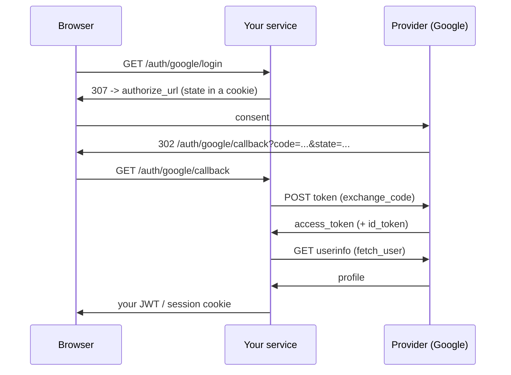

# Social login (OAuth2 / OIDC)

"Sign in with Google" has three parts: send the user to the provider, receive a
`code` back, and trade that `code` for something that identifies the person. The
SDK ships all three — `GoogleOAuthClient`, `GitHubOAuthClient` and the generic
`OIDCProvider` — ending in one normalized identity (`OAuthUser`) whatever the
provider is.

!!! info "What the SDK does, and what stays yours"
    The clients cover **only the OAuth2 dance**: authorize URL, code exchange,
    user fetch. Storing that user in your table, minting **your** session token
    and writing the cookie are service decisions — and the SDK already has parts
    for those ([`UserAuthService`](auth-flow.md), `JWTUtils`, `set_cookie`).

Nothing extra to install: `httpx` is a base dependency of the SDK, and the
`HTTPClient` (retry + circuit breaker) comes along.

## The flow in four steps



## 1. Register the app with the provider

In the provider's console (Google Cloud, GitHub Developer Settings, Auth0…)
create an OAuth credential and register the **exact redirect URI** your service
will expose — `https://api.example.com/auth/google/callback`. Keep `client_id`
and `client_secret` in settings:

```python
# src/core/settings.py
from tempest_fastapi_sdk import BaseAppSettings


class Settings(BaseAppSettings):
    """Environment-driven configuration."""

    GOOGLE_CLIENT_ID: str
    GOOGLE_CLIENT_SECRET: str
    GOOGLE_REDIRECT_URI: str = "http://127.0.0.1:8000/auth/google/callback"


settings: Settings = Settings()
```

!!! warning "The redirect URI must match character for character"
    A trailing slash, `http` vs `https`, `127.0.0.1` vs `localhost` — any
    difference makes the provider reject with `redirect_uri_mismatch`. Register
    one URI per environment (dev, staging, production) instead of reaching for
    a wildcard.

## 2. Build the client once

The client opens HTTP connections, so it lives with the other infra resources —
one per process, not one per request:

```python
# src/api/dependencies/resources.py
from tempest_fastapi_sdk import GoogleOAuthClient

from src.core.settings import settings

google: GoogleOAuthClient = GoogleOAuthClient(
    client_id=settings.GOOGLE_CLIENT_ID,
    client_secret=settings.GOOGLE_CLIENT_SECRET,
    redirect_uri=settings.GOOGLE_REDIRECT_URI,
)
```

Google's default scopes: `openid email profile`. Pass `scopes=[...]` to ask for
more (e.g. `"https://www.googleapis.com/auth/calendar.readonly"`).

!!! tip "Reuse your own `HTTPClient`"
    Without `http_client=`, the client builds a dedicated one (10s timeout,
    breaker off). If your service already has a configured `HTTPClient`, inject
    it: a single connection pool, and the retry / breaker / `X-Request-ID`
    behavior you already tuned applies to the provider too.

    ```python
    from tempest_fastapi_sdk import GoogleOAuthClient, HTTPClient, RetryPolicy

    http: HTTPClient = HTTPClient(
        timeout=10.0,
        retry_policy=RetryPolicy(max_attempts=2),
    )
    google: GoogleOAuthClient = GoogleOAuthClient(
        client_id=settings.GOOGLE_CLIENT_ID,
        client_secret=settings.GOOGLE_CLIENT_SECRET,
        redirect_uri=settings.GOOGLE_REDIRECT_URI,
        http_client=http,
    )
    ```

    When the client owns the `HTTPClient` (no `http_client=`), close it on
    shutdown with `await google.aclose()` — a no-op when the client was
    injected.

## 3. The start route: `state` + redirect

`state` is this flow's CSRF defense: a random value you store **before** the
redirect and compare **on the way back**. `generate_oauth_state()` mints it; an
`HttpOnly` cookie stores it:

```python
# src/api/routers/oauth.py
from fastapi import APIRouter
from fastapi.responses import RedirectResponse
from tempest_fastapi_sdk import generate_oauth_state, set_cookie

from src.api.dependencies.resources import google

router: APIRouter = APIRouter(prefix="/auth/google", tags=["oauth"])

STATE_COOKIE: str = "oauth_state"


@router.get("/login")
async def login() -> RedirectResponse:
    """Redirect the browser to Google, remembering the CSRF state."""
    state: str = generate_oauth_state()
    response: RedirectResponse = RedirectResponse(
        google.build_authorize_url(state=state),
    )
    set_cookie(
        response,
        STATE_COOKIE,
        state,
        max_age=600,
        samesite="lax",
    )
    return response
```

`build_authorize_url` takes `**extra` for any provider parameter:
`build_authorize_url(state=state, access_type="offline", prompt="consent")` asks
Google for a `refresh_token`.

!!! danger "Without checking `state`, the callback is forgeable"
    An attacker can get the victim's browser to call your `/callback` with a
    `code` obtained on *their* account — and the victim ends up logged into the
    attacker's account. The comparison in step 4 is what closes that; it is not
    optional.

## 4. The callback: validate, exchange, fetch

```python
# src/api/routers/oauth.py (continued)
from fastapi import Request
from tempest_fastapi_sdk import (
    OAuthTokens,
    OAuthUser,
    UnauthorizedException,
    clear_cookie,
)


@router.get("/callback")
async def callback(request: Request, code: str, state: str) -> RedirectResponse:
    """Complete the OAuth dance and hand the browser your own session.

    Raises:
        UnauthorizedException: When the `state` does not match the cookie
            issued at `/login`, which means a forged callback.
    """
    expected: str | None = request.cookies.get(STATE_COOKIE)
    if expected is None or expected != state:
        raise UnauthorizedException(message="Invalid OAuth state")

    tokens: OAuthTokens = await google.exchange_code(code)
    profile: OAuthUser = await google.fetch_user(tokens)

    access_token: str = await oauth_login.login(profile)

    response: RedirectResponse = RedirectResponse("/")
    clear_cookie(response, STATE_COOKIE)
    set_cookie(response, "access_token", access_token, max_age=3600)
    return response
```

`OAuthUser` is the same shape for every provider:

| Field | Type | Content |
| --- | --- | --- |
| `provider` | `str` | `"google"`, `"github"`, `"oidc:auth0"` — the provider key |
| `subject` | `str` | Stable id **within** that provider |
| `email` | `str` or `None` | Email, when the provider returns one. **Not necessarily verified** |
| `email_verified` | `bool` or `None` | Does the provider state it verified the email? `None` = it said nothing |
| `name` | `str` or `None` | Display name |
| `picture` | `str` or `None` | Avatar URL |
| `raw` | `dict[str, Any]` | Raw provider payload, for custom claims |

!!! info "The unique key is `(provider, subject)`, not the email"
    Emails change, and the same email can arrive from two providers. Store both
    columns under a composite unique index — that is what lets one person link
    Google and GitHub to the same account.

!!! danger "Linking an account by email requires `email_verified is True`"
    If you match a social login to an existing account by email, a provider
    returning an **unverified** address hands over the victim's account: the
    attacker only has to register her email with the provider without confirming
    it. GitHub is exactly that case — the `email` from `GET /user` is the public
    profile one, which GitHub does not require verifying. Only link
    automatically when `profile.email_verified is True`; on `None` or `False`,
    confirm the email through your own flow first.

## 5. Linking to your own user

The step that is yours: find-or-create the user and mint **your** token. Minimal
pattern with `JWTUtils`:

```python
# src/services/oauth.py
from tempest_fastapi_sdk import JWTUtils, OAuthUser

from src.db.models import UserModel
from src.db.repositories import UserRepository


class OAuthLoginService:
    """Turn a provider identity into a local user + local session token."""

    def __init__(self, repository: UserRepository, tokens: JWTUtils) -> None:
        """Initialize the service.

        Args:
            repository (UserRepository): Data access for users.
            tokens (JWTUtils): The same helper the rest of the API
                validates bearer tokens with.
        """
        self.repository: UserRepository = repository
        self.tokens: JWTUtils = tokens

    async def login(self, profile: OAuthUser) -> str:
        """Find-or-create the local user and mint an access token.

        Args:
            profile (OAuthUser): Normalized identity from the provider.

        Returns:
            str: A signed access token for this service's own routes.
        """
        user: UserModel | None = await self.repository.get_or_none(
            {"oauth_provider": profile.provider, "oauth_subject": profile.subject},
        )
        if user is None:
            user = await self.repository.add(
                UserModel(
                    email=profile.email,
                    name=profile.name,
                    oauth_provider=profile.provider,
                    oauth_subject=profile.subject,
                    is_active=True,
                ),
            )
        return self.tokens.encode({"sub": str(user.id)})
```

!!! tip "Already on the bundled flow? Reuse the same `JWTUtils`"
    If the service mounts `make_auth_router` ([auth recipe](auth-flow.md)), pass
    `auth_service.jwt` here instead of building a second `JWTUtils` — the social
    login's token then works on the same protected routes, signed with the same
    secret. Two `JWTUtils` with different secrets is the classic footgun: login
    succeeds and every guarded route answers 401.

## GitHub

Same surface, two differences:

```python
from tempest_fastapi_sdk import GitHubOAuthClient

github: GitHubOAuthClient = GitHubOAuthClient(
    client_id=settings.GITHUB_CLIENT_ID,
    client_secret=settings.GITHUB_CLIENT_SECRET,
    redirect_uri=settings.GITHUB_REDIRECT_URI,
)
```

- **Not OIDC.** No `id_token`; the profile comes from `GET /user`, which is what
  `fetch_user` calls.
- **`email` may be `None`.** Default scopes are `read:user` and `user:email`,
  but a user who marks their email private on GitHub does not expose it on
  `/user`. Handle `profile.email is None` — by asking for the email on a screen
  of your own, for instance.
- **`email_verified` is always `None` here.** The `GET /user` payload carries no
  verification field, so the SDK does not invent one. When you need the answer,
  call `GET /user/emails` (scope `user:email`) and read its `verified` field.

## Any other IdP: `OIDCProvider`

Auth0, Keycloak, Okta, Microsoft Entra, Cognito — they all speak OIDC. Pass the
three endpoints from the discovery document
(`${issuer}/.well-known/openid-configuration`):

```python
from tempest_fastapi_sdk import OIDCProvider

keycloak: OIDCProvider = OIDCProvider(
    client_id=settings.OIDC_CLIENT_ID,
    client_secret=settings.OIDC_CLIENT_SECRET,
    redirect_uri=settings.OIDC_REDIRECT_URI,
    authorize_url="https://id.example.com/realms/app/protocol/openid-connect/auth",
    token_url="https://id.example.com/realms/app/protocol/openid-connect/token",
    userinfo_url="https://id.example.com/realms/app/protocol/openid-connect/userinfo",
    provider_name="oidc:keycloak",
)
```

`provider_name` lands in `OAuthUser.provider`, so pick a stable value — it
becomes part of the user's unique key. Without `userinfo_url`, `fetch_user`
raises `NotImplementedError`: the profile then has to come from the `id_token`,
which means overriding `_parse_user` in a subclass.

## Errors

A failed code exchange or userinfo call raises **`OAuthError`** — an
`AppException` with `code="OAUTH_ERROR"` and status **502** (the fault is at the
provider, not the caller), carrying the provider's response body in `details`.
With `register_exception_handlers` mounted it already renders as the canonical
`{detail, code, details}` envelope; declare it on the route for Swagger:

```python
from tempest_fastapi_sdk import OAuthError, UnauthorizedException, error_responses


@router.get(
    "/callback",
    responses=error_responses(OAuthError, UnauthorizedException),
)
async def callback(request: Request, code: str, state: str) -> RedirectResponse:
    """Complete the OAuth dance (see above)."""
```

## Recap

- `GoogleOAuthClient` / `GitHubOAuthClient` / `OIDCProvider` — one API:
  `build_authorize_url(state=...)` → `exchange_code(code)` →
  `fetch_user(tokens)`.
- `generate_oauth_state()` + an `HttpOnly` cookie + the callback comparison is
  the defense against a forged callback. Do not skip it.
- `OAuthUser` normalizes providers; the unique key is `(provider, subject)`.
- `OAuthTokens` carries `access_token`, plus `id_token` / `refresh_token` when
  the provider sends them.
- Minting **your** session stays yours: reuse the `JWTUtils` the rest of the API
  uses. The full local flow (signup, activation, reset) is in the
  [auth recipe](auth-flow.md); cookie delivery and CSRF, in the
  [HTTP recipe](http.md).
