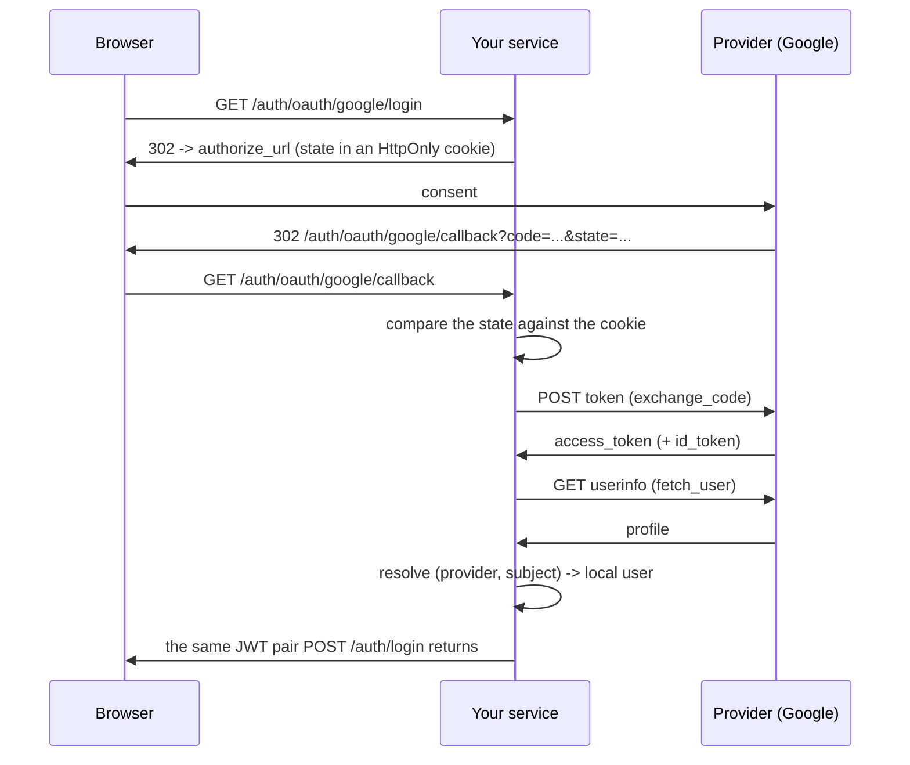

# Social login (OAuth2 / OIDC)

"Sign in with Google" has four parts: send the user to the provider, take the
`code` back, trade that `code` for an identity — and turn that identity into a
**session in your service**. The SDK ships all four.

The first three are the clients: `GoogleOAuthClient`, `GitHubOAuthClient` and
the generic `OIDCProvider`, all ending at the same normalized identity
(`OAuthUser`). The fourth — the one that decides who the person is in *your*
database and mints *your* token — is `make_auth_router` as of v0.273.0, wired
by `AUTH_OAUTH_ENABLED`.

!!! info "Why the fourth part matters so much"
    Minting the token by hand is the step that looks trivial and is not. A
    `jwt.encode({"sub": str(user.id)})` produces a **different** token from the
    one `POST /auth/login` returns: no `typ` claim, no opaque refresh token, no
    rotation, no family-wide reuse detection and no `POST /auth/logout`. The
    service ends up with two session mechanisms, one of them with half the
    guarantees — and the day someone turns on `strict=True` in the type check,
    every Google login breaks at once.

Nothing extra to install: `httpx` is a base dependency of the SDK and
`HTTPClient` (retry + circuit breaker) is already bundled.

## The flow, end to end



## 1. Register the app at the provider

In the provider's console (Google Cloud, GitHub Developer Settings, Auth0…)
create an OAuth credential and register the **exact redirect URI** your service
exposes — `https://api.example.com/auth/oauth/google/callback`. Then compose the
`OAuthSettings` mixin, which holds the credentials and **derives** that URI:

```python
# src/core/settings.py
from tempest_fastapi_sdk import (
    AuthSettings,
    DatabaseSettings,
    JWTSettings,
    OAuthSettings,
    ServerSettings,
)


class Settings(
    ServerSettings,
    DatabaseSettings,
    JWTSettings,
    AuthSettings,
    OAuthSettings,
):
    """Environment-driven configuration."""


settings: Settings = Settings()
```

`OAuthSettings` reads five environment variables:

| Variable | Default | What it is |
| --- | --- | --- |
| `OAUTH_REDIRECT_BASE_URL` | `""` | Public origin of the service (`https://api.example.com`), no trailing slash and no path |
| `OAUTH_GOOGLE_CLIENT_ID` | `""` | `Client ID` from the Google console |
| `OAUTH_GOOGLE_CLIENT_SECRET` | `""` | Matching `Client secret` |
| `OAUTH_GITHUB_CLIENT_ID` | `""` | `Client ID` of the GitHub OAuth app |
| `OAUTH_GITHUB_CLIENT_SECRET` | `""` | Matching `Client secret` |

The redirect URI is not declared — it is **derived** from the base, the router
prefix and the provider key:

```python
from tempest_fastapi_sdk import OAuthSettings

settings: OAuthSettings = OAuthSettings(
    OAUTH_REDIRECT_BASE_URL="https://api.example.com",
)
print(settings.oauth_redirect_uri("google"))
# https://api.example.com/auth/oauth/google/callback
```

!!! warning "The redirect URI must match byte for byte"
    A trailing slash, `http` vs `https`, `127.0.0.1` vs `localhost` — any
    difference makes the provider refuse with `redirect_uri_mismatch`, and the
    refusal happens **before** the consent screen, which makes it look like a
    credential problem. Paste into the console exactly what `oauth_redirect_uri`
    prints. In development the base is your tunnel or `http://localhost:8000` —
    the provider redirects the *user agent*, not itself, so the container's
    internal address will not do.

## 2. Two pieces in the database

Social login writes to two tables: the user table (which gains a name column)
and a new one, for linked identities.

```python
# src/db/models.py
from tempest_fastapi_sdk import (
    BaseUserModel,
    NameMixin,
    make_user_oauth_account_model,
    make_user_refresh_token_model,
    make_user_token_model,
)


class UserModel(NameMixin, BaseUserModel):
    """The project's user table."""

    __tablename__ = "users"


UserTokenModel = make_user_token_model(user_table="users")
UserOAuthAccountModel = make_user_oauth_account_model(user_table="users")
UserRefreshTokenModel = make_user_refresh_token_model(user_table="users")
```

**`NameMixin`** exists because `BaseUserModel` ships no `name` column — it was
designed for the admin login, which needs an email and a password, not a
greeting. The callback creates accounts and stores the name the provider
reports, so the column becomes necessary. Turning `AUTH_OAUTH_ENABLED` on
without the mixin is refused at router construction, with a message naming what
is missing — fail at boot, not at the first callback in production.

**The identity table is separate** — not two columns on `UserModel`. That is
what lets the same person have Google **and** GitHub linked, and it is where the
`UNIQUE (provider, subject)` lives that makes the identity, not the email, the
key of the login.

!!! info "The key is `(provider, subject)`, never the email"
    Emails change hands; a `subject` does not. Someone who changes their email
    at Google still signs into the same local account, because the `subject`
    did not change. The model declares both `UNIQUE` constraints on the abstract
    base itself, so a hand-written mapping cannot ship without them either.

Generate the migration with Alembic as usual — both changes (the `name` column
and the new table) come out of a single `alembic revision --autogenerate`.

## 3. Wire it into the router

Three lines: the client, the `oauth_account_model` on the service and
`oauth_clients` on the router.

```python
# src/api/dependencies/resources.py
from tempest_fastapi_sdk import (
    AsyncDatabaseManager,
    GoogleOAuthClient,
    UserAuthService,
)

from src.core.settings import settings
from src.db.models import (
    UserModel,
    UserOAuthAccountModel,
    UserRefreshTokenModel,
    UserTokenModel,
)

db: AsyncDatabaseManager = AsyncDatabaseManager(**settings.database_kwargs())

google: GoogleOAuthClient = GoogleOAuthClient(**settings.google_kwargs())

auth_service: UserAuthService = UserAuthService(
    user_model=UserModel,
    token_model=UserTokenModel,
    auth_settings=settings,
    jwt_settings=settings,
    db=db,
    refresh_token_model=UserRefreshTokenModel,
    oauth_account_model=UserOAuthAccountModel,
)
```

```python
# src/api/app.py
from fastapi import FastAPI
from tempest_fastapi_sdk import make_auth_router

from src.api.dependencies.resources import auth_service, db, google


def create_app() -> FastAPI:
    """Build the application with social login mounted."""
    app: FastAPI = FastAPI()
    app.include_router(
        make_auth_router(
            auth_service,
            session_factory=db.session_dependency,
            oauth_clients={"google": google},
        )
    )
    return app
```

Flip the switch in the environment:

```bash
AUTH_OAUTH_ENABLED=true
OAUTH_REDIRECT_BASE_URL=https://api.example.com
OAUTH_GOOGLE_CLIENT_ID=1234567890-abc123.apps.googleusercontent.com
OAUTH_GOOGLE_CLIENT_SECRET=GOCSPX-...
```

!!! tip "The dictionary key is the URL key"
    `{"google": google}` serves `/auth/oauth/google/login`. That same string
    goes into the `provider` column of every linked identity, so renaming it
    once accounts exist orphans the links. Pick one and keep it.

!!! check "Three things that fail at boot, not at the first request"
    `AUTH_OAUTH_ENABLED=true` requires (1) at least one client, (2) an
    `oauth_account_model` on the service and (3) a `name` column on the user
    model. Each missing piece raises `RuntimeError` at router construction,
    naming which one — the same idiom as `AUTH_MFA_ENABLED` without a
    `recovery_code_model`.

## 4. The five routes

| Method | Route | What it does |
| --- | --- | --- |
| `GET` | `/auth/oauth/{provider}/login` | Mints the `state`, writes it to an `HttpOnly` cookie and redirects **302** to the provider |
| `GET` | `/auth/oauth/{provider}/callback` | Checks the `state`, trades the `code`, resolves the identity and returns the JWT pair |
| `POST` | `/auth/oauth/{provider}/token` | *(v0.278.0+)* Takes an access token the app already holds, checks which application it was issued to, and returns the same session |
| `GET` | `/auth/oauth/accounts` | Authenticated. Lists the providers linked to the account |
| `POST` | `/auth/oauth/accounts/unlink` | Authenticated. Detaches one provider |

The start route is a **navigation**, not an XHR: point a link or a button
straight at it. A `fetch` gets a redirect to another origin and will either
follow it opaquely or fail CORS.

An unregistered `{provider}` answers **404** — it is part of the path, so an
unknown provider is an unknown route.

!!! danger "The `state` is what stops a forged callback"
    Without the comparison, an attacker can make the victim's browser call your
    `/callback` with a `code` obtained on **their** account — and the victim
    ends up logged into the attacker's account, handing over whatever they type
    there. The router compares with `hmac.compare_digest`, and the cookie
    carries the provider key alongside the random value, so a `state` minted for
    Google is not valid at GitHub's callback.

    The cookie is always `SameSite=Lax`, **regardless of
    `AUTH_COOKIE_SAMESITE`**: the provider returns the user with a cross-site
    top-level navigation, and `Strict` would withhold the cookie exactly there —
    every login would fail the very check the cookie exists to pass.

## 4.1. Clients with no browser: the token-in-hand flow *(v0.278.0+)*

A native app has no browser to redirect. It runs the provider's own SDK on the
device — `GoogleSignIn`, Credential Manager, whatever it is — and ends up
**holding an access token**. There is nowhere for `/login` → consent →
`/callback` to happen.

`POST /auth/oauth/{provider}/token` is that half:

```console
$ curl -s -X POST localhost:8000/auth/oauth/google/token \
    -H "Content-Type: application/json" \
    -d '{"access_token":"ya29.a0AfH6SM…"}'
{"user_id":"0e5cf2fc-…","access_token":"eyJ…","refresh_token":"eyJ…","mfa_required":false,"mfa_token":null}
```

The session is the **same** one the callback returns: same claims, same `typ`,
same rotation family, same `POST /auth/logout`. A client written against the
password login gets no second path to handle.

The token travels in the **body**, never in the path or the query. A URL
crosses the access log, the browser history and every `Referer` header on the
way — and this value is live at the provider.

!!! danger "Without the audience check, this endpoint hands over the victim's account"
    The provider's `userinfo` answers **whose** token this is. It does not
    answer **which application** the token was issued for — and that is the
    question that matters here, because whoever presents the token is whoever
    is calling.

    The attack is three steps and no password:

    1. the attacker publishes any app and asks for `email profile` consent —
       the most ordinary Google screen there is, the one nobody reads;
    2. the victim accepts, and the attacker now holds an access token that
       describes the victim;
    3. the attacker posts that token to this endpoint. `userinfo` loyally
       confirms the token is the victim's, and the session comes back in their
       name.

    The route therefore **asks the provider which `client_id` the token was
    issued to** before it reads a single row. A token from another app is
    refused with **401** `OAUTH_TOKEN_AUDIENCE_MISMATCH`, touching no account.

    The redirect flow needs none of this: there, the token was exchanged by this
    service, from a `code` this service asked for.

The registered client is what answers the question, through
`verify_token_audience(tokens)`:

| Client | How it checks |
| --- | --- |
| `GoogleOAuthClient` | `GET https://oauth2.googleapis.com/tokeninfo`, comparing `aud` and `azp` |
| `GitHubOAuthClient` | `POST /applications/{client_id}/token` with `client_id:client_secret` as Basic auth — 200 only for a token this app issued, 404 for anybody else's |
| `OIDCProvider` | The introspection endpoint (RFC 7662) you pass as `tokeninfo_url=`; without it the route refuses |
| Your own client | Implement `verify_token_audience`; without the method the route refuses |

!!! warning "A mobile app has one `client_id` per platform"
    Google issues one client id for the backend (web), another for Android,
    another for iOS. The token the Android app sends carries the **Android**
    id in `aud` — comparing only against the backend's would refuse every
    legitimate login. List the platform ids in `extra_audiences=`:

    ```python
    google = GoogleOAuthClient(
        client_id=settings.GOOGLE_CLIENT_ID,
        client_secret=settings.GOOGLE_CLIENT_SECRET,
        redirect_uri=settings.oauth_redirect_uri("google"),
        extra_audiences=[
            settings.GOOGLE_ANDROID_CLIENT_ID,
            settings.GOOGLE_IOS_CLIENT_ID,
        ],
    )
    ```

    Every value in that list is an application allowed to log people into this
    service. Put **your** project's ids there, and only those.

    A client with no id configured at all — the `GoogleOAuthClient(client_id="")`
    that exists only for `fetch_user` — makes the route answer **501**: there is
    nothing to compare against, and comparing with the empty string would either
    refuse everything or match a provider that echoes an empty claim.

```python
# src/api/dependencies/resources.py

from tempest_fastapi_sdk import OIDCProvider

from src.core.settings import settings

keycloak = OIDCProvider(
    client_id=settings.OIDC_CLIENT_ID,
    client_secret=settings.OIDC_CLIENT_SECRET,
    redirect_uri="https://api.example.com/auth/oauth/keycloak/callback",
    authorize_url="https://id.example.com/realms/app/protocol/openid-connect/auth",
    token_url="https://id.example.com/realms/app/protocol/openid-connect/token",
    userinfo_url="https://id.example.com/realms/app/protocol/openid-connect/userinfo",
    tokeninfo_url="https://id.example.com/realms/app/protocol/openid-connect/token/introspect",
    provider_name="keycloak",
)
```

!!! info "Refusing is the correct behavior, not a limitation"
    A provider that cannot report a token's audience makes the route answer
    **501** `OAUTH_AUDIENCE_UNVERIFIABLE` — and the profile is never fetched.
    The alternative would be to accept the token, which is exactly the hole
    above. The redirect flow for that same provider keeps working.

!!! note "There is no `state` here, and none is missing"
    `state` protects a **navigation**: the victim's browser being sent to a
    forged callback. There is no navigation here — the caller sends the
    credential in the body of a POST.

**Recap.** One POST with the token in the body, the audience checked before any
read, and the same session as the rest of the flow. Nothing a native app needs
is left outside the SDK.

## 5. Create accounts, or only authenticate existing ones

The callback is a registration door too. The first time an unknown identity
arrives, it either creates the row in `users` — with the provider's email, the
provider's name and a generated password — or refuses.

`AUTH_OAUTH_ALLOW_ACCOUNT_CREATION` decides, and the default **inherits
`AUTH_SIGNUP_ENABLED`**: closing the front door closes this one with it, rather
than leaving a second, quieter way in.

| `AUTH_SIGNUP_ENABLED` | `AUTH_OAUTH_ALLOW_ACCOUNT_CREATION` | New identity |
| --- | --- | --- |
| `true` | unset | Creates the account |
| `false` | unset | **403** — only authenticates an already-linked identity |
| `false` | `true` | Creates the account (closed system, onboarding via the provider) |
| `true` | `false` | **403** — form signup yes, provider signup no |

A created account is born **active**. The point of the flow is that the provider
already did the verification; re-verifying by email would ask the user to prove
again what Google just proved. `AUTH_AUTO_ACTIVATE` is not consulted here — a
service that wants human approval before the first login turns creation off and
has an administrator create and link the row.

!!! info "The generated password, and why it is not `secrets.token_urlsafe`"
    `hashed_password` is `NOT NULL` and stays that way: no migration, no
    "user without a password" branch scattered through login. The callback
    generates a random password and stores it — nobody ever sees it, and anyone
    who wants a password of their own uses `POST /auth/password-reset/request`,
    which already exists and already works because the email is already on the
    row.

    Generation goes through
    [`generate_password`](../../../reference/#tempest_fastapi_sdk.utils.password.generate_password),
    which guarantees the character classes **by construction**. Drawing from a
    flat alphabet and hoping is the defect that function exists to avoid:
    measured against the real policy with complexity on, 200 000 samples each,
    `secrets.token_urlsafe(32)` is rejected 26.54% of the time and
    `secrets.token_hex(32)` 100% of the time. A quarter of logins would fail
    intermittently, with a 422 coming out of the callback about a password the
    user never typed.

## 6. Linking by email: the button you probably do not want

The scenario: the person already has a password account at `ana@example.com` and
clicks "sign in with Google" for the first time. The email matches; the identity
does not. The default is to refuse with **409**.

`AUTH_OAUTH_LINK_BY_VERIFIED_EMAIL=true` links automatically — but **only** when
the provider explicitly states it verified the address
(`email_verified is True`).

!!! danger "`None` is not a yes"
    `email_verified` has three values, and the difference is the vulnerability:
    `True` = the provider verified it, `False` = the provider says it did not,
    `None` = **the provider said nothing**. Treating silence as verification
    hands over any account whose email an attacker can guess: they just register
    that address at an IdP that does not require confirmation.

    That is GitHub's possible case — the `email` from `GET /user` is the public
    profile address, which GitHub does not require verifying, which is why the
    SDK leaves `email_verified=None` there instead of inventing a value. Turn
    this knob on only for providers whose verification you trust.

The safe path, with the knob off: the person signs in with their password and
links the provider from inside their account.

## 7. How the JWT pair comes back

The callback honours `AUTH_TOKEN_DELIVERY` like every other login-equivalent
step — with one difference:

| `AUTH_TOKEN_DELIVERY` | What the callback returns |
| --- | --- |
| `bearer` (default) | `access_token` and `refresh_token` in the body |
| `cookie` | Both as `HttpOnly` cookies; the body keeps them `null` |
| `both` | Cookies **and** body, in the same response |

Under `both`, the rest of the router mounts parallel routes at `/auth/cookie/*`.
The callback does not: its URL is **registered at the provider**, so a second
route would force a second redirect URI into every console for one flow.

The practical effect of answering JSON is that the flow serves SPAs and mobile
without a redirect: the client calls the callback, gets the pair and moves on.

And the pair is the usual pair. It is worth seeing what that means:

```python
from tempest_fastapi_sdk import ACCESS_TOKEN_TYPE, JWTUtils, token_type_allowed

jwt: JWTUtils = JWTUtils(secret="a-32-character-secret-for-tests!")
access_token: str = "<the access_token the callback returned>"
payload: dict[str, object] = jwt.decode(access_token)
print(sorted(payload))
# ['email', 'exp', 'iat', 'sub', 'typ']
print(token_type_allowed(payload, [ACCESS_TOKEN_TYPE], strict=True))
# True
```

With `refresh_token_model` wired, the social login's refresh token is opaque,
persisted, single-use, joins the same rotation family, is covered by reuse
detection and dies on `POST /auth/logout` — none of which exists in a
hand-signed token.

## 8. Linked accounts: list and unlink

```bash
curl -H "Authorization: Bearer $ACCESS_TOKEN" \
     https://api.example.com/auth/oauth/accounts
```

```json
[
  {
    "provider": "google",
    "subject": "101234567890123456789",
    "email": "ana@example.com",
    "email_verified": true,
    "name": "Ana Souza",
    "picture": "https://lh3.googleusercontent.com/a/...",
    "created_at": "2026-08-30T12:00:00Z",
    "last_login_at": "2026-08-30T18:41:03Z"
  }
]
```

An account that only ever used a password answers **200** with `[]` — an empty
collection is success, not a 404.

```bash
curl -X POST -H "Authorization: Bearer $ACCESS_TOKEN" \
     -H "Content-Type: application/json" \
     -d '{"provider": "google"}' \
     https://api.example.com/auth/oauth/accounts/unlink
```

**204** on unlink; **404** when that provider is not linked to this account. The
lookup is scoped to the caller, so a provider linked by somebody else answers
404 exactly like one that never existed.

Unlinking the only provider on an account created by a callback leaves
`POST /auth/password-reset/request` as the way back in — the same door that flow
always offered, since the email is already on the row.

## `OAuthUser`, the normalized identity

It is the same shape for every provider, and it is what `login_with_oauth`
receives:

| Field | Type | Content |
| --- | --- | --- |
| `provider` | `str` | `"google"`, `"github"`, `"oidc:auth0"` — the provider key |
| `subject` | `str` | Stable id **inside** that provider |
| `email` | `str` or `None` | Email, when the provider returns one. **Not necessarily verified** |
| `email_verified` | `bool` or `None` | Does the provider claim it verified it? `None` = it said nothing |
| `name` | `str` or `None` | Display name |
| `picture` | `str` or `None` | Avatar URL |
| `raw` | `dict[str, Any]` | Raw provider payload, for custom claims |

!!! warning "A provider with no email does not complete the login"
    `OAuthUser.email` is `str | None` and the column is `NOT NULL UNIQUE`, so a
    provider that returns no address gets a **422** instead of an invented one —
    an account with a fake email is an account nobody can recover. An email
    scope on the client covers most cases; the rest is an explicit refusal, not
    a silent fallback.

When the provider returns no `name`, the SDK stores a localized placeholder:
`"Você"` in pt-BR, `"You"` in en-US, picked by the same `resolve_locale` the
rest of the auth flow uses (the link's `?lang=` → `Accept-Language` →
`AUTH_DEFAULT_LOCALE`).

## GitHub

Same surface, two different details:

```python
from tempest_fastapi_sdk import GitHubOAuthClient, OAuthSettings

settings: OAuthSettings = OAuthSettings()
github: GitHubOAuthClient = GitHubOAuthClient(**settings.github_kwargs())
```

Register it next to Google and both sets of routes exist:

```python
from fastapi import FastAPI
from tempest_fastapi_sdk import make_auth_router

from src.api.dependencies.resources import auth_service, db, github, google

app: FastAPI = FastAPI()
app.include_router(
    make_auth_router(
        auth_service,
        session_factory=db.session_dependency,
        oauth_clients={"google": google, "github": github},
    )
)
```

- **It is not OIDC.** There is no `id_token`; the profile comes from
  `GET /user`, which is what `fetch_user` does.
- **`email` can be `None`.** Default scopes are `read:user` and `user:email`,
  but someone who marks their email private on GitHub does not expose it on
  `/user` — and then the callback answers 422.
- **`email_verified` is always `None` here.** The `GET /user` payload carries no
  verification field, so the SDK does not invent one. If you need the answer,
  call `GET /user/emails` (scope `user:email`) and read `verified` there.

## Any other IdP: `OIDCProvider`

Auth0, Keycloak, Okta, Microsoft Entra, Cognito — they all speak OIDC. Pass the
three endpoints from the *discovery document*
(`${issuer}/.well-known/openid-configuration`):

```python
from tempest_fastapi_sdk import OAuthSettings, OIDCProvider

settings: OAuthSettings = OAuthSettings(
    OAUTH_REDIRECT_BASE_URL="https://api.example.com",
)

keycloak: OIDCProvider = OIDCProvider(
    client_id="the-client-id",
    client_secret="the-client-secret",
    redirect_uri=settings.oauth_redirect_uri("keycloak"),
    authorize_url="https://id.example.com/realms/app/protocol/openid-connect/auth",
    token_url="https://id.example.com/realms/app/protocol/openid-connect/token",
    userinfo_url="https://id.example.com/realms/app/protocol/openid-connect/userinfo",
    provider_name="keycloak",
)
```

Register it as `{"keycloak": keycloak}` and the routes become
`/auth/oauth/keycloak/login`. Use the **same string** for `provider_name` and
for the dictionary key: `provider_name` is what goes into the `provider` column
and the key is what appears in the URL — letting them diverge creates links that
unlink cannot find.

Without `userinfo_url`, `fetch_user` raises `NotImplementedError`: the profile
then has to come from the `id_token`, and you override `_parse_user` in a
subclass.

## Reusing your `HTTPClient`

Without `http_client=`, each client builds a dedicated one (10s timeout, breaker
off). If the service already has a tuned `HTTPClient`, inject it: one connection
pool, and the retry/breaker/`X-Request-ID` you already calibrated apply to the
provider too.

```python
from tempest_fastapi_sdk import (
    GoogleOAuthClient,
    HTTPClient,
    OAuthSettings,
    RetryPolicy,
)

settings: OAuthSettings = OAuthSettings()
http: HTTPClient = HTTPClient(
    timeout=10.0,
    retry_policy=RetryPolicy(max_attempts=2),
)
google: GoogleOAuthClient = GoogleOAuthClient(
    **settings.google_kwargs(),
    http_client=http,
)
```

When the client owns the `HTTPClient` (no `http_client=`), close it on shutdown
with `await google.aclose()` — it is a no-op if the client was injected.

## Errors

A failure in the `code` exchange or in userinfo raises **`OAuthError`** — an
`AppException` with `code="OAUTH_ERROR"` and status **502** (the problem is at
the provider, not the client), carrying the provider's response body in
`details`. With `register_exception_handlers` mounted it already comes out in
the canonical `{detail, code, details}` envelope.

What the callback answers, by cause:

| Status | `code` | When |
| --- | --- | --- |
| **401** | `OAUTH_STATE_MISMATCH` | `state` missing or not matching the cookie |
| **401** | `OAUTH_PROVIDER_DENIED` | The provider returned `error=` (almost always, the user declined consent) |
| **401** | `OAUTH_ACCOUNT_INACTIVE` | The identity resolves to a deactivated account |
| **401** | `OAUTH_TOKEN_AUDIENCE_MISMATCH` | *(token-in-hand)* The presented token was issued to another application |
| **401** | `OAUTH_TOKEN_REJECTED` | *(token-in-hand)* The provider refused the presented token |
| **403** | `OAUTH_REGISTRATION_DISABLED` | New identity and account creation is off |
| **404** | `OAUTH_PROVIDER_NOT_CONFIGURED` | `{provider}` is not registered |
| **404** | `OAUTH_ACCOUNT_NOT_LINKED` | Unlinking a provider this account never linked |
| **409** | `OAUTH_EMAIL_TAKEN` | The email belongs to another account and automatic linking is not allowed |
| **409** | `OAUTH_EMAIL_UNVERIFIED` | Linking allowed, but the provider did not state it verified the email |
| **422** | `OAUTH_EMAIL_MISSING` | The provider returned no email |
| **422** | `OAUTH_CODE_MISSING` | The callback carried neither a `code` nor an `error` |
| **501** | `OAUTH_AUDIENCE_UNVERIFIABLE` | *(token-in-hand)* The registered client cannot check the token's audience |
| **502** | `OAUTH_ERROR` | The provider refused the exchange or the userinfo call |

!!! tip "Branch on `code`, never on the message *(v0.274.0+)*"
    The two **409**s are the pair that matters most, and they arrived
    identical before v0.274.0. `OAUTH_EMAIL_TAKEN` **has** a next step for the
    person: sign in with the password they already have and link the provider
    from their settings. `OAUTH_EMAIL_UNVERIFIED` **has none** — it is the
    barrier that stops someone who registered an identity carrying the
    victim's email from taking the account over, and no user action clears it.
    An app showing "sign in and link it" for both would be telling half of
    those people to do something that cannot work.

    Each class subclasses the exception that site already raised
    (`OAuthEmailTakenException(ConflictException)` and the other nine), so
    `except ConflictException` keeps catching what it caught.

## Doing it by hand

The bundled router is the recommended path, but the clients stay public and work
on their own — a service that does not mount `make_auth_router`, or that needs a
step of its own in the middle (approval, invite, tenant), calls the three
methods directly:

```python
from tempest_fastapi_sdk import (
    GoogleOAuthClient,
    OAuthTokens,
    OAuthUser,
    generate_oauth_state,
)

google: GoogleOAuthClient = GoogleOAuthClient(
    client_id="the-client-id",
    client_secret="the-client-secret",
    redirect_uri="https://api.example.com/callback",
)


def start_login() -> str:
    """Mint the state you must store, and the URL to redirect to."""
    state: str = generate_oauth_state()
    return google.build_authorize_url(state=state)


async def finish_login(code: str) -> OAuthUser:
    """Trade the callback's code for a normalized identity."""
    tokens: OAuthTokens = await google.exchange_code(code)
    return await google.fetch_user(tokens)
```

`build_authorize_url` takes `**extra` for any provider parameter:
`build_authorize_url(state=state, access_type="offline", prompt="consent")` asks
Google for a `refresh_token`.

!!! warning "Going this way, the three security rules are yours"
    Storing and comparing the `state`; requiring `email_verified is True` before
    linking an account by email; and keying on `(provider, subject)` with a
    composite unique index. The bundled router does all three and has a test for
    each; by hand, they go back to living only in your attention.

    If you go this way and the service already mounts `make_auth_router`,
    **reuse `auth_service.jwt`** instead of building another `JWTUtils`. Two
    `JWTUtils` with different secrets is the classic footgun: login works and
    every protected route answers 401.

## Recap

- `AUTH_OAUTH_ENABLED=true` + `oauth_clients={"google": ...}` mounts five routes
  under `/auth/oauth/*`; any of the three missing prerequisites fails at boot.
- `OAuthSettings` holds the credentials and **derives** the redirect URI with
  `oauth_redirect_uri(provider)` — paste what it prints into the console.
- The database gains `NameMixin` on the user model and an identity table
  (`make_user_oauth_account_model`), with `UNIQUE (provider, subject)`.
- The callback returns the **same JWT pair** as `POST /auth/login`: `typ`,
  opaque refresh, rotation, reuse detection and `/auth/logout`.
- Account creation inherits `AUTH_SIGNUP_ENABLED`; linking by email requires
  `email_verified is True` and is off by default.
- A native client uses `POST /auth/oauth/{provider}/token` with the token in
  the body — and the token's audience is checked **before** any read,
  because `userinfo` says whose token it is, never who it was issued for.
- A provider with no email gets a 422, not an invented address; a provider with
  no name gets `"Você"` / `"You"` depending on the locale.
- The full local flow (signup, activation, reset) is in the
  [auth recipe](auth-flow.en.md); cookie delivery and CSRF are in the
  [HTTP recipe](http.en.md).
