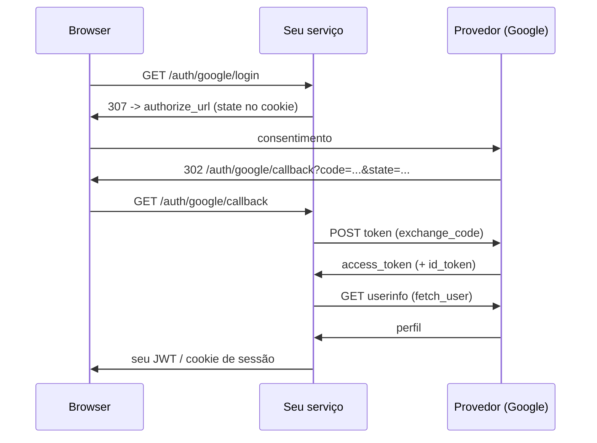

# Login social (OAuth2 / OIDC)

"Entrar com Google" tem três partes: mandar o usuário pro provedor, receber o
`code` de volta e trocar esse `code` por um token que identifica a pessoa. O SDK
entrega as três — `GoogleOAuthClient`, `GitHubOAuthClient` e o genérico
`OIDCProvider` — com uma identidade normalizada no fim (`OAuthUser`), qualquer
que seja o provedor.

!!! info "O que o SDK faz e o que fica com você"
    Os clients cobrem **só a dança OAuth2**: URL de autorização, troca do
    `code`, busca do usuário. Gravar esse usuário na sua tabela, emitir o
    **seu** token de sessão e gravar o cookie são decisões do serviço — e o SDK
    já tem peças pra isso ([`UserAuthService`](auth-flow.md), `JWTUtils`,
    `set_cookie`).

Nada de extra pra instalar: `httpx` é dependência base do SDK e o `HTTPClient`
(com retry e circuit breaker) já vem embutido.

## O fluxo em quatro passos



## 1. Registre o app no provedor

No console do provedor (Google Cloud, GitHub Developer Settings, Auth0…) crie
uma credencial OAuth e cadastre o **redirect URI exato** que o seu serviço vai
expor — `https://api.exemplo.com/auth/google/callback`. Guarde `client_id` e
`client_secret` nas settings:

```python
# src/core/settings.py
from tempest_fastapi_sdk import BaseAppSettings


class Settings(BaseAppSettings):
    """Environment-driven configuration."""

    GOOGLE_CLIENT_ID: str
    GOOGLE_CLIENT_SECRET: str
    GOOGLE_REDIRECT_URI: str = "http://127.0.0.1:8000/auth/google/callback"


settings: Settings = Settings()
```

!!! warning "O redirect URI tem que casar caractere a caractere"
    Barra final, `http` vs `https`, `127.0.0.1` vs `localhost` — qualquer
    diferença faz o provedor recusar com `redirect_uri_mismatch`. Cadastre um
    URI por ambiente (dev, staging, produção) em vez de tentar um curinga.

## 2. Instancie o client uma vez

O client abre conexões HTTP, então ele vive junto dos outros recursos de infra —
um por processo, não um por request:

```python
# src/api/dependencies/resources.py
from tempest_fastapi_sdk import GoogleOAuthClient

from src.core.settings import settings

google: GoogleOAuthClient = GoogleOAuthClient(
    client_id=settings.GOOGLE_CLIENT_ID,
    client_secret=settings.GOOGLE_CLIENT_SECRET,
    redirect_uri=settings.GOOGLE_REDIRECT_URI,
)
```

Scopes default do Google: `openid email profile`. Passe `scopes=[...]` pra
pedir mais (ex.: `"https://www.googleapis.com/auth/calendar.readonly"`).

!!! tip "Reuse o seu `HTTPClient`"
    Sem `http_client=`, o client constrói um dedicado (timeout 10s, breaker
    desligado). Se o serviço já tem um `HTTPClient` configurado, injete: uma
    pool de conexões só, e o retry/breaker/`X-Request-ID` que você já
    calibrou valem pro provedor também.

    ```python
    from tempest_fastapi_sdk import GoogleOAuthClient, HTTPClient, RetryPolicy

    http: HTTPClient = HTTPClient(
        timeout=10.0,
        retry_policy=RetryPolicy(max_attempts=2),
    )
    google: GoogleOAuthClient = GoogleOAuthClient(
        client_id=settings.GOOGLE_CLIENT_ID,
        client_secret=settings.GOOGLE_CLIENT_SECRET,
        redirect_uri=settings.GOOGLE_REDIRECT_URI,
        http_client=http,
    )
    ```

    Quando o client é dono do `HTTPClient` (sem `http_client=`), feche no
    shutdown com `await google.aclose()` — é no-op se o client foi injetado.

## 3. A rota de início: `state` + redirect

`state` é a proteção contra CSRF do fluxo: um valor aleatório que você guarda
**antes** do redirect e confere **na volta**. `generate_oauth_state()` gera; um
cookie `HttpOnly` guarda:

```python
# src/api/routers/oauth.py
from fastapi import APIRouter
from fastapi.responses import RedirectResponse
from tempest_fastapi_sdk import generate_oauth_state, set_cookie

from src.api.dependencies.resources import google

router: APIRouter = APIRouter(prefix="/auth/google", tags=["oauth"])

STATE_COOKIE: str = "oauth_state"


@router.get("/login")
async def login() -> RedirectResponse:
    """Redirect the browser to Google, remembering the CSRF state."""
    state: str = generate_oauth_state()
    response: RedirectResponse = RedirectResponse(
        google.build_authorize_url(state=state),
    )
    set_cookie(
        response,
        STATE_COOKIE,
        state,
        max_age=600,
        samesite="lax",
    )
    return response
```

`build_authorize_url` aceita `**extra` pra qualquer parâmetro do provedor:
`build_authorize_url(state=state, access_type="offline", prompt="consent")`
pede um `refresh_token` ao Google.

!!! danger "Sem conferir o `state`, o callback é forjável"
    Um atacante consegue induzir o browser da vítima a chamar o seu
    `/callback` com um `code` obtido na conta *dele* — e a vítima termina
    logada na conta do atacante. A comparação do passo 4 é o que fecha isso;
    ela não é opcional.

## 4. O callback: valida, troca, busca o usuário

```python
# src/api/routers/oauth.py (continuação)
from fastapi import Request
from tempest_fastapi_sdk import (
    OAuthTokens,
    OAuthUser,
    UnauthorizedException,
    clear_cookie,
)


@router.get("/callback")
async def callback(request: Request, code: str, state: str) -> RedirectResponse:
    """Complete the OAuth dance and hand the browser your own session.

    Raises:
        UnauthorizedException: When the `state` does not match the cookie
            issued at `/login`, which means a forged callback.
    """
    expected: str | None = request.cookies.get(STATE_COOKIE)
    if expected is None or expected != state:
        raise UnauthorizedException(message="Invalid OAuth state")

    tokens: OAuthTokens = await google.exchange_code(code)
    profile: OAuthUser = await google.fetch_user(tokens)

    access_token: str = await oauth_login.login(profile)

    response: RedirectResponse = RedirectResponse("/")
    clear_cookie(response, STATE_COOKIE)
    set_cookie(response, "access_token", access_token, max_age=3600)
    return response
```

`OAuthUser` é a mesma forma pra todo provedor:

| Campo | Tipo | Conteúdo |
| --- | --- | --- |
| `provider` | `str` | `"google"`, `"github"`, `"oidc:auth0"` — a chave do provedor |
| `subject` | `str` | Id estável **dentro** daquele provedor |
| `email` | `str` ou `None` | E-mail, quando o provedor devolve. **Não necessariamente verificado** |
| `email_verified` | `bool` ou `None` | O provedor afirma ter verificado o e-mail? `None` = não disse nada |
| `name` | `str` ou `None` | Nome de exibição |
| `picture` | `str` ou `None` | URL do avatar |
| `raw` | `dict[str, Any]` | Payload cru do provedor, pra claims customizadas |

!!! info "A chave única é `(provider, subject)`, não o e-mail"
    E-mail muda, e o mesmo e-mail pode chegar por dois provedores. Guarde as
    duas colunas com um índice único composto — é o que permite a mesma pessoa
    ter Google e GitHub ligados na mesma conta.

!!! danger "Ligar conta por e-mail exige `email_verified is True`"
    Se você casa o login social com uma conta existente pelo e-mail, um
    provedor que devolve endereço **não verificado** entrega a conta da vítima:
    basta o atacante cadastrar o e-mail dela no provedor sem confirmar. É o caso
    do GitHub — o `email` de `GET /user` é o do perfil público, que o GitHub não
    exige verificar. Só faça o vínculo automático quando
    `profile.email_verified is True`; com `None` ou `False`, peça a confirmação
    do e-mail no seu próprio fluxo antes de ligar.

## 5. Ligando no seu usuário

O passo que é seu: achar ou criar o usuário e emitir o **seu** token. Padrão
mínimo com `JWTUtils`:

```python
# src/services/oauth.py
from tempest_fastapi_sdk import JWTUtils, OAuthUser

from src.db.models import UserModel
from src.db.repositories import UserRepository


class OAuthLoginService:
    """Turn a provider identity into a local user + local session token."""

    def __init__(self, repository: UserRepository, tokens: JWTUtils) -> None:
        """Initialize the service.

        Args:
            repository (UserRepository): Data access for users.
            tokens (JWTUtils): The same helper the rest of the API
                validates bearer tokens with.
        """
        self.repository: UserRepository = repository
        self.tokens: JWTUtils = tokens

    async def login(self, profile: OAuthUser) -> str:
        """Find-or-create the local user and mint an access token.

        Args:
            profile (OAuthUser): Normalized identity from the provider.

        Returns:
            str: A signed access token for this service's own routes.
        """
        user: UserModel | None = await self.repository.get_or_none(
            {"oauth_provider": profile.provider, "oauth_subject": profile.subject},
        )
        if user is None:
            user = await self.repository.add(
                UserModel(
                    email=profile.email,
                    name=profile.name,
                    oauth_provider=profile.provider,
                    oauth_subject=profile.subject,
                    is_active=True,
                ),
            )
        return self.tokens.encode({"sub": str(user.id)})
```

!!! tip "Já usa o flow bundled? Reuse o mesmo `JWTUtils`"
    Se o serviço monta `make_auth_router` ([receita de auth](auth-flow.md)),
    passe o `auth_service.jwt` aqui em vez de construir outro `JWTUtils` — o
    token do login social passa a valer nas mesmas rotas protegidas, com o
    mesmo segredo. Dois `JWTUtils` com segredos diferentes é o footgun
    clássico: o login funciona e toda rota protegida devolve 401.

## GitHub

Mesma superfície, dois detalhes diferentes:

```python
from tempest_fastapi_sdk import GitHubOAuthClient

github: GitHubOAuthClient = GitHubOAuthClient(
    client_id=settings.GITHUB_CLIENT_ID,
    client_secret=settings.GITHUB_CLIENT_SECRET,
    redirect_uri=settings.GITHUB_REDIRECT_URI,
)
```

- **Não é OIDC.** Não vem `id_token`; o perfil sai de `GET /user`, que é o que
  `fetch_user` faz.
- **`email` pode vir `None`.** Scopes default são `read:user` e `user:email`,
  mas quem marca o e-mail como privado no GitHub não expõe no `/user`. Trate
  `profile.email is None` — pedindo o e-mail numa tela sua, por exemplo.
- **`email_verified` é sempre `None` aqui.** O payload de `GET /user` não traz
  nenhum campo de verificação, então o SDK não inventa um. Se você precisa da
  resposta, chame `GET /user/emails` (scope `user:email`) e leia o campo
  `verified` de lá.

## Qualquer outro IdP: `OIDCProvider`

Auth0, Keycloak, Okta, Microsoft Entra, Cognito — todos falam OIDC. Passe os
três endpoints do *discovery document*
(`${issuer}/.well-known/openid-configuration`):

```python
from tempest_fastapi_sdk import OIDCProvider

keycloak: OIDCProvider = OIDCProvider(
    client_id=settings.OIDC_CLIENT_ID,
    client_secret=settings.OIDC_CLIENT_SECRET,
    redirect_uri=settings.OIDC_REDIRECT_URI,
    authorize_url="https://id.exemplo.com/realms/app/protocol/openid-connect/auth",
    token_url="https://id.exemplo.com/realms/app/protocol/openid-connect/token",
    userinfo_url="https://id.exemplo.com/realms/app/protocol/openid-connect/userinfo",
    provider_name="oidc:keycloak",
)
```

`provider_name` entra no `OAuthUser.provider`, então use um valor estável — ele
vira parte da chave única do usuário. Sem `userinfo_url`, `fetch_user` levanta
`NotImplementedError`: nesse caso o perfil tem que sair do `id_token`, e você
sobrescreve `_parse_user` numa subclasse.

## Erros

Falha na troca do `code` ou no userinfo levanta **`OAuthError`** — uma
`AppException` com `code="OAUTH_ERROR"` e status **502** (o problema está no
provedor, não no cliente), com o corpo da resposta do provedor em `details`.
Com `register_exception_handlers` montado, ela já sai no envelope canônico
`{detail, code, details}`; declare na rota pro Swagger:

```python
from tempest_fastapi_sdk import OAuthError, UnauthorizedException, error_responses


@router.get(
    "/callback",
    responses=error_responses(OAuthError, UnauthorizedException),
)
async def callback(request: Request, code: str, state: str) -> RedirectResponse:
    """Complete the OAuth dance (see above)."""
```

## Recap

- `GoogleOAuthClient` / `GitHubOAuthClient` / `OIDCProvider` — mesma API:
  `build_authorize_url(state=...)` → `exchange_code(code)` →
  `fetch_user(tokens)`.
- `generate_oauth_state()` + um cookie `HttpOnly` + comparação no callback é a
  defesa contra callback forjado. Não pule.
- `OAuthUser` normaliza os provedores; a chave única é `(provider, subject)`.
- `OAuthTokens` traz `access_token`, e `id_token`/`refresh_token` quando o
  provedor manda.
- Emitir a **sua** sessão continua sendo seu: reuse o `JWTUtils` do resto da
  API. Fluxo local completo (signup, ativação, reset) está na
  [receita de auth](auth-flow.md); entrega por cookie e CSRF, na
  [receita HTTP](http.md).
