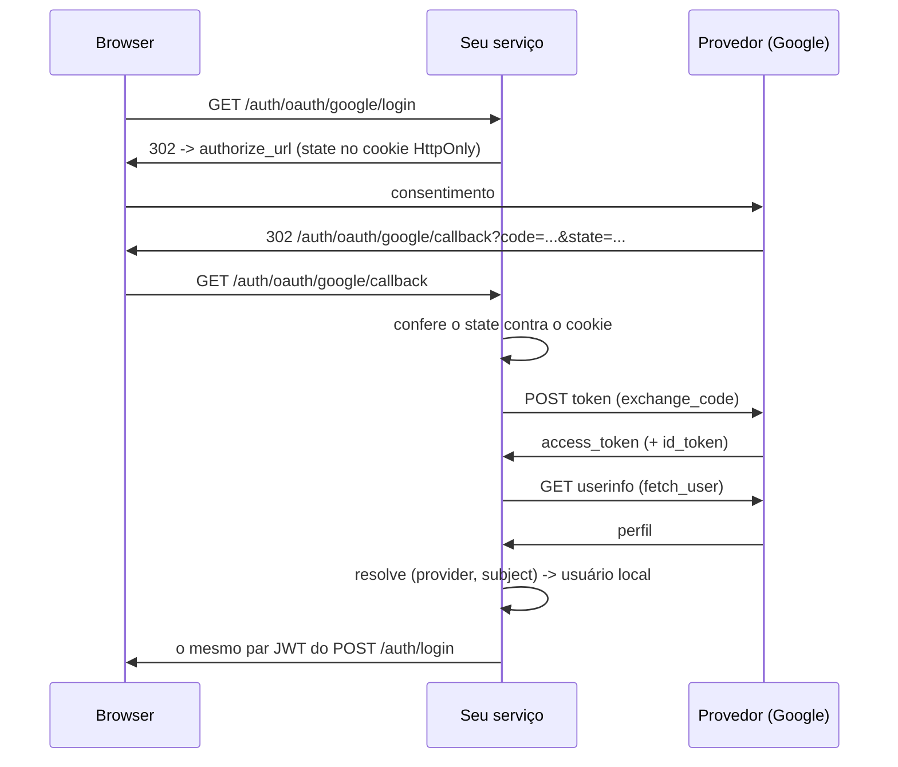

# Login social (OAuth2 / OIDC)

"Entrar com Google" tem quatro partes: mandar o usuário pro provedor, receber o
`code` de volta, trocar esse `code` por uma identidade — e transformar essa
identidade numa **sessão do seu serviço**. O SDK entrega as quatro.

As três primeiras são os clients: `GoogleOAuthClient`, `GitHubOAuthClient` e o
genérico `OIDCProvider`, todos terminando na mesma identidade normalizada
(`OAuthUser`). A quarta — a que decide quem é a pessoa no *seu* banco e emite o
*seu* token — é o `make_auth_router` a partir da v0.273.0, ligado por
`AUTH_OAUTH_ENABLED`.

!!! info "Por que a quarta parte importa tanto"
    Emitir o token na mão é o passo que parece trivial e não é. Um
    `jwt.encode({"sub": str(user.id)})` produz um token **diferente** do que o
    `POST /auth/login` devolve: sem o claim `typ`, sem refresh token opaco, sem
    rotação, sem detecção de reuso por família e sem `POST /auth/logout`. O
    serviço termina com dois mecanismos de sessão, um deles com metade das
    garantias — e o dia em que alguém ligar `strict=True` na verificação de
    tipo, todo login com Google quebra de uma vez.

Nada de extra pra instalar: `httpx` é dependência base do SDK e o `HTTPClient`
(com retry e circuit breaker) já vem embutido.

## O fluxo, ponta a ponta



## 1. Registre o app no provedor

No console do provedor (Google Cloud, GitHub Developer Settings, Auth0…) crie
uma credencial OAuth e cadastre o **redirect URI exato** que o serviço expõe —
`https://api.exemplo.com/auth/oauth/google/callback`. Depois componha o mixin
`OAuthSettings`, que guarda as credenciais e **deriva** esse URI:

```python
# src/core/settings.py
from tempest_fastapi_sdk import (
    AuthSettings,
    DatabaseSettings,
    JWTSettings,
    OAuthSettings,
    ServerSettings,
)


class Settings(
    ServerSettings,
    DatabaseSettings,
    JWTSettings,
    AuthSettings,
    OAuthSettings,
):
    """Environment-driven configuration."""


settings: Settings = Settings()
```

`OAuthSettings` lê cinco variáveis de ambiente:

| Variável | Default | Para que serve |
| --- | --- | --- |
| `OAUTH_REDIRECT_BASE_URL` | `""` | Origem pública do serviço (`https://api.exemplo.com`), sem barra final e sem path |
| `OAUTH_GOOGLE_CLIENT_ID` | `""` | `Client ID` do console do Google |
| `OAUTH_GOOGLE_CLIENT_SECRET` | `""` | `Client secret` correspondente |
| `OAUTH_GITHUB_CLIENT_ID` | `""` | `Client ID` do OAuth app do GitHub |
| `OAUTH_GITHUB_CLIENT_SECRET` | `""` | `Client secret` correspondente |

O redirect URI não é declarado — ele é **derivado** da base, do prefixo do
router e da chave do provedor:

```python
from tempest_fastapi_sdk import OAuthSettings

settings: OAuthSettings = OAuthSettings(
    OAUTH_REDIRECT_BASE_URL="https://api.exemplo.com",
)
print(settings.oauth_redirect_uri("google"))
# https://api.exemplo.com/auth/oauth/google/callback
```

!!! warning "O redirect URI tem que casar caractere a caractere"
    Barra final, `http` vs `https`, `127.0.0.1` vs `localhost` — qualquer
    diferença faz o provedor recusar com `redirect_uri_mismatch`, e a recusa
    acontece **antes** da tela de consentimento, o que faz parecer problema de
    credencial. Cole no console exatamente o que `oauth_redirect_uri` imprime.
    Em desenvolvimento, a base é o túnel ou `http://localhost:8000` — o
    provedor redireciona o *navegador*, não a si mesmo, então o endereço
    interno do container não serve.

## 2. Duas peças no banco

O login social escreve em duas tabelas: a de usuários (que ganha uma coluna de
nome) e uma tabela nova, de identidades ligadas.

```python
# src/db/models.py
from tempest_fastapi_sdk import (
    BaseUserModel,
    NameMixin,
    make_user_oauth_account_model,
    make_user_refresh_token_model,
    make_user_token_model,
)


class UserModel(NameMixin, BaseUserModel):
    """The project's user table."""

    __tablename__ = "users"


UserTokenModel = make_user_token_model(user_table="users")
UserOAuthAccountModel = make_user_oauth_account_model(user_table="users")
UserRefreshTokenModel = make_user_refresh_token_model(user_table="users")
```

**`NameMixin`** existe porque `BaseUserModel` não tem coluna `name` — ele foi
desenhado para o login do admin, que precisa de e-mail e senha, não de saudação.
O callback cria contas e guarda o nome que o provedor reporta, então a coluna
passa a ser necessária. Ligar `AUTH_OAUTH_ENABLED` sem o mixin é recusado na
construção do router, com a mensagem dizendo o que falta — falhar no boot, não
no primeiro callback em produção.

**A tabela de identidades é separada** — não duas colunas no `UserModel`. É o
que permite a mesma pessoa ter Google **e** GitHub ligados, e é onde mora o
`UNIQUE (provider, subject)` que faz a identidade, e não o e-mail, ser a chave
do login.

!!! info "A chave é `(provider, subject)`, nunca o e-mail"
    E-mail muda de dono; `subject` não. Uma pessoa que troca o e-mail no Google
    continua entrando na mesma conta local, porque o `subject` não mudou. O
    modelo declara os dois `UNIQUE` no próprio abstrato, então um mapeamento
    escrito à mão também não consegue shippar sem eles.

Gere a migration com o Alembic normalmente — as duas mudanças (a coluna `name`
e a tabela nova) saem num `alembic revision --autogenerate` só.

## 3. Ligue no router

Três linhas: o client, o `oauth_account_model` no serviço e o `oauth_clients` no
router.

```python
# src/api/dependencies/resources.py
from tempest_fastapi_sdk import (
    AsyncDatabaseManager,
    GoogleOAuthClient,
    UserAuthService,
)

from src.core.settings import settings
from src.db.models import (
    UserModel,
    UserOAuthAccountModel,
    UserRefreshTokenModel,
    UserTokenModel,
)

db: AsyncDatabaseManager = AsyncDatabaseManager(**settings.database_kwargs())

google: GoogleOAuthClient = GoogleOAuthClient(**settings.google_kwargs())

auth_service: UserAuthService = UserAuthService(
    user_model=UserModel,
    token_model=UserTokenModel,
    auth_settings=settings,
    jwt_settings=settings,
    db=db,
    refresh_token_model=UserRefreshTokenModel,
    oauth_account_model=UserOAuthAccountModel,
)
```

```python
# src/api/app.py
from fastapi import FastAPI
from tempest_fastapi_sdk import make_auth_router

from src.api.dependencies.resources import auth_service, db, google


def create_app() -> FastAPI:
    """Build the application with social login mounted."""
    app: FastAPI = FastAPI()
    app.include_router(
        make_auth_router(
            auth_service,
            session_factory=db.session_dependency,
            oauth_clients={"google": google},
        )
    )
    return app
```

Ligue o switch no ambiente:

```bash
AUTH_OAUTH_ENABLED=true
OAUTH_REDIRECT_BASE_URL=https://api.exemplo.com
OAUTH_GOOGLE_CLIENT_ID=1234567890-abc123.apps.googleusercontent.com
OAUTH_GOOGLE_CLIENT_SECRET=GOCSPX-...
```

!!! tip "A chave do dicionário é a chave da URL"
    `{"google": google}` serve `/auth/oauth/google/login`. Essa mesma string vai
    para a coluna `provider` de cada identidade ligada, então renomeá-la depois
    que existem contas órfa­na as ligações. Escolha e mantenha.

!!! check "Três coisas que falham no boot, não no primeiro request"
    `AUTH_OAUTH_ENABLED=true` exige (1) pelo menos um client, (2) um
    `oauth_account_model` no serviço e (3) a coluna `name` no user model. Cada
    um que faltar levanta `RuntimeError` na construção do router, dizendo qual
    é — mesmo idioma de `AUTH_MFA_ENABLED` sem `recovery_code_model`.

## 4. As cinco rotas

| Método | Rota | O que faz |
| --- | --- | --- |
| `GET` | `/auth/oauth/{provider}/login` | Sorteia o `state`, grava no cookie `HttpOnly` e redireciona **302** para o provedor |
| `GET` | `/auth/oauth/{provider}/callback` | Confere o `state`, troca o `code`, resolve a identidade e devolve o par JWT |
| `POST` | `/auth/oauth/{provider}/token` | *(v0.278.0+)* Recebe um access token que o app já tem na mão, confere para qual aplicação ele foi emitido e devolve a mesma sessão |
| `GET` | `/auth/oauth/accounts` | Autenticado. Lista os provedores ligados à conta |
| `POST` | `/auth/oauth/accounts/unlink` | Autenticado. Desliga um provedor |

A rota de início é uma **navegação**, não um XHR: aponte um link ou um botão
direto para ela. Um `fetch` recebe um redirect para outra origem e ou o segue
opaco ou falha no CORS.

Um `{provider}` que não está registrado responde **404** — ele faz parte do
path, então provedor desconhecido é rota desconhecida.

!!! danger "O `state` é o que impede o callback forjado"
    Sem a comparação, um atacante induz o navegador da vítima a chamar o seu
    `/callback` com um `code` obtido na conta **dele** — e a vítima termina
    logada na conta do atacante, entregando o que digitar ali. O router faz a
    comparação com `hmac.compare_digest` e o cookie carrega a chave do provedor
    junto do valor aleatório, então um `state` sorteado para o Google não vale
    no callback do GitHub.

    O cookie é sempre `SameSite=Lax`, **independente de
    `AUTH_COOKIE_SAMESITE`**: o provedor devolve o usuário numa navegação
    top-level cross-site, e `Strict` reteria o cookie exatamente ali — todo
    login falharia a checagem que o cookie existe para passar.

## 4.1. Cliente sem navegador: o fluxo token-in-hand *(v0.278.0+)*

O app nativo não tem navegador para redirecionar. Ele roda o SDK do próprio
provedor no dispositivo — `GoogleSignIn`, `Credential Manager`, o que for — e
termina com um **access token na mão**. O `/login` → consentimento →
`/callback` não tem onde acontecer.

`POST /auth/oauth/{provider}/token` é essa metade:

```console
$ curl -s -X POST localhost:8000/auth/oauth/google/token \
    -H "Content-Type: application/json" \
    -d '{"access_token":"ya29.a0AfH6SM…"}'
{"user_id":"0e5cf2fc-…","access_token":"eyJ…","refresh_token":"eyJ…","mfa_required":false,"mfa_token":null}
```

A sessão é a **mesma** que o callback devolve: mesmos claims, mesmo `typ`, mesma
família de rotação, mesmo `POST /auth/logout`. Um cliente escrito contra o login
por senha não ganha um segundo caminho para tratar.

O token vai no **corpo**, nunca no path nem na query. Uma URL atravessa o log de
acesso, o histórico do navegador e todo header `Referer` no caminho — e esse
valor está vivo no provedor.

!!! danger "Sem conferir a audiência, este endpoint entrega a conta da vítima"
    O `userinfo` do provedor responde de **quem** é o token. Ele não responde
    para **qual aplicação** o token foi emitido — e essa é a pergunta que
    importa aqui, porque quem apresenta o token é quem está chamando.

    O ataque tem três passos e nenhuma senha:

    1. o atacante publica um app qualquer e pede consentimento `email profile`
       — a tela mais banal do Google, que ninguém lê;
    2. a vítima aceita, e o atacante fica com um access token que descreve a
       vítima;
    3. o atacante posta esse token neste endpoint. O `userinfo` confirma
       lealmente que o token é da vítima, e a sessão sai no nome dela.

    A rota **pergunta ao provedor para qual `client_id` o token foi emitido**
    antes de olhar qualquer linha do banco. Token de outro app é recusado com
    **401** `OAUTH_TOKEN_AUDIENCE_MISMATCH`, sem tocar em conta nenhuma.

    O fluxo de redirect não precisa disso: lá o token foi trocado por este
    serviço, a partir de um `code` que este serviço pediu.

Quem responde a pergunta é o client registrado, por
`verify_token_audience(tokens)`:

| Client | Como confere |
| --- | --- |
| `GoogleOAuthClient` | `GET https://oauth2.googleapis.com/tokeninfo`, comparando `aud` e `azp` |
| `GitHubOAuthClient` | `POST /applications/{client_id}/token` com o par `client_id:client_secret` em Basic — 200 só para token do próprio app, 404 para o de qualquer outro |
| `OIDCProvider` | O endpoint de introspection (RFC 7662) que você passar em `tokeninfo_url=`; sem ele, a rota recusa |
| Client próprio | Implemente `verify_token_audience`; sem o método, a rota recusa |

!!! warning "App mobile tem um `client_id` por plataforma"
    O Google emite um client id para o backend (web), outro para o Android,
    outro para o iOS. O token que o app Android manda carrega o id **do
    Android** em `aud` — comparar só com o do backend recusaria todo login
    legítimo. Liste os ids das plataformas em `extra_audiences=`:

    ```python
    google = GoogleOAuthClient(
        client_id=settings.GOOGLE_CLIENT_ID,
        client_secret=settings.GOOGLE_CLIENT_SECRET,
        redirect_uri=settings.oauth_redirect_uri("google"),
        extra_audiences=[
            settings.GOOGLE_ANDROID_CLIENT_ID,
            settings.GOOGLE_IOS_CLIENT_ID,
        ],
    )
    ```

    Cada valor nessa lista é uma aplicação autorizada a logar gente neste
    serviço. Coloque os ids do **seu** projeto, e só eles.

    Pelo `OAuthSettings`, isso é `OAUTH_GOOGLE_EXTRA_AUDIENCES` no ambiente — e
    `google_kwargs()` já o repassa, então o client continua sendo um splat:

    ```python
    google = GoogleOAuthClient(**settings.google_kwargs())
    ```

    Client sem nenhum id configurado — o `GoogleOAuthClient(client_id="")` que
    serve só para `fetch_user` — faz a rota responder **501**: não há contra o
    que comparar, e comparar com string vazia ou recusaria tudo ou casaria com
    um provedor que ecoa claim vazio.

```python
# src/api/dependencies/resources.py

from tempest_fastapi_sdk import OIDCProvider

from src.core.settings import settings

keycloak = OIDCProvider(
    client_id=settings.OIDC_CLIENT_ID,
    client_secret=settings.OIDC_CLIENT_SECRET,
    redirect_uri="https://api.exemplo.com/auth/oauth/keycloak/callback",
    authorize_url="https://id.exemplo.com/realms/app/protocol/openid-connect/auth",
    token_url="https://id.exemplo.com/realms/app/protocol/openid-connect/token",
    userinfo_url="https://id.exemplo.com/realms/app/protocol/openid-connect/userinfo",
    tokeninfo_url="https://id.exemplo.com/realms/app/protocol/openid-connect/token/introspect",
    provider_name="keycloak",
)
```

!!! info "Recusar é o comportamento correto, não uma limitação"
    Um provedor que não sabe dizer a audiência do token faz a rota responder
    **501** `OAUTH_AUDIENCE_UNVERIFIABLE` — e o perfil nem é buscado. A
    alternativa seria aceitar o token, que é exatamente o furo acima. O fluxo de
    redirect desse mesmo provedor continua funcionando normalmente.

!!! note "Não há `state` aqui, e não falta"
    O `state` protege uma **navegação**: o navegador da vítima sendo mandado a
    um callback forjado. Aqui não há navegação nenhuma — o chamador manda a
    credencial no corpo de um POST.

**Recap.** Um POST com o token no corpo, a audiência conferida antes de
qualquer leitura, e a mesma sessão do resto do fluxo. Nada do que o app nativo
precisa fica fora do SDK.

## 5. Criar conta, ou só autenticar quem já tem

O callback é uma porta de cadastro também. Na primeira vez que uma identidade
desconhecida chega, ele cria a linha em `users` — com o e-mail do provedor, o
nome do provedor e uma senha gerada — ou recusa.

`AUTH_OAUTH_ALLOW_ACCOUNT_CREATION` decide, e o default **herda
`AUTH_SIGNUP_ENABLED`**: fechar a porta da frente fecha essa junto, em vez de
deixar um segundo caminho mais silencioso.

| `AUTH_SIGNUP_ENABLED` | `AUTH_OAUTH_ALLOW_ACCOUNT_CREATION` | Identidade nova |
| --- | --- | --- |
| `true` | não definido | Cria a conta |
| `false` | não definido | **403** — só autentica identidade já ligada |
| `false` | `true` | Cria a conta (sistema fechado com onboarding pelo provedor) |
| `true` | `false` | **403** — cadastro por formulário sim, por provedor não |

A conta criada nasce **ativa**. O ponto do fluxo é que o provedor já fez a
verificação; re-verificar por e-mail pediria ao usuário que provasse de novo o
que o Google acabou de provar. `AUTH_AUTO_ACTIVATE` não é consultado aqui — um
serviço que quer aprovação humana antes do primeiro login desliga a criação e
faz um administrador criar e ligar a linha.

!!! info "A senha gerada, e por que ela não é `secrets.token_urlsafe`"
    `hashed_password` é `NOT NULL` e continua assim: nenhuma migration, nenhum
    ramo "usuário sem senha" espalhado pelo login. O callback gera uma senha
    aleatória e a grava — ninguém nunca a vê, e quem quiser uma senha própria
    usa o `POST /auth/password-reset/request`, que já existe e já funciona
    porque o e-mail já está na linha.

    A geração passa por
    [`generate_password`](../reference.md#tempest_fastapi_sdk.utils.password.generate_password),
    que garante as classes de caractere **por construção**. Sortear de um
    alfabeto plano e torcer é o defeito que essa função existe para evitar:
    medido contra a política real com complexidade ligada, 200 000 amostras
    cada, `secrets.token_urlsafe(32)` é reprovado em 26,54% das vezes e
    `secrets.token_hex(32)` em 100%. Um quarto dos logins falharia de forma
    intermitente, com um 422 vindo de dentro do callback sobre uma senha que o
    usuário nunca digitou.

## 6. Ligar por e-mail: o botão que você provavelmente não quer

Cenário: a pessoa já tem conta com senha em `ana@exemplo.com` e clica em "entrar
com Google" pela primeira vez. O e-mail bate; a identidade não. O default é
recusar com **409**.

`AUTH_OAUTH_LINK_BY_VERIFIED_EMAIL=true` liga automaticamente — mas **só** quando
o provedor afirma explicitamente ter verificado o endereço
(`email_verified is True`).

!!! danger "`None` não é um sim"
    `email_verified` tem três valores, e a diferença é a vulnerabilidade:
    `True` = o provedor verificou, `False` = o provedor diz que não verificou,
    `None` = **o provedor não falou nada**. Tratar silêncio como verificação
    entrega qualquer conta cujo e-mail o atacante consiga adivinhar: basta
    cadastrar aquele endereço num IdP que não exige confirmação.

    É o caso possível do GitHub — o `email` de `GET /user` é o do perfil
    público, que o GitHub não exige verificar, e por isso o SDK deixa
    `email_verified=None` ali em vez de inventar um valor. Ligue esse knob só
    para provedores em que você confia na verificação.

O caminho seguro, com o knob desligado: a pessoa entra com a senha e liga o
provedor de dentro da conta.

## 7. Como o par JWT volta

O callback respeita `AUTH_TOKEN_DELIVERY` como qualquer outro passo equivalente
a login — com uma diferença:

| `AUTH_TOKEN_DELIVERY` | O callback devolve |
| --- | --- |
| `bearer` (default) | `access_token` e `refresh_token` no corpo |
| `cookie` | Os dois como cookies `HttpOnly`; o corpo mantém `null` |
| `both` | Cookies **e** corpo, na mesma resposta |

Em `both`, o resto do router monta rotas paralelas em `/auth/cookie/*`. O
callback não: a URL dele está **cadastrada no provedor**, então uma segunda rota
obrigaria a cadastrar um segundo redirect URI em cada console para um fluxo só.

O efeito prático de responder JSON é que o fluxo serve SPA e mobile sem
redirect: o cliente chama o callback, recebe o par e segue.

E o par é o par de sempre. Vale a pena ver o que isso significa:

```python
from tempest_fastapi_sdk import ACCESS_TOKEN_TYPE, JWTUtils, token_type_allowed

jwt: JWTUtils = JWTUtils(secret="a-32-character-secret-for-tests!")
access_token: str = "<o access_token que o callback devolveu>"
payload: dict[str, object] = jwt.decode(access_token)
print(sorted(payload))
# ['email', 'exp', 'iat', 'sub', 'typ']
print(token_type_allowed(payload, [ACCESS_TOKEN_TYPE], strict=True))
# True
```

Com o `refresh_token_model` ligado, o refresh do login social é opaco,
persistido, de uso único, entra na mesma família de rotação, é coberto pela
detecção de reuso e morre no `POST /auth/logout` — nada disso existe num token
assinado à mão.

## 8. Contas ligadas: listar e desligar

```bash
curl -H "Authorization: Bearer $ACCESS_TOKEN" \
     https://api.exemplo.com/auth/oauth/accounts
```

```json
[
  {
    "provider": "google",
    "subject": "101234567890123456789",
    "email": "ana@exemplo.com",
    "email_verified": true,
    "name": "Ana Souza",
    "picture": "https://lh3.googleusercontent.com/a/...",
    "created_at": "2026-08-30T12:00:00Z",
    "last_login_at": "2026-08-30T18:41:03Z"
  }
]
```

Conta que só usou senha responde **200** com `[]` — lista vazia é sucesso, não
404.

```bash
curl -X POST -H "Authorization: Bearer $ACCESS_TOKEN" \
     -H "Content-Type: application/json" \
     -d '{"provider": "google"}' \
     https://api.exemplo.com/auth/oauth/accounts/unlink
```

**204** ao desligar; **404** quando aquele provedor não está ligado nesta conta.
A busca é escopada ao chamador, então um provedor ligado por outra pessoa
responde 404 igual a um que nunca existiu.

Desligar o único provedor de uma conta criada pelo callback deixa o
`POST /auth/password-reset/request` como caminho de volta — a mesma porta que
esse fluxo sempre ofereceu, já que o e-mail está na linha.

## `OAuthUser`, a identidade normalizada

É a mesma forma para todo provedor, e é o que o `login_with_oauth` recebe:

| Campo | Tipo | Conteúdo |
| --- | --- | --- |
| `provider` | `str` | `"google"`, `"github"`, `"oidc:auth0"` — a chave do provedor |
| `subject` | `str` | Id estável **dentro** daquele provedor |
| `email` | `str` ou `None` | E-mail, quando o provedor devolve. **Não necessariamente verificado** |
| `email_verified` | `bool` ou `None` | O provedor afirma ter verificado? `None` = não disse nada |
| `name` | `str` ou `None` | Nome de exibição |
| `picture` | `str` ou `None` | URL do avatar |
| `raw` | `dict[str, Any]` | Payload cru do provedor, para claims customizadas |

!!! warning "Provedor sem e-mail não completa o login"
    `OAuthUser.email` é `str | None` e a coluna é `NOT NULL UNIQUE`, então um
    provedor que não devolve endereço recebe **422** em vez de um endereço
    inventado — uma conta com e-mail falso é uma conta que ninguém recupera.
    Escopo de e-mail no client resolve a maioria dos casos; o resto é recusa
    explícita, não fallback silencioso.

Quando o provedor não devolve `name`, o SDK grava um placeholder localizado:
`"Você"` em pt-BR, `"You"` em en-US, escolhido pelo mesmo `resolve_locale` que o
resto do fluxo de auth usa (o `?lang=` do link → `Accept-Language` →
`AUTH_DEFAULT_LOCALE`).

## GitHub

Mesma superfície, dois detalhes diferentes:

```python
from tempest_fastapi_sdk import GitHubOAuthClient, OAuthSettings

settings: OAuthSettings = OAuthSettings()
github: GitHubOAuthClient = GitHubOAuthClient(**settings.github_kwargs())
```

Registre junto do Google e as duas rotas passam a existir:

```python
from fastapi import FastAPI
from tempest_fastapi_sdk import make_auth_router

from src.api.dependencies.resources import auth_service, db, github, google

app: FastAPI = FastAPI()
app.include_router(
    make_auth_router(
        auth_service,
        session_factory=db.session_dependency,
        oauth_clients={"google": google, "github": github},
    )
)
```

- **Não é OIDC.** Não vem `id_token`; o perfil sai de `GET /user`, que é o que
  `fetch_user` faz.
- **`email` pode vir `None`.** Scopes default são `read:user` e `user:email`,
  mas quem marca o e-mail como privado no GitHub não o expõe no `/user` — e aí
  o callback responde 422.
- **`email_verified` é sempre `None` aqui.** O payload de `GET /user` não traz
  campo de verificação, então o SDK não inventa um. Se você precisa da resposta,
  chame `GET /user/emails` (scope `user:email`) e leia o campo `verified` de lá.

## Qualquer outro IdP: `OIDCProvider`

Auth0, Keycloak, Okta, Microsoft Entra, Cognito — todos falam OIDC. Passe os
três endpoints do *discovery document*
(`${issuer}/.well-known/openid-configuration`):

```python
from tempest_fastapi_sdk import OAuthSettings, OIDCProvider

settings: OAuthSettings = OAuthSettings(
    OAUTH_REDIRECT_BASE_URL="https://api.exemplo.com",
)

keycloak: OIDCProvider = OIDCProvider(
    client_id="the-client-id",
    client_secret="the-client-secret",
    redirect_uri=settings.oauth_redirect_uri("keycloak"),
    authorize_url="https://id.exemplo.com/realms/app/protocol/openid-connect/auth",
    token_url="https://id.exemplo.com/realms/app/protocol/openid-connect/token",
    userinfo_url="https://id.exemplo.com/realms/app/protocol/openid-connect/userinfo",
    provider_name="keycloak",
)
```

Registre como `{"keycloak": keycloak}` e as rotas viram
`/auth/oauth/keycloak/login`. Use a **mesma string** em `provider_name` e na
chave do dicionário: `provider_name` é o que vai para a coluna `provider`, e a
chave é o que aparece na URL — divergirem cria ligações que o unlink não acha.

Sem `userinfo_url`, `fetch_user` levanta `NotImplementedError`: nesse caso o
perfil tem que sair do `id_token`, e você sobrescreve `_parse_user` numa
subclasse.

## Reusando o seu `HTTPClient`

Sem `http_client=`, cada client constrói um dedicado (timeout 10s, breaker
desligado). Se o serviço já tem um `HTTPClient` calibrado, injete: uma pool de
conexões só, e o retry/breaker/`X-Request-ID` que você já ajustou valem para o
provedor também.

```python
from tempest_fastapi_sdk import (
    GoogleOAuthClient,
    HTTPClient,
    OAuthSettings,
    RetryPolicy,
)

settings: OAuthSettings = OAuthSettings()
http: HTTPClient = HTTPClient(
    timeout=10.0,
    retry_policy=RetryPolicy(max_attempts=2),
)
google: GoogleOAuthClient = GoogleOAuthClient(
    **settings.google_kwargs(),
    http_client=http,
)
```

Quando o client é dono do `HTTPClient` (sem `http_client=`), feche no shutdown
com `await google.aclose()` — é no-op se o client foi injetado.

## Erros

Falha na troca do `code` ou no userinfo levanta **`OAuthError`** — uma
`AppException` com `code="OAUTH_ERROR"` e status **502** (o problema está no
provedor, não no cliente), com o corpo da resposta do provedor em `details`.
Com `register_exception_handlers` montado, ela já sai no envelope canônico
`{detail, code, details}`.

O que o callback — e o token-in-hand — respondem, por causa:

| Status | `code` | Quando |
| --- | --- | --- |
| **401** | `OAUTH_STATE_MISMATCH` | `state` ausente ou divergente do cookie |
| **401** | `OAUTH_PROVIDER_DENIED` | Provedor devolveu `error=` (quase sempre, o usuário recusou o consentimento) |
| **401** | `OAUTH_ACCOUNT_INACTIVE` | A identidade resolve para uma conta desativada |
| **401** | `OAUTH_TOKEN_AUDIENCE_MISMATCH` | *(token-in-hand)* O token apresentado foi emitido para outra aplicação |
| **401** | `OAUTH_TOKEN_REJECTED` | *(token-in-hand)* O provedor recusou o token apresentado |
| **403** | `OAUTH_REGISTRATION_DISABLED` | Identidade nova e criação de conta desligada |
| **404** | `OAUTH_PROVIDER_NOT_CONFIGURED` | `{provider}` não registrado |
| **404** | `OAUTH_ACCOUNT_NOT_LINKED` | Unlink de um provedor que esta conta não ligou |
| **409** | `OAUTH_EMAIL_TAKEN` | E-mail já é de outra conta e o vínculo automático não é permitido |
| **409** | `OAUTH_EMAIL_UNVERIFIED` | Vínculo permitido, mas o provedor não afirmou ter verificado o e-mail |
| **422** | `OAUTH_EMAIL_MISSING` | Provedor não devolveu e-mail |
| **422** | `OAUTH_CODE_MISSING` | Callback sem `code` e sem `error` |
| **501** | `OAUTH_AUDIENCE_UNVERIFIABLE` | *(token-in-hand)* O client registrado não sabe conferir a audiência do token |
| **502** | `OAUTH_ERROR` | O provedor recusou a troca ou o userinfo |

!!! tip "Ramifique no `code`, nunca na mensagem *(v0.274.0+)*"
    Os dois **409** são o par que mais importa, e chegavam idênticos antes da
    v0.274.0. `OAUTH_EMAIL_TAKEN` **tem** um próximo passo para a pessoa:
    entrar com a senha que ela já tem e ligar o provedor pelas configurações.
    `OAUTH_EMAIL_UNVERIFIED` **não tem nenhum** — é a barreira que impede quem
    registrou uma identidade carregando o e-mail da vítima de assumir a conta,
    e nenhuma ação do usuário a remove. Um app que mostrasse "entre e ligue"
    nos dois estaria mandando metade das pessoas fazer algo que não pode
    funcionar.

    Cada classe herda a exceção que aquele ponto já levantava
    (`OAuthEmailTakenException(ConflictException)` e as outras nove), então
    `except ConflictException` continua pegando o que pegava.

## Fazendo na mão

O router bundled é o caminho recomendado, mas os clients continuam públicos e
funcionam sozinhos — um serviço que não monta `make_auth_router`, ou que precisa
de um passo próprio no meio (aprovação, convite, tenant), usa os três métodos
direto:

```python
from tempest_fastapi_sdk import (
    GoogleOAuthClient,
    OAuthTokens,
    OAuthUser,
    generate_oauth_state,
)

google: GoogleOAuthClient = GoogleOAuthClient(
    client_id="the-client-id",
    client_secret="the-client-secret",
    redirect_uri="https://api.exemplo.com/callback",
)


def start_login() -> str:
    """Mint the state you must store, and the URL to redirect to."""
    state: str = generate_oauth_state()
    return google.build_authorize_url(state=state)


async def finish_login(code: str) -> OAuthUser:
    """Trade the callback's code for a normalized identity."""
    tokens: OAuthTokens = await google.exchange_code(code)
    return await google.fetch_user(tokens)
```

`build_authorize_url` aceita `**extra` para qualquer parâmetro do provedor:
`build_authorize_url(state=state, access_type="offline", prompt="consent")` pede
um `refresh_token` ao Google.

!!! warning "Indo por aqui, as três regras de segurança são suas"
    Guardar e comparar o `state`; exigir `email_verified is True` antes de ligar
    conta por e-mail; e chavear em `(provider, subject)` com índice único
    composto. O router bundled faz as três e tem teste para cada uma; na mão,
    elas voltam a viver só na sua atenção.

    Se for por aqui e o serviço já monta `make_auth_router`, **reuse o
    `auth_service.jwt`** em vez de construir outro `JWTUtils`. Dois `JWTUtils`
    com segredos diferentes é o footgun clássico: o login funciona e toda rota
    protegida devolve 401.

## Recap

- `AUTH_OAUTH_ENABLED=true` + `oauth_clients={"google": ...}` monta cinco
  rotas em `/auth/oauth/*`; três pré-requisitos faltando falham no boot.
- `OAuthSettings` guarda as credenciais e **deriva** o redirect URI com
  `oauth_redirect_uri(provider)` — cole no console o que ele imprime.
- O banco ganha `NameMixin` no user model e uma tabela de identidades
  (`make_user_oauth_account_model`), com `UNIQUE (provider, subject)`.
- O callback devolve o **mesmo par JWT** do `POST /auth/login`: `typ`, refresh
  opaco, rotação, detecção de reuso e `/auth/logout`.
- Criar conta herda `AUTH_SIGNUP_ENABLED`; ligar por e-mail exige
  `email_verified is True` e está desligado por padrão.
- Cliente nativo usa `POST /auth/oauth/{provider}/token` com o token no corpo —
  e a audiência do token é conferida **antes** de qualquer leitura, porque
  `userinfo` diz de quem é o token, nunca para quem ele foi emitido.
- Provedor sem e-mail recebe 422, não um endereço inventado; provedor sem nome
  recebe `"Você"` / `"You"` conforme o locale.
- Fluxo local completo (signup, ativação, reset) está na
  [receita de auth](auth-flow.md); entrega por cookie e CSRF, na
  [receita HTTP](http.md).
